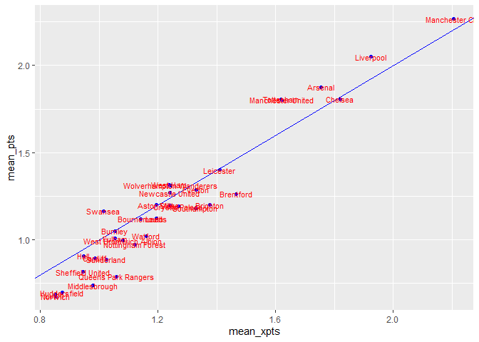

# About

Exploring Understat's data using *understatr*, *ggfootball*, and and *worldfootballR*.


get *understatr* data.  


``` r
DF_xg <-
  rbind(
    get_league_teams_stats(league_name = "EPL", year = 2023),
    get_league_teams_stats(league_name = "EPL", year = 2022),
    get_league_teams_stats(league_name = "EPL", year = 2021),
    get_league_teams_stats(league_name = "EPL", year = 2020),
    get_league_teams_stats(league_name = "EPL", year = 2019),
    get_league_teams_stats(league_name = "EPL", year = 2018),
    get_league_teams_stats(league_name = "EPL", year = 2017),
    get_league_teams_stats(league_name = "EPL", year = 2016),
    get_league_teams_stats(league_name = "EPL", year = 2015),
    get_league_teams_stats(league_name = "EPL", year = 2014)
  )

DF_table_summary <-
  inner_join(
    DF_xg %>% select(xpts,date,pts,xG,xGA,scored,team_name,year),
    DF_xg %>% select(date,xG,xGA,scored,team_name,year) %>% rename(xG = xGA, xGA = xG),
    by = c("date","xG", "xGA", "year")) %>%
  group_by(team_name.x, year) %>%
  summarise(xpts = sum(xpts), pts = sum(pts), GD = sum(scored.x - scored.y), GF = sum(scored.x), .groups = "drop") %>%
  # arrange(year,desc(pts),desc(GD)) %>%
  mutate(points = pts + GD/1000 + GF/1000000)
```

xg_rank vs. table_rank  


``` r
# DF_table_summary %>% 
#   group_by(year) %>% 
#   mutate(table_rank = rank(-points)) %>% 
#   mutate(xpoints_rank = rank(-xpts)) %>% 
#   filter(table_rank <= 4) %>% 
#   dcast(year ~ table_rank, value.var = "xpoints_rank") %>% 
#   kable()
# 
# DF_table_summary %>% 
#   group_by(year) %>% 
#   mutate(table_rank = rank(-points)) %>% 
#   mutate(xpoints_rank = rank(-xpts)) %>% 
#   filter(table_rank <= 4) %>%
#   filter(xpoints_rank > 4) %>% 
#   kable()
# 
# DF_table_summary %>% 
#   group_by(year) %>% 
#   mutate(table_rank = rank(-points)) %>% 
#   mutate(xpoints_rank = rank(-xpts)) %>% 
#   filter(xpoints_rank <= 4) %>%
#   filter(table_rank > 4) %>% 
#   kable()
#   
# DF_table_summary %>% 
#   group_by(year) %>% 
#   mutate(table_rank = rank(-points)) %>% 
#   mutate(xpoints_rank = rank(-xpts)) %>% 
#   ggplot(aes(x = as.factor(table_rank), y = xpoints_rank)) +
#   # geom_point()
#   geom_boxplot()
# 
# DF_table_summary %>% 
#   group_by(year) %>% 
#   mutate(table_rank = rank(-points)) %>% 
#   mutate(xpoints_rank = rank(-xpts)) %>% 
#   ggplot(aes(x = as.factor(table_rank), y = xpoints_rank)) +
#   geom_point()
#   # geom_boxplot()
# 
# DF_table_summary %>% 
#   group_by(year) %>% 
#   mutate(table_rank = rank(-points)) %>% 
#   mutate(xpoints_rank = rank(-xpts)) %>% 
#   ungroup() %>%
#   mutate(one = 1) %>%
#   dcast(xpoints_rank ~ table_rank, value.var = "one", fun.aggregate = sum) %>%
#   melt(id.vars = "xpoints_rank") %>%
#   rename(table_rank = variable) %>% 
#   ggplot(aes(x = table_rank, y = xpoints_rank, label = value, fill = value)) +
#   geom_tile() +
#   scale_fill_gradient(low = "white", high = "red") +
#   geom_text() + 
#   scale_y_reverse()
# 
# DF_table_summary %>% 
#   group_by(year) %>% 
#   mutate(table_rank = rank(-points)) %>% 
#   mutate(xpoints_rank = rank(-xpts)) %>% 
#   mutate(rank_diff = table_rank - xpoints_rank) %>% 
#   ggplot(aes(x = rank_diff)) +
#   geom_histogram(binwidth = 1, fill = "blue")
# 
# DF_table_summary %>% 
#   group_by(year) %>% 
#   mutate(table_rank = rank(-points)) %>% 
#   mutate(xpoints_rank = rank(-xpts)) %>% 
#   mutate(rank_diff = table_rank - xpoints_rank) %>% 
#   filter(abs(rank_diff)> 5) %>% 
#   kable()
# 
# DF_table_summary %>% 
#   group_by(year) %>% 
#   mutate(table_rank = rank(-points)) %>% 
#   mutate(xpoints_rank = rank(-xpts)) %>% 
#   mutate(rank_diff = table_rank - xpoints_rank) %>% 
#   group_by(team_name.x) %>% 
#   summarise(tot_years = n(), diff_0_years = sum(if_else(table_rank == xpoints_rank, 1, 0))) %>% 
#   kable()
```

pts vs xpts


``` r
DF_xg %>% 
  group_by(team_name) %>% 
  summarise(xpts = sum(xpts), pts = sum(pts), games = n()) %>% 
  mutate(mean_xpts = xpts/games, mean_pts = pts/games) %>% 
  ggplot(aes(x = mean_xpts, mean_pts, label = team_name)) +
  geom_point(colour = "blue") +
  geom_abline(colour = "blue") +
  geom_text(size = 3, colour = "red")
```

<!-- -->

*ggfootball* example  


``` r
# xG chart
xg_chart(match_id = 26631, 
         home_team_color = "red", 
         away_team_color = "grey", 
         competition = "Premier League",
         bg_color = "#FFF1E5",
         plot_bg_color = "#FFF1E5")
```

```{=html}
<div class="highchart html-widget html-fill-item" id="htmlwidget-a1586371cf7b83421b6b" style="width:672px;height:480px;"></div>
<script type="application/json" data-for="htmlwidget-a1586371cf7b83421b6b">{"x":{"hc_opts":{"chart":{"reflow":true,"backgroundColor":"#FFF1E5","plotBackgroundColor":"#FFF1E5"},"title":{"text":"<span style='color:red'>Manchester United 0<\/span>\n- <span style='color:grey'>3 Liverpool<\/span>","style":{"fontSize":"30px","fontFamily":"Karla"},"align":"left","useHTML":true},"yAxis":{"title":{"text":"Expected goals","style":{"fontFamily":"Karla"}},"min":0,"max":3,"tickInterval":1},"credits":{"enabled":true,"text":"Data: Understat","style":{"fontSize":"15px","fontFamily":"Karla"},"href":"https://understat.com/match/26631"},"exporting":{"enabled":false},"boost":{"enabled":false},"plotOptions":{"series":{"label":{"enabled":false},"turboThreshold":0},"treemap":{"layoutAlgorithm":"squarified"},"line":{"marker":{"enabled":false}},"scatter":{"tooltip":{"pointFormat":"<b>{point.situation}<\/b><br>Last Action: {point.lastAction}<br>Assisted by: {point.player_assisted}","headerFormat":null}}},"subtitle":{"text":"<span>Premier League 2024/2025 | Sunday, 01 September 2024<\/span>","style":{"fontSize":"15px","fontFamily":"Karla"},"align":"left","useHTML":true},"xAxis":{"title":{"text":"Minute","style":{"fontFamily":"Karla"}},"min":0,"max":90,"tickInterval":15},"series":[{"group":"group","data":[{"id":589903,"minute":31,"result":"MissedShots","X":0.8669999694824219,"Y":0.5170000076293946,"xG":0.07979319989681244,"player":"Noussair Mazraoui","h_a":"h","player_id":10696,"situation":"Open Play","season":2024,"shotType":"RightFoot","match_id":26631,"h_team":"Manchester United","a_team":"Liverpool","h_goals":0,"a_goals":3,"date":"2024-09-01T15:00:00Z","player_assisted":"Alejandro Garnacho","lastAction":"Chipped","cumulativexG":0.07979319989681244,"x":31,"y":0.07979319989681244},{"id":589905,"minute":38,"result":"SavedShot","X":0.840999984741211,"Y":0.3340000152587891,"xG":0.03780299797654152,"player":"Noussair Mazraoui","h_a":"h","player_id":10696,"situation":"Open Play","season":2024,"shotType":"RightFoot","match_id":26631,"h_team":"Manchester United","a_team":"Liverpool","h_goals":0,"a_goals":3,"date":"2024-09-01T15:00:00Z","player_assisted":"None","lastAction":"None","cumulativexG":0.117596197873354,"x":38,"y":0.117596197873354},{"id":589907,"minute":51,"result":"SavedShot","X":0.8259999847412109,"Y":0.6359999847412109,"xG":0.01739338971674442,"player":"Joshua Zirkzee","h_a":"h","player_id":8044,"situation":"Open Play","season":2024,"shotType":"RightFoot","match_id":26631,"h_team":"Manchester United","a_team":"Liverpool","h_goals":0,"a_goals":3,"date":"2024-09-01T15:00:00Z","player_assisted":"Toby Collyer","lastAction":"Head Pass","cumulativexG":0.1349895875900984,"x":51,"y":0.1349895875900984},{"id":589912,"minute":62,"result":"SavedShot","X":0.941999969482422,"Y":0.5059999847412109,"xG":0.4733910858631134,"player":"Joshua Zirkzee","h_a":"h","player_id":8044,"situation":"Open Play","season":2024,"shotType":"Head","match_id":26631,"h_team":"Manchester United","a_team":"Liverpool","h_goals":0,"a_goals":3,"date":"2024-09-01T15:00:00Z","player_assisted":"Marcus Rashford","lastAction":"Cross","cumulativexG":0.6083806734532118,"x":62,"y":0.6083806734532118},{"id":589914,"minute":72,"result":"MissedShots","X":0.91,"Y":0.474000015258789,"xG":0.34333536028862,"player":"Lisandro Martínez","h_a":"h","player_id":10802,"situation":"From Corner","season":2024,"shotType":"LeftFoot","match_id":26631,"h_team":"Manchester United","a_team":"Liverpool","h_goals":0,"a_goals":3,"date":"2024-09-01T15:00:00Z","player_assisted":"Amad Diallo Traore","lastAction":"Cross","cumulativexG":0.9517160337418318,"x":72,"y":0.9517160337418318},{"id":589915,"minute":77,"result":"MissedShots","X":0.958000030517578,"Y":0.4620000076293945,"xG":0.5244500637054443,"player":"Joshua Zirkzee","h_a":"h","player_id":8044,"situation":"Open Play","season":2024,"shotType":"RightFoot","match_id":26631,"h_team":"Manchester United","a_team":"Liverpool","h_goals":0,"a_goals":3,"date":"2024-09-01T15:00:00Z","player_assisted":"Marcus Rashford","lastAction":"Cross","cumulativexG":1.476166097447276,"x":77,"y":1.476166097447276},{"id":589916,"minute":80,"result":"MissedShots","X":0.7930000305175782,"Y":0.2579999923706054,"xG":0.01336634624749422,"player":"Amad Diallo Traore","h_a":"h","player_id":8127,"situation":"Open Play","season":2024,"shotType":"LeftFoot","match_id":26631,"h_team":"Manchester United","a_team":"Liverpool","h_goals":0,"a_goals":3,"date":"2024-09-01T15:00:00Z","player_assisted":"Noussair Mazraoui","lastAction":"Pass","cumulativexG":1.48953244369477,"x":80,"y":1.48953244369477},{"id":589917,"minute":85,"result":"MissedShots","X":0.7869999694824219,"Y":0.2679999923706055,"xG":0.0113342460244894,"player":"Bruno Fernandes","h_a":"h","player_id":1228,"situation":"Open Play","season":2024,"shotType":"RightFoot","match_id":26631,"h_team":"Manchester United","a_team":"Liverpool","h_goals":0,"a_goals":3,"date":"2024-09-01T15:00:00Z","player_assisted":"Amad Diallo Traore","lastAction":"Pass","cumulativexG":1.50086668971926,"x":85,"y":1.50086668971926},{"id":null,"minute":90,"result":null,"X":null,"Y":null,"xG":null,"player":null,"h_a":"h","player_id":null,"situation":null,"season":null,"shotType":null,"match_id":null,"h_team":"Manchester United","a_team":"Liverpool","h_goals":null,"a_goals":null,"date":null,"player_assisted":null,"lastAction":null,"cumulativexG":1.50086668971926,"x":90,"y":1.50086668971926}],"type":"line","step":"left","name":"Home xG","color":"red","lineWidth":2,"stickyTracking":false},{"group":"group","data":[{"id":589901,"minute":3,"result":"MissedShots","X":0.9030000305175782,"Y":0.6580000305175782,"xG":0.07869572937488556,"player":"Diogo Jota","h_a":"a","player_id":6854,"situation":"Open Play","season":2024,"shotType":"LeftFoot","match_id":26631,"h_team":"Manchester United","a_team":"Liverpool","h_goals":0,"a_goals":3,"date":"2024-09-01T15:00:00Z","player_assisted":"Virgil van Dijk","lastAction":"Pass","cumulativexG":0.07869572937488556,"x":3,"y":0.07869572937488556},{"id":589902,"minute":26,"result":"MissedShots","X":0.8719999694824219,"Y":0.5459999847412109,"xG":0.03541809692978859,"player":"Dominik Szoboszlai","h_a":"a","player_id":9788,"situation":"Open Play","season":2024,"shotType":"Head","match_id":26631,"h_team":"Manchester United","a_team":"Liverpool","h_goals":0,"a_goals":3,"date":"2024-09-01T15:00:00Z","player_assisted":"Andrew Robertson","lastAction":"Cross","cumulativexG":0.1141138263046741,"x":26,"y":0.1141138263046741},{"id":589904,"minute":34,"result":"Goal","X":0.955999984741211,"Y":0.5649999999999999,"xG":0.3876050710678101,"player":"Luis Díaz","h_a":"a","player_id":10408,"situation":"Open Play","season":2024,"shotType":"Head","match_id":26631,"h_team":"Manchester United","a_team":"Liverpool","h_goals":0,"a_goals":3,"date":"2024-09-01T15:00:00Z","player_assisted":"Mohamed Salah","lastAction":"Chipped","cumulativexG":0.5017188973724842,"x":34,"y":0.5017188973724842},{"id":589906,"minute":41,"result":"Goal","X":0.875,"Y":0.4620000076293945,"xG":0.3899449110031128,"player":"Luis Díaz","h_a":"a","player_id":10408,"situation":"Open Play","season":2024,"shotType":"RightFoot","match_id":26631,"h_team":"Manchester United","a_team":"Liverpool","h_goals":0,"a_goals":3,"date":"2024-09-01T15:00:00Z","player_assisted":"Mohamed Salah","lastAction":"Pass","cumulativexG":0.891663808375597,"x":41,"y":0.891663808375597},{"id":589908,"minute":55,"result":"Goal","X":0.8569999694824219,"Y":0.42,"xG":0.2954355478286743,"player":"Mohamed Salah","h_a":"a","player_id":1250,"situation":"Open Play","season":2024,"shotType":"LeftFoot","match_id":26631,"h_team":"Manchester United","a_team":"Liverpool","h_goals":0,"a_goals":3,"date":"2024-09-01T15:00:00Z","player_assisted":"Dominik Szoboszlai","lastAction":"Pass","cumulativexG":1.187099356204271,"x":55,"y":1.187099356204271},{"id":589909,"minute":56,"result":"MissedShots","X":0.860999984741211,"Y":0.4909999847412109,"xG":0.1737222522497177,"player":"Mohamed Salah","h_a":"a","player_id":1250,"situation":"Open Play","season":2024,"shotType":"LeftFoot","match_id":26631,"h_team":"Manchester United","a_team":"Liverpool","h_goals":0,"a_goals":3,"date":"2024-09-01T15:00:00Z","player_assisted":"None","lastAction":"Take On","cumulativexG":1.360821608453989,"x":56,"y":1.360821608453989},{"id":589910,"minute":57,"result":"BlockedShot","X":0.865,"Y":0.2929999923706055,"xG":0.05393638834357262,"player":"Mohamed Salah","h_a":"a","player_id":1250,"situation":"Open Play","season":2024,"shotType":"LeftFoot","match_id":26631,"h_team":"Manchester United","a_team":"Liverpool","h_goals":0,"a_goals":3,"date":"2024-09-01T15:00:00Z","player_assisted":"Alexis Mac Allister","lastAction":"Pass","cumulativexG":1.414757996797562,"x":57,"y":1.414757996797562},{"id":589911,"minute":58,"result":"MissedShots","X":0.8830000305175781,"Y":0.4420000076293945,"xG":0.08019610494375229,"player":"Ibrahima Konaté","h_a":"a","player_id":6326,"situation":"From Corner","season":2024,"shotType":"RightFoot","match_id":26631,"h_team":"Manchester United","a_team":"Liverpool","h_goals":0,"a_goals":3,"date":"2024-09-01T15:00:00Z","player_assisted":"None","lastAction":"None","cumulativexG":1.494954101741314,"x":58,"y":1.494954101741314},{"id":589913,"minute":66,"result":"MissedShots","X":0.8930000305175781,"Y":0.470999984741211,"xG":0.1101090833544731,"player":"Cody Gakpo","h_a":"a","player_id":11296,"situation":"Open Play","season":2024,"shotType":"Head","match_id":26631,"h_team":"Manchester United","a_team":"Liverpool","h_goals":0,"a_goals":3,"date":"2024-09-01T15:00:00Z","player_assisted":"Dominik Szoboszlai","lastAction":"Cross","cumulativexG":1.605063185095787,"x":66,"y":1.605063185095787},{"id":589918,"minute":87,"result":"MissedShots","X":0.9769999694824218,"Y":0.585,"xG":0.3982570767402649,"player":"Cody Gakpo","h_a":"a","player_id":11296,"situation":"Open Play","season":2024,"shotType":"RightFoot","match_id":26631,"h_team":"Manchester United","a_team":"Liverpool","h_goals":0,"a_goals":3,"date":"2024-09-01T15:00:00Z","player_assisted":"Mohamed Salah","lastAction":"Cross","cumulativexG":2.003320261836052,"x":87,"y":2.003320261836052},{"id":589919,"minute":88,"result":"MissedShots","X":0.7959999847412109,"Y":0.5559999847412109,"xG":0.1006480380892754,"player":"Darwin Núñez","h_a":"a","player_id":10720,"situation":"Open Play","season":2024,"shotType":"RightFoot","match_id":26631,"h_team":"Manchester United","a_team":"Liverpool","h_goals":0,"a_goals":3,"date":"2024-09-01T15:00:00Z","player_assisted":"Dominik Szoboszlai","lastAction":"Take On","cumulativexG":2.103968299925327,"x":88,"y":2.103968299925327},{"id":null,"minute":90,"result":null,"X":null,"Y":null,"xG":null,"player":null,"h_a":"a","player_id":null,"situation":null,"season":null,"shotType":null,"match_id":null,"h_team":"Manchester United","a_team":"Liverpool","h_goals":null,"a_goals":null,"date":null,"player_assisted":null,"lastAction":null,"cumulativexG":2.103968299925327,"x":90,"y":2.103968299925327}],"type":"line","step":"left","name":"Away xG","color":"grey","lineWidth":2,"stickyTracking":false},{"group":"group","data":[{"id":589904,"minute":34,"result":"Goal","X":0.955999984741211,"Y":0.5649999999999999,"xG":0.3876050710678101,"player":"Luis Díaz","h_a":"a","player_id":10408,"situation":"Open Play","season":2024,"shotType":"Head","match_id":26631,"h_team":"Manchester United","a_team":"Liverpool","h_goals":0,"a_goals":3,"date":"2024-09-01T15:00:00Z","player_assisted":"Mohamed Salah","lastAction":"Chipped","cumulativexG":0.5017188973724842,"x":34,"y":0.5017188973724842},{"id":589906,"minute":41,"result":"Goal","X":0.875,"Y":0.4620000076293945,"xG":0.3899449110031128,"player":"Luis Díaz","h_a":"a","player_id":10408,"situation":"Open Play","season":2024,"shotType":"RightFoot","match_id":26631,"h_team":"Manchester United","a_team":"Liverpool","h_goals":0,"a_goals":3,"date":"2024-09-01T15:00:00Z","player_assisted":"Mohamed Salah","lastAction":"Pass","cumulativexG":0.891663808375597,"x":41,"y":0.891663808375597},{"id":589908,"minute":55,"result":"Goal","X":0.8569999694824219,"Y":0.42,"xG":0.2954355478286743,"player":"Mohamed Salah","h_a":"a","player_id":1250,"situation":"Open Play","season":2024,"shotType":"LeftFoot","match_id":26631,"h_team":"Manchester United","a_team":"Liverpool","h_goals":0,"a_goals":3,"date":"2024-09-01T15:00:00Z","player_assisted":"Dominik Szoboszlai","lastAction":"Pass","cumulativexG":1.187099356204271,"x":55,"y":1.187099356204271}],"type":"scatter","name":"Away Goals","color":"grey","marker":{"radius":8,"symbol":" 'url(data:image/png;base64,iVBORw0KGgoAAAANSUhEUgAAAB4AAAAeCAYAAAA7MK6iAAAACXBIWXMAAAsTAAALEwEAmpwYAAAD70lEQVR4nO2WXUxTZxjHa+LNLnexxAtXrIx+nJ5TWtrTUzCKE5a4ZRfO6JJl80JN8SOyzW1hzZhItZWPFgp+wLS0wWEYKAVKW3GVIeqyUMaCTszc8MIP2CSi8uGwlPX8l9bZcGy7FnVX45/8b877PO8v7/M+75PD4y1oQVwtXraMyBcRtJegNL+KSWYwTag4xefL1vD+C/H5MoGUoq+KCNXs6tx17PvaAnz0ZRV2fl6GDZvyodLkBMWE0k+QtGPpUs1LLwRKyph6mlk11d19mr118xeUW45Abz6OSpsn7H1mO2qtNkxNjqC0tCRAUPREmjj9neeCUnLNxc1btdNs8AHmurfve+gPWFBdY8XIyG+ctfv3boHJzH5IKdQFzwQlZEz/tm07Hz0NfWLvWXfM7yHPzNyFXJHlF0pUm+YFXf6aarNcmR1saXXgWcAhl1UegUiiDMzrzsWE6k+9pRHW+oaYm05O/oHC4jI0NDbHBRtMtVj/3nZIZZk9SUFfFYjfoDW5bKhxzAetURv2/+RDQVEFzHUuGKqb0OT8DmNjNzkxoUYrNNaEm09MqAPJnZZkBrQf6sNJumILJsaHIxs2nnSgsMQa6eiQK+rcOFD9NXz9vkic29MO48Hm8DqdmcumpEhXJwRLSPWU2erCfksDGptP4sJFL5xOB3TFJhgPneJAuXah1XMGntNtuHy5FyUVh1D+lRMbPshHmlDekhAspZhpvbkeLW0tnPLp9FX/An1sc/WxSPxs4B4sh49i+6dGEKR6MPGJpfSjrm5v1N0ePmoPlzUeNFQNV6eHkxP86z50e/SQkOrrSZyYvhNKeBo8PDKEgn2PGyaWP9lTCb//blSe3WaFUJJhTwgmKfWAr+98zCeyvzw+2DSnzHO9Zat2mi+gNiYE81MprTZvR9SYDNnpdkFntGKvuYHjL0ptaOvoiAlWKFdM8HjZixOCeTzeIkqmGZ+JUbYrP/fC7enAufPnOO7q7kJnpzMq/luviyVI9ZVkoGERBF219u31syeamuByt2Nw8EeMjl7H8O1rcSdVT88ZDA1dQl/fBTjaWtHwTTOk6YxfIJAJkwaHJCZUD/J2G8ITSl95Arq9JgQCY3HBA5d8+KzIAsM/g2NlzjqWlGnaefPVkiXyV0QSpV+72xDeqKy2FR2u6HI+cVVNXaTRct58lyUoJvETiic+n3pZTKjG16zdyJqOuWA018SE3rhxFUXlNhSZjkOuXBmUUswPvBchMUXbRRJVIGvVW6zNZuNAAzNjyNvxMZuhfj0oktAPl6c9599HDC3ip5K7CJK+RsmY3xUZK0bliqw7ZDpzmyBUvSmpZGaspAX9f/U3WgBwrlq8VJoAAAAASUVORK5CYII=)' "},"stickyTracking":false,"dataLabels":{"enabled":true,"format":"{point.player}<br>({point.minute}')<br>","shape":"callout","style":{"fontFamily":"Karla","textOutline":"none","fontWeight":"normal"},"y":-5}}],"legend":{"enabled":true,"itemStyle":{"fontFamily":"Karla","fontWeight":"normal","fontSize":"16px"},"style":{"fontFamily":"Karla"}},"tooltip":{"shared":false,"headerFormat":"<b>Minute {point.x}'<\/b><br>","pointFormat":"{series.name}: {point.y:.2f}<br>","style":{"fontFamily":"Karla"},"stickOnContact":true,"snap":10}},"theme":{"chart":{"backgroundColor":"transparent"},"colors":["#7cb5ec","#434348","#90ed7d","#f7a35c","#8085e9","#f15c80","#e4d354","#2b908f","#f45b5b","#91e8e1"]},"conf_opts":{"global":{"Date":null,"VMLRadialGradientURL":"http =//code.highcharts.com/list(version)/gfx/vml-radial-gradient.png","canvasToolsURL":"http =//code.highcharts.com/list(version)/modules/canvas-tools.js","getTimezoneOffset":null,"timezoneOffset":0,"useUTC":true},"lang":{"contextButtonTitle":"Chart context menu","decimalPoint":".","downloadCSV":"Download CSV","downloadJPEG":"Download JPEG image","downloadPDF":"Download PDF document","downloadPNG":"Download PNG image","downloadSVG":"Download SVG vector image","downloadXLS":"Download XLS","drillUpText":"◁ Back to {series.name}","exitFullscreen":"Exit from full screen","exportData":{"annotationHeader":"Annotations","categoryDatetimeHeader":"DateTime","categoryHeader":"Category"},"hideData":"Hide data table","invalidDate":null,"loading":"Loading...","months":["January","February","March","April","May","June","July","August","September","October","November","December"],"noData":"No data to display","numericSymbolMagnitude":1000,"numericSymbols":["k","M","G","T","P","E"],"printChart":"Print chart","resetZoom":"Reset zoom","resetZoomTitle":"Reset zoom level 1:1","shortMonths":["Jan","Feb","Mar","Apr","May","Jun","Jul","Aug","Sep","Oct","Nov","Dec"],"shortWeekdays":["Sat","Sun","Mon","Tue","Wed","Thu","Fri"],"thousandsSep":" ","viewData":"View data table","viewFullscreen":"View in full screen","weekdays":["Sunday","Monday","Tuesday","Wednesday","Thursday","Friday","Saturday"]}},"type":"chart","fonts":"Karla","debug":false},"evals":["hc_opts.series.2.marker.symbol"],"jsHooks":[]}</script>
```

``` r
# Shot/xG map
xg_map(match_id = 26631, title = "xG Map")
```

```{=html}
<div class="girafe html-widget html-fill-item" id="htmlwidget-56f2bf86079409ccaa71" style="width:672px;height:480px;"></div>
<script type="application/json" data-for="htmlwidget-56f2bf86079409ccaa71">{"x":{"html":"<?xml version=\"1.0\" encoding=\"UTF-8\"?>\n<svg xmlns='http://www.w3.org/2000/svg' xmlns:xlink='http://www.w3.org/1999/xlink' class='ggiraph-svg' role='graphics-document' id='svg_8710fc6e_0dd9_4e74_9cb3_0e6a5f0b5f57' viewBox='0 0 504 360'>\n <defs id='svg_8710fc6e_0dd9_4e74_9cb3_0e6a5f0b5f57_defs'>\n  <clipPath id='svg_8710fc6e_0dd9_4e74_9cb3_0e6a5f0b5f57_c1'>\n   <rect x='0' y='0' width='504' height='360'/>\n  <\/clipPath>\n  <clipPath id='svg_8710fc6e_0dd9_4e74_9cb3_0e6a5f0b5f57_c2'>\n   <rect x='0' y='27.11' width='504' height='305.78'/>\n  <\/clipPath>\n  <clipPath id='svg_8710fc6e_0dd9_4e74_9cb3_0e6a5f0b5f57_c3'>\n   <rect x='8.22' y='78.81' width='242.41' height='156.99'/>\n  <\/clipPath>\n  <clipPath id='svg_8710fc6e_0dd9_4e74_9cb3_0e6a5f0b5f57_c4'>\n   <rect x='256.11' y='78.81' width='242.41' height='156.99'/>\n  <\/clipPath>\n  <clipPath id='svg_8710fc6e_0dd9_4e74_9cb3_0e6a5f0b5f57_c5'>\n   <rect x='8.22' y='59.55' width='242.41' height='19.26'/>\n  <\/clipPath>\n  <clipPath id='svg_8710fc6e_0dd9_4e74_9cb3_0e6a5f0b5f57_c6'>\n   <rect x='256.11' y='59.55' width='242.41' height='19.26'/>\n  <\/clipPath>\n <\/defs>\n <g id='svg_8710fc6e_0dd9_4e74_9cb3_0e6a5f0b5f57_rootg' class='ggiraph-svg-rootg'>\n  <g clip-path='url(#svg_8710fc6e_0dd9_4e74_9cb3_0e6a5f0b5f57_c1)'>\n   <rect x='0' y='0' width='504' height='360' fill='#FFFFFF' fill-opacity='1' stroke='#FFFFFF' stroke-opacity='1' stroke-width='0.75' stroke-linejoin='round' stroke-linecap='round' class='ggiraph-svg-bg'/>\n  <\/g>\n  <g clip-path='url(#svg_8710fc6e_0dd9_4e74_9cb3_0e6a5f0b5f57_c2)'>\n   <rect x='0' y='27.11' width='504' height='305.78' fill='none' stroke='none'/>\n  <\/g>\n  <g clip-path='url(#svg_8710fc6e_0dd9_4e74_9cb3_0e6a5f0b5f57_c3)'>\n   <rect x='8.22' y='78.81' width='242.41' height='156.99' fill='none' stroke='none'/>\n   <rect x='19.24' y='88.89' width='220.37' height='293.96' fill='#FFFFFF' fill-opacity='1' stroke='#696969' stroke-opacity='1' stroke-width='1.07' stroke-linejoin='miter' stroke-linecap='round'/>\n   <polyline points='104.08,235.87 104.08,235.90 104.08,236.08 104.09,236.29 104.09,236.48 104.10,236.65 104.10,236.82 104.11,236.98 104.12,237.12 104.12,237.27 104.13,237.44 104.14,237.61 104.16,237.76 104.17,237.91 104.18,238.06 104.19,238.23 104.21,238.40 104.23,238.55 104.24,238.69 104.26,238.84 104.28,239.01 104.30,239.18 104.32,239.33 104.34,239.47 104.36,239.62 104.39,239.79 104.42,239.96 104.44,240.11 104.47,240.25 104.49,240.40 104.52,240.57 104.56,240.73 104.59,240.89 104.62,241.02 104.65,241.18 104.68,241.34 104.72,241.51 104.75,241.66 104.79,241.79 104.82,241.94 104.86,242.11 104.91,242.27 104.95,242.42 104.98,242.56 105.02,242.71 105.07,242.87 105.12,243.03 105.16,243.18 105.20,243.31 105.25,243.46 105.30,243.62 105.35,243.78 105.40,243.93 105.45,244.06 105.50,244.21 105.55,244.37 105.61,244.53 105.66,244.67 105.71,244.80 105.77,244.95 105.83,245.11 105.89,245.26 105.95,245.41 106.00,245.54 106.06,245.68 106.13,245.84 106.20,245.99 106.26,246.13 106.32,246.26 106.38,246.40 106.45,246.56 106.52,246.71 106.59,246.85 106.65,246.98 106.72,247.11 106.79,247.27 106.87,247.42 106.94,247.55 107.01,247.68 107.08,247.81 107.16,247.96 107.24,248.11 107.31,248.25 107.38,248.37 107.46,248.50 107.55,248.65 107.63,248.80 107.71,248.93 107.78,249.05 107.86,249.18 107.95,249.32 108.04,249.47 108.13,249.60 108.20,249.72 108.29,249.84 108.38,249.99 108.48,250.13 108.56,250.25 108.65,250.37 108.73,250.50 108.83,250.63 108.93,250.77 109.02,250.89 109.11,251.01 109.20,251.13 109.30,251.27 109.40,251.40 109.50,251.52 109.59,251.63 109.68,251.75 109.79,251.89 109.90,252.02 110.00,252.13 110.09,252.24 110.19,252.36 110.30,252.49 110.41,252.62 110.51,252.73 110.61,252.84 110.71,252.95 110.82,253.07 110.94,253.20 111.04,253.31 111.14,253.41 111.25,253.52 111.37,253.64 111.49,253.76 111.60,253.87 111.70,253.97 111.81,254.08 111.93,254.20 112.05,254.31 112.16,254.42 112.27,254.52 112.38,254.62 112.51,254.73 112.63,254.85 112.75,254.95 112.86,255.04 112.97,255.14 113.10,255.25 113.23,255.36 113.35,255.46 113.46,255.55 113.58,255.64 113.71,255.75 113.85,255.85 113.97,255.95 114.08,256.03 114.20,256.13 114.34,256.23 114.48,256.33 114.60,256.42 114.72,256.50 114.84,256.59 114.98,256.69 115.12,256.78 115.25,256.87 115.36,256.95 115.49,257.03 115.63,257.13 115.78,257.22 115.91,257.30 116.03,257.37 116.16,257.46 116.30,257.54 116.45,257.63 116.58,257.71 116.70,257.78 116.84,257.86 116.98,257.94 117.13,258.02 117.27,258.10 117.39,258.17 117.53,258.24 117.68,258.32 117.83,258.40 117.96,258.47 118.09,258.53 118.23,258.60 118.38,258.67 118.53,258.75 118.67,258.81 118.80,258.87 118.94,258.94 119.09,259.01 119.25,259.07 119.39,259.13 119.52,259.19 119.66,259.25 119.82,259.32 119.98,259.38 120.12,259.44 120.25,259.49 120.39,259.54 120.55,259.60 120.71,259.66 120.86,259.71 120.99,259.76 121.13,259.81 121.29,259.87 121.46,259.92 121.60,259.97 121.74,260.01 121.88,260.06 122.05,260.11 122.21,260.16 122.36,260.20 122.49,260.24 122.64,260.28 122.80,260.33 122.97,260.37 123.12,260.41 123.25,260.44 123.40,260.48 123.57,260.52 123.73,260.56 123.88,260.59 124.02,260.62 124.17,260.66 124.34,260.69 124.50,260.72 124.65,260.75 124.79,260.78 124.94,260.81 125.11,260.84 125.28,260.87 125.43,260.89 125.57,260.91 125.72,260.93 125.89,260.96 126.06,260.98 126.21,261.00 126.35,261.02 126.50,261.04 126.67,261.06 126.84,261.07 126.99,261.09 127.13,261.10 127.29,261.12 127.46,261.13 127.62,261.14 127.78,261.15 127.92,261.16 128.07,261.17 128.24,261.18 128.41,261.19 128.57,261.19 128.71,261.20 128.86,261.20 129.03,261.20 129.20,261.21 129.35,261.21 129.50,261.21 129.65,261.21 129.82,261.20 129.99,261.20 130.14,261.20 130.28,261.19 130.44,261.19 130.61,261.18 130.78,261.17 130.93,261.16 131.07,261.15 131.22,261.14 131.39,261.13 131.56,261.12 131.72,261.10 131.86,261.09 132.01,261.07 132.18,261.06 132.35,261.04 132.50,261.02 132.64,261.00 132.79,260.98 132.96,260.96 133.13,260.93 133.28,260.91 133.42,260.89 133.57,260.87 133.74,260.84 133.91,260.81 134.06,260.78 134.20,260.75 134.35,260.72 134.51,260.69 134.68,260.66 134.83,260.62 134.97,260.59 135.12,260.56 135.28,260.52 135.45,260.48 135.60,260.44 135.73,260.41 135.88,260.37 136.05,260.33 136.21,260.28 136.36,260.24 136.49,260.20 136.64,260.16 136.80,260.11 136.97,260.06 137.11,260.01 137.25,259.97 137.39,259.92 137.55,259.87 137.71,259.81 137.86,259.76 137.99,259.71 138.14,259.66 138.30,259.60 138.46,259.54 138.60,259.49 138.73,259.44 138.87,259.38 139.03,259.32 139.19,259.25 139.33,259.19 139.46,259.13 139.60,259.07 139.76,259.01 139.91,258.94 140.05,258.87 140.18,258.81 140.32,258.75 140.47,258.67 140.62,258.60 140.76,258.53 140.89,258.47 141.02,258.40 141.17,258.32 141.32,258.24 141.46,258.17 141.58,258.10 141.72,258.02 141.87,257.94 142.01,257.86 142.15,257.78 142.27,257.71 142.40,257.63 142.55,257.54 142.69,257.46 142.82,257.37 142.94,257.30 143.07,257.22 143.21,257.13 143.36,257.03 143.49,256.95 143.60,256.87 143.73,256.78 143.87,256.69 144.01,256.59 144.13,256.50 144.25,256.42 144.37,256.33 144.51,256.23 144.65,256.13 144.77,256.03 144.88,255.95 145.00,255.85 145.14,255.75 145.27,255.64 145.39,255.55 145.50,255.46 145.62,255.36 145.75,255.25 145.88,255.14 145.99,255.04 146.10,254.95 146.22,254.85 146.34,254.73 146.47,254.62 146.58,254.52 146.68,254.42 146.80,254.31 146.92,254.20 147.04,254.08 147.15,253.97 147.25,253.87 147.36,253.76 147.48,253.64 147.60,253.52 147.71,253.41 147.80,253.31 147.91,253.20 148.03,253.07 148.14,252.95 148.24,252.84 148.34,252.73 148.44,252.62 148.55,252.49 148.66,252.36 148.76,252.24 148.85,252.13 148.95,252.02 149.06,251.89 149.17,251.75 149.26,251.63 149.35,251.52 149.45,251.40 149.55,251.27 149.65,251.13 149.74,251.01 149.83,250.89 149.92,250.77 150.02,250.63 150.12,250.50 150.20,250.37 150.28,250.25 150.37,250.13 150.47,249.99 150.56,249.84 150.65,249.72 150.72,249.60 150.81,249.47 150.90,249.32 150.99,249.18 151.07,249.05 151.14,248.93 151.22,248.80 151.30,248.65 151.39,248.50 151.47,248.37 151.53,248.25 151.61,248.11 151.69,247.96 151.77,247.81 151.84,247.68 151.91,247.55 151.98,247.42 152.06,247.27 152.13,247.11 152.20,246.98 152.26,246.85 152.33,246.71 152.40,246.56 152.47,246.40 152.53,246.26 152.59,246.13 152.65,245.99 152.72,245.84 152.79,245.68 152.85,245.54 152.90,245.41 152.96,245.26 153.02,245.11 153.08,244.95 153.14,244.80 153.19,244.67 153.24,244.53 153.30,244.37 153.35,244.21 153.40,244.06 153.45,243.93 153.50,243.78 153.55,243.62 153.60,243.46 153.65,243.31 153.69,243.18 153.73,243.03 153.78,242.87 153.82,242.71 153.87,242.56 153.90,242.42 153.94,242.27 153.98,242.11 154.03,241.94 154.06,241.79 154.09,241.66 154.13,241.51 154.17,241.34 154.20,241.18 154.23,241.02 154.26,240.89 154.29,240.73 154.32,240.57 154.36,240.40 154.38,240.25 154.41,240.11 154.43,239.96 154.46,239.79 154.48,239.62 154.51,239.47 154.53,239.33 154.55,239.18 154.57,239.01 154.59,238.84 154.61,238.69 154.62,238.55 154.64,238.40 154.65,238.23 154.67,238.06 154.68,237.91 154.69,237.76 154.70,237.61 154.72,237.44 154.73,237.27 154.73,237.12 154.74,236.98 154.75,236.82 154.75,236.65 154.76,236.48 154.76,236.29 154.76,236.08 154.77,235.90 154.77,235.87' fill='none' stroke='#696969' stroke-opacity='1' stroke-width='1.07' stroke-linejoin='round' stroke-linecap='round'/>\n   <polyline points='104.08,235.87 104.08,235.83 104.08,235.66 104.09,235.44 104.09,235.25 104.10,235.08 104.10,234.91 104.11,234.76 104.12,234.61 104.12,234.46 104.13,234.29 104.14,234.12 104.16,233.97 104.17,233.83 104.18,233.67 104.19,233.51 104.21,233.34 104.23,233.18 104.24,233.04 104.26,232.89 104.28,232.72 104.30,232.55 104.32,232.40 104.34,232.26 104.36,232.11 104.39,231.94 104.42,231.77 104.44,231.62 104.47,231.48 104.49,231.33 104.52,231.16 104.56,231.00 104.59,230.85 104.62,230.71 104.65,230.56 104.68,230.39 104.72,230.23 104.75,230.08 104.79,229.94 104.82,229.79 104.86,229.63 104.91,229.46 104.95,229.31 104.98,229.18 105.02,229.03 105.07,228.86 105.12,228.70 105.16,228.55 105.20,228.42 105.25,228.27 105.30,228.11 105.35,227.95 105.40,227.80 105.45,227.67 105.50,227.52 105.55,227.36 105.61,227.21 105.66,227.06 105.71,226.93 105.77,226.78 105.83,226.63 105.89,226.47 105.95,226.33 106.00,226.20 106.06,226.05 106.13,225.90 106.20,225.74 106.26,225.60 106.32,225.47 106.38,225.33 106.45,225.18 106.52,225.02 106.59,224.88 106.65,224.76 106.72,224.62 106.79,224.47 106.87,224.32 106.94,224.18 107.01,224.05 107.08,223.92 107.16,223.77 107.24,223.62 107.31,223.49 107.38,223.36 107.46,223.23 107.55,223.08 107.63,222.94 107.71,222.80 107.78,222.68 107.86,222.55 107.95,222.41 108.04,222.27 108.13,222.14 108.20,222.02 108.29,221.89 108.38,221.75 108.48,221.61 108.56,221.48 108.65,221.36 108.73,221.24 108.83,221.10 108.93,220.96 109.02,220.84 109.11,220.72 109.20,220.60 109.30,220.47 109.40,220.33 109.50,220.21 109.59,220.10 109.68,219.98 109.79,219.85 109.90,219.72 110.00,219.60 110.09,219.49 110.19,219.37 110.30,219.25 110.41,219.12 110.51,219.00 110.61,218.90 110.71,218.78 110.82,218.66 110.94,218.53 111.04,218.42 111.14,218.32 111.25,218.21 111.37,218.09 111.49,217.97 111.60,217.86 111.70,217.76 111.81,217.65 111.93,217.54 112.05,217.42 112.16,217.31 112.27,217.22 112.38,217.11 112.51,217.00 112.63,216.89 112.75,216.79 112.86,216.69 112.97,216.59 113.10,216.48 113.23,216.37 113.35,216.28 113.46,216.19 113.58,216.09 113.71,215.98 113.85,215.88 113.97,215.79 114.08,215.70 114.20,215.61 114.34,215.51 114.48,215.41 114.60,215.31 114.72,215.23 114.84,215.14 114.98,215.05 115.12,214.95 115.25,214.86 115.36,214.79 115.49,214.70 115.63,214.61 115.78,214.52 115.91,214.43 116.03,214.36 116.16,214.28 116.30,214.19 116.45,214.10 116.58,214.02 116.70,213.95 116.84,213.87 116.98,213.79 117.13,213.71 117.27,213.63 117.39,213.57 117.53,213.49 117.68,213.41 117.83,213.34 117.96,213.27 118.09,213.20 118.23,213.13 118.38,213.06 118.53,212.99 118.67,212.92 118.80,212.86 118.94,212.80 119.09,212.73 119.25,212.66 119.39,212.60 119.52,212.54 119.66,212.48 119.82,212.42 119.98,212.35 120.12,212.30 120.25,212.25 120.39,212.19 120.55,212.13 120.71,212.07 120.86,212.02 120.99,211.97 121.13,211.92 121.29,211.87 121.46,211.81 121.60,211.76 121.74,211.72 121.88,211.67 122.05,211.62 122.21,211.58 122.36,211.53 122.49,211.49 122.64,211.45 122.80,211.41 122.97,211.36 123.12,211.32 123.25,211.29 123.40,211.25 123.57,211.21 123.73,211.17 123.88,211.14 124.02,211.11 124.17,211.08 124.34,211.04 124.50,211.01 124.65,210.98 124.79,210.95 124.94,210.93 125.11,210.90 125.28,210.87 125.43,210.84 125.57,210.82 125.72,210.80 125.89,210.77 126.06,210.75 126.21,210.73 126.35,210.71 126.50,210.70 126.67,210.68 126.84,210.66 126.99,210.64 127.13,210.63 127.29,210.62 127.46,210.60 127.62,210.59 127.78,210.58 127.92,210.57 128.07,210.56 128.24,210.55 128.41,210.55 128.57,210.54 128.71,210.54 128.86,210.53 129.03,210.53 129.20,210.53 129.35,210.53 129.50,210.53 129.65,210.53 129.82,210.53 129.99,210.53 130.14,210.54 130.28,210.54 130.44,210.55 130.61,210.55 130.78,210.56 130.93,210.57 131.07,210.58 131.22,210.59 131.39,210.60 131.56,210.62 131.72,210.63 131.86,210.64 132.01,210.66 132.18,210.68 132.35,210.70 132.50,210.71 132.64,210.73 132.79,210.75 132.96,210.77 133.13,210.80 133.28,210.82 133.42,210.84 133.57,210.87 133.74,210.90 133.91,210.93 134.06,210.95 134.20,210.98 134.35,211.01 134.51,211.04 134.68,211.08 134.83,211.11 134.97,211.14 135.12,211.17 135.28,211.21 135.45,211.25 135.60,211.29 135.73,211.32 135.88,211.36 136.05,211.41 136.21,211.45 136.36,211.49 136.49,211.53 136.64,211.58 136.80,211.62 136.97,211.67 137.11,211.72 137.25,211.76 137.39,211.81 137.55,211.87 137.71,211.92 137.86,211.97 137.99,212.02 138.14,212.07 138.30,212.13 138.46,212.19 138.60,212.25 138.73,212.30 138.87,212.35 139.03,212.42 139.19,212.48 139.33,212.54 139.46,212.60 139.60,212.66 139.76,212.73 139.91,212.80 140.05,212.86 140.18,212.92 140.32,212.99 140.47,213.06 140.62,213.13 140.76,213.20 140.89,213.27 141.02,213.34 141.17,213.41 141.32,213.49 141.46,213.57 141.58,213.63 141.72,213.71 141.87,213.79 142.01,213.87 142.15,213.95 142.27,214.02 142.40,214.10 142.55,214.19 142.69,214.28 142.82,214.36 142.94,214.43 143.07,214.52 143.21,214.61 143.36,214.70 143.49,214.79 143.60,214.86 143.73,214.95 143.87,215.05 144.01,215.14 144.13,215.23 144.25,215.31 144.37,215.41 144.51,215.51 144.65,215.61 144.77,215.70 144.88,215.79 145.00,215.88 145.14,215.98 145.27,216.09 145.39,216.19 145.50,216.28 145.62,216.37 145.75,216.48 145.88,216.59 145.99,216.69 146.10,216.79 146.22,216.89 146.34,217.00 146.47,217.11 146.58,217.22 146.68,217.31 146.80,217.42 146.92,217.54 147.04,217.65 147.15,217.76 147.25,217.86 147.36,217.97 147.48,218.09 147.60,218.21 147.71,218.32 147.80,218.42 147.91,218.53 148.03,218.66 148.14,218.78 148.24,218.90 148.34,219.00 148.44,219.12 148.55,219.25 148.66,219.37 148.76,219.49 148.85,219.60 148.95,219.72 149.06,219.85 149.17,219.98 149.26,220.10 149.35,220.21 149.45,220.33 149.55,220.47 149.65,220.60 149.74,220.72 149.83,220.84 149.92,220.96 150.02,221.10 150.12,221.24 150.20,221.36 150.28,221.48 150.37,221.61 150.47,221.75 150.56,221.89 150.65,222.02 150.72,222.14 150.81,222.27 150.90,222.41 150.99,222.55 151.07,222.68 151.14,222.80 151.22,222.94 151.30,223.08 151.39,223.23 151.47,223.36 151.53,223.49 151.61,223.62 151.69,223.77 151.77,223.92 151.84,224.05 151.91,224.18 151.98,224.32 152.06,224.47 152.13,224.62 152.20,224.76 152.26,224.88 152.33,225.02 152.40,225.18 152.47,225.33 152.53,225.47 152.59,225.60 152.65,225.74 152.72,225.90 152.79,226.05 152.85,226.20 152.90,226.33 152.96,226.47 153.02,226.63 153.08,226.78 153.14,226.93 153.19,227.06 153.24,227.21 153.30,227.36 153.35,227.52 153.40,227.67 153.45,227.80 153.50,227.95 153.55,228.11 153.60,228.27 153.65,228.42 153.69,228.55 153.73,228.70 153.78,228.86 153.82,229.03 153.87,229.18 153.90,229.31 153.94,229.46 153.98,229.63 154.03,229.79 154.06,229.94 154.09,230.08 154.13,230.23 154.17,230.39 154.20,230.56 154.23,230.71 154.26,230.85 154.29,231.00 154.32,231.16 154.36,231.33 154.38,231.48 154.41,231.62 154.43,231.77 154.46,231.94 154.48,232.11 154.51,232.26 154.53,232.40 154.55,232.55 154.57,232.72 154.59,232.89 154.61,233.04 154.62,233.18 154.64,233.34 154.65,233.51 154.67,233.67 154.68,233.83 154.69,233.97 154.70,234.12 154.72,234.29 154.73,234.46 154.73,234.61 154.74,234.76 154.75,234.91 154.75,235.08 154.76,235.25 154.76,235.44 154.76,235.66 154.77,235.83 154.77,235.87' fill='none' stroke='#696969' stroke-opacity='1' stroke-width='1.07' stroke-linejoin='round' stroke-linecap='round'/>\n   <circle cx='129.42' cy='235.87' r='1.07pt' fill='#696969' fill-opacity='1' stroke='#696969' stroke-opacity='1' stroke-width='0.71' stroke-linejoin='round' stroke-linecap='round'/>\n   <line x1='239.61' y1='235.87' x2='19.24' y2='235.87' stroke='#696969' stroke-opacity='1' stroke-width='1.07' stroke-linejoin='round' stroke-linecap='round'/>\n   <line x1='193.11' y1='138.86' x2='193.11' y2='88.89' stroke='#696969' stroke-opacity='1' stroke-width='1.07' stroke-linejoin='round' stroke-linecap='round'/>\n   <line x1='193.11' y1='138.86' x2='65.74' y2='138.86' stroke='#696969' stroke-opacity='1' stroke-width='1.07' stroke-linejoin='round' stroke-linecap='round'/>\n   <line x1='65.74' y1='138.86' x2='65.74' y2='88.89' stroke='#696969' stroke-opacity='1' stroke-width='1.07' stroke-linejoin='round' stroke-linecap='round'/>\n   <polyline points='107.17,138.86 107.18,138.88 107.24,138.98 107.31,139.11 107.37,139.23 107.43,139.33 107.49,139.43 107.54,139.52 107.59,139.60 107.64,139.69 107.70,139.79 107.76,139.89 107.82,139.98 107.87,140.06 107.92,140.15 107.99,140.25 108.05,140.35 108.10,140.44 108.16,140.52 108.21,140.61 108.28,140.70 108.34,140.80 108.40,140.89 108.45,140.97 108.51,141.05 108.58,141.15 108.64,141.24 108.70,141.33 108.76,141.41 108.82,141.49 108.89,141.59 108.96,141.68 109.02,141.77 109.08,141.84 109.14,141.93 109.21,142.02 109.28,142.11 109.34,142.20 109.40,142.27 109.47,142.36 109.54,142.45 109.61,142.54 109.68,142.62 109.74,142.69 109.80,142.78 109.88,142.86 109.95,142.95 110.02,143.03 110.08,143.11 110.15,143.19 110.22,143.28 110.30,143.36 110.37,143.44 110.43,143.52 110.50,143.59 110.58,143.68 110.66,143.77 110.73,143.84 110.79,143.91 110.86,143.99 110.94,144.08 111.02,144.16 111.09,144.24 111.16,144.31 111.23,144.38 111.31,144.46 111.40,144.55 111.47,144.62 111.54,144.69 111.61,144.76 111.69,144.85 111.78,144.93 111.85,145.00 111.92,145.07 112.00,145.14 112.08,145.22 112.17,145.30 112.24,145.37 112.32,145.43 112.39,145.50 112.48,145.58 112.57,145.66 112.64,145.73 112.72,145.79 112.80,145.86 112.88,145.94 112.97,146.01 113.05,146.08 113.12,146.14 113.21,146.21 113.29,146.28 113.38,146.36 113.47,146.42 113.54,146.48 113.62,146.55 113.71,146.62 113.80,146.69 113.89,146.76 113.96,146.82 114.05,146.88 114.14,146.95 114.23,147.02 114.32,147.08 114.39,147.14 114.48,147.20 114.57,147.27 114.66,147.34 114.75,147.40 114.83,147.45 114.92,147.52 115.01,147.58 115.11,147.65 115.19,147.71 115.27,147.76 115.36,147.82 115.46,147.88 115.55,147.95 115.64,148.00 115.72,148.06 115.81,148.11 115.91,148.17 116.01,148.24 116.10,148.29 116.18,148.34 116.27,148.40 116.37,148.46 116.46,148.52 116.56,148.57 116.64,148.62 116.73,148.67 116.83,148.73 116.93,148.79 117.02,148.84 117.11,148.88 117.20,148.94 117.30,148.99 117.40,149.05 117.49,149.10 117.58,149.14 117.67,149.19 117.77,149.24 117.88,149.30 117.97,149.34 118.06,149.39 118.15,149.43 118.25,149.49 118.36,149.54 118.45,149.58 118.54,149.62 118.64,149.67 118.74,149.72 118.85,149.77 118.94,149.81 119.03,149.85 119.13,149.89 119.23,149.94 119.34,149.99 119.43,150.03 119.52,150.07 119.62,150.11 119.73,150.15 119.83,150.19 119.93,150.23 120.02,150.27 120.12,150.31 120.22,150.35 120.33,150.39 120.43,150.43 120.52,150.46 120.62,150.50 120.73,150.54 120.84,150.58 120.94,150.62 121.03,150.65 121.13,150.68 121.24,150.72 121.34,150.76 121.44,150.79 121.54,150.82 121.64,150.85 121.75,150.89 121.86,150.92 121.96,150.96 122.05,150.98 122.15,151.01 122.26,151.05 122.37,151.08 122.47,151.11 122.57,151.13 122.67,151.16 122.78,151.19 122.89,151.22 122.99,151.25 123.08,151.27 123.19,151.30 123.30,151.33 123.41,151.36 123.51,151.38 123.61,151.40 123.71,151.43 123.82,151.45 123.93,151.48 124.04,151.50 124.13,151.52 124.24,151.54 124.35,151.57 124.46,151.59 124.56,151.61 124.66,151.63 124.76,151.65 124.88,151.67 124.99,151.69 125.09,151.71 125.19,151.72 125.29,151.74 125.41,151.76 125.52,151.78 125.62,151.79 125.72,151.81 125.82,151.82 125.94,151.84 126.05,151.86 126.16,151.87 126.25,151.88 126.36,151.89 126.47,151.91 126.59,151.92 126.69,151.93 126.79,151.94 126.89,151.95 127.01,151.96 127.12,151.98 127.23,151.98 127.32,151.99 127.43,152.00 127.54,152.01 127.66,152.02 127.76,152.03 127.86,152.03 127.97,152.04 128.08,152.04 128.20,152.05 128.30,152.06 128.40,152.06 128.50,152.06 128.62,152.07 128.73,152.07 128.84,152.07 128.93,152.08 129.04,152.08 129.16,152.08 129.27,152.08 129.38,152.08 129.47,152.08 129.58,152.08 129.69,152.08 129.81,152.08 129.91,152.08 130.01,152.07 130.12,152.07 130.23,152.07 130.35,152.06 130.45,152.06 130.55,152.06 130.65,152.05 130.77,152.04 130.88,152.04 130.99,152.03 131.09,152.03 131.19,152.02 131.31,152.01 131.42,152.00 131.53,151.99 131.62,151.98 131.73,151.98 131.84,151.96 131.96,151.95 132.06,151.94 132.16,151.93 132.26,151.92 132.38,151.91 132.49,151.89 132.60,151.88 132.69,151.87 132.80,151.86 132.91,151.84 133.02,151.82 133.13,151.81 133.22,151.79 133.33,151.78 133.44,151.76 133.56,151.74 133.66,151.72 133.76,151.71 133.86,151.69 133.97,151.67 134.09,151.65 134.19,151.63 134.28,151.61 134.39,151.59 134.50,151.57 134.61,151.54 134.72,151.52 134.81,151.50 134.91,151.48 135.03,151.45 135.14,151.43 135.24,151.40 135.34,151.38 135.44,151.36 135.55,151.33 135.66,151.30 135.76,151.27 135.86,151.25 135.96,151.22 136.07,151.19 136.18,151.16 136.28,151.13 136.38,151.11 136.48,151.08 136.59,151.05 136.70,151.01 136.80,150.98 136.89,150.96 136.99,150.92 137.10,150.89 137.21,150.85 137.31,150.82 137.40,150.79 137.50,150.76 137.61,150.72 137.72,150.68 137.82,150.65 137.91,150.62 138.01,150.58 138.12,150.54 138.23,150.50 138.33,150.46 138.42,150.43 138.52,150.39 138.62,150.35 138.73,150.31 138.83,150.27 138.92,150.23 139.02,150.19 139.12,150.15 139.23,150.11 139.33,150.07 139.42,150.03 139.51,149.99 139.62,149.94 139.72,149.89 139.82,149.85 139.91,149.81 140.00,149.77 140.11,149.72 140.21,149.67 140.31,149.62 140.40,149.58 140.49,149.54 140.59,149.49 140.70,149.43 140.79,149.39 140.88,149.34 140.97,149.30 141.07,149.24 141.18,149.19 141.27,149.14 141.36,149.10 141.45,149.05 141.55,148.99 141.65,148.94 141.74,148.88 141.83,148.84 141.92,148.79 142.02,148.73 142.12,148.67 142.21,148.62 142.29,148.57 142.38,148.52 142.48,148.46 142.58,148.40 142.67,148.34 142.75,148.29 142.84,148.24 142.94,148.17 143.04,148.11 143.13,148.06 143.21,148.00 143.30,147.95 143.39,147.88 143.49,147.82 143.58,147.76 143.66,147.71 143.74,147.65 143.84,147.58 143.93,147.52 144.02,147.45 144.10,147.40 144.18,147.34 144.28,147.27 144.37,147.20 144.46,147.14 144.53,147.08 144.62,147.02 144.71,146.95 144.80,146.88 144.89,146.82 144.96,146.76 145.05,146.69 145.14,146.62 145.23,146.55 145.31,146.48 145.38,146.42 145.47,146.36 145.56,146.28 145.64,146.21 145.72,146.14 145.80,146.08 145.88,146.01 145.97,145.94 146.05,145.86 146.13,145.79 146.21,145.73 146.28,145.66 146.37,145.58 146.46,145.50 146.53,145.43 146.60,145.37 146.68,145.30 146.77,145.22 146.85,145.14 146.93,145.07 147.00,145.00 147.07,144.93 147.15,144.85 147.24,144.76 147.31,144.69 147.38,144.62 147.45,144.55 147.54,144.46 147.62,144.38 147.69,144.31 147.76,144.24 147.83,144.16 147.91,144.08 147.99,143.99 148.06,143.91 148.12,143.84 148.19,143.77 148.27,143.68 148.35,143.59 148.42,143.52 148.48,143.44 148.55,143.36 148.63,143.28 148.70,143.19 148.77,143.11 148.83,143.03 148.90,142.95 148.97,142.86 149.05,142.78 149.11,142.69 149.17,142.62 149.24,142.54 149.31,142.45 149.38,142.36 149.45,142.27 149.51,142.20 149.57,142.11 149.64,142.02 149.71,141.93 149.77,141.84 149.83,141.77 149.89,141.68 149.96,141.59 150.03,141.49 150.09,141.41 150.14,141.33 150.20,141.24 150.27,141.15 150.34,141.05 150.40,140.97 150.45,140.89 150.51,140.80 150.57,140.70 150.64,140.61 150.69,140.52 150.75,140.44 150.80,140.35 150.86,140.25 150.92,140.15 150.98,140.06 151.03,139.98 151.09,139.89 151.15,139.79 151.20,139.69 151.26,139.60 151.31,139.52 151.36,139.43 151.42,139.33 151.48,139.23 151.54,139.11 151.61,138.98 151.67,138.88 151.68,138.86' fill='none' stroke='#696969' stroke-opacity='1' stroke-width='1.07' stroke-linejoin='round' stroke-linecap='round'/>\n   <circle cx='129.42' cy='122.69' r='1.07pt' fill='#696969' fill-opacity='1' stroke='#696969' stroke-opacity='1' stroke-width='0.71' stroke-linejoin='round' stroke-linecap='round'/>\n   <line x1='193.11' y1='382.85' x2='193.11' y2='332.87' stroke='#696969' stroke-opacity='1' stroke-width='1.07' stroke-linejoin='round' stroke-linecap='round'/>\n   <line x1='193.11' y1='332.87' x2='65.74' y2='332.87' stroke='#696969' stroke-opacity='1' stroke-width='1.07' stroke-linejoin='round' stroke-linecap='round'/>\n   <line x1='65.74' y1='382.85' x2='65.74' y2='332.87' stroke='#696969' stroke-opacity='1' stroke-width='1.07' stroke-linejoin='round' stroke-linecap='round'/>\n   <polyline points='107.17,332.87 107.18,332.85 107.24,332.75 107.31,332.62 107.37,332.51 107.43,332.40 107.49,332.30 107.54,332.21 107.59,332.13 107.64,332.04 107.70,331.94 107.76,331.84 107.82,331.75 107.87,331.67 107.92,331.58 107.99,331.48 108.05,331.38 108.10,331.30 108.16,331.22 108.21,331.13 108.28,331.03 108.34,330.93 108.40,330.85 108.45,330.77 108.51,330.68 108.58,330.58 108.64,330.49 108.70,330.40 108.76,330.32 108.82,330.24 108.89,330.15 108.96,330.05 109.02,329.97 109.08,329.89 109.14,329.80 109.21,329.71 109.28,329.62 109.34,329.54 109.40,329.46 109.47,329.38 109.54,329.29 109.61,329.20 109.68,329.11 109.74,329.04 109.80,328.96 109.88,328.87 109.95,328.78 110.02,328.70 110.08,328.62 110.15,328.54 110.22,328.46 110.30,328.37 110.37,328.29 110.43,328.22 110.50,328.14 110.58,328.05 110.66,327.97 110.73,327.89 110.79,327.82 110.86,327.74 110.94,327.66 111.02,327.57 111.09,327.50 111.16,327.43 111.23,327.35 111.31,327.27 111.40,327.19 111.47,327.11 111.54,327.04 111.61,326.97 111.69,326.89 111.78,326.81 111.85,326.73 111.92,326.67 112.00,326.59 112.08,326.52 112.17,326.44 112.24,326.37 112.32,326.30 112.39,326.23 112.48,326.15 112.57,326.07 112.64,326.00 112.72,325.94 112.80,325.87 112.88,325.80 112.97,325.72 113.05,325.65 113.12,325.59 113.21,325.52 113.29,325.45 113.38,325.38 113.47,325.31 113.54,325.25 113.62,325.18 113.71,325.11 113.80,325.04 113.89,324.98 113.96,324.92 114.05,324.85 114.14,324.78 114.23,324.71 114.32,324.65 114.39,324.59 114.48,324.53 114.57,324.46 114.66,324.39 114.75,324.33 114.83,324.28 114.92,324.22 115.01,324.15 115.11,324.09 115.19,324.03 115.27,323.97 115.36,323.91 115.46,323.85 115.55,323.79 115.64,323.73 115.72,323.68 115.81,323.62 115.91,323.56 116.01,323.50 116.10,323.44 116.18,323.39 116.27,323.34 116.37,323.28 116.46,323.22 116.56,323.16 116.64,323.11 116.73,323.06 116.83,323.00 116.93,322.95 117.02,322.90 117.11,322.85 117.20,322.80 117.30,322.74 117.40,322.69 117.49,322.64 117.58,322.59 117.67,322.54 117.77,322.49 117.88,322.44 117.97,322.39 118.06,322.35 118.15,322.30 118.25,322.25 118.36,322.20 118.45,322.15 118.54,322.11 118.64,322.06 118.74,322.01 118.85,321.97 118.94,321.92 119.03,321.88 119.13,321.84 119.23,321.79 119.34,321.75 119.43,321.71 119.52,321.67 119.62,321.63 119.73,321.58 119.83,321.54 119.93,321.50 120.02,321.46 120.12,321.42 120.22,321.38 120.33,321.34 120.43,321.30 120.52,321.27 120.62,321.23 120.73,321.19 120.84,321.15 120.94,321.12 121.03,321.08 121.13,321.05 121.24,321.01 121.34,320.98 121.44,320.94 121.54,320.91 121.64,320.88 121.75,320.84 121.86,320.81 121.96,320.78 122.05,320.75 122.15,320.72 122.26,320.69 122.37,320.65 122.47,320.62 122.57,320.60 122.67,320.57 122.78,320.54 122.89,320.51 122.99,320.48 123.08,320.46 123.19,320.43 123.30,320.40 123.41,320.38 123.51,320.35 123.61,320.33 123.71,320.31 123.82,320.28 123.93,320.25 124.04,320.23 124.13,320.21 124.24,320.19 124.35,320.17 124.46,320.14 124.56,320.12 124.66,320.10 124.76,320.08 124.88,320.06 124.99,320.04 125.09,320.03 125.19,320.01 125.29,319.99 125.41,319.97 125.52,319.96 125.62,319.94 125.72,319.92 125.82,319.91 125.94,319.89 126.05,319.88 126.16,319.86 126.25,319.85 126.36,319.84 126.47,319.83 126.59,319.81 126.69,319.80 126.79,319.79 126.89,319.78 127.01,319.77 127.12,319.76 127.23,319.75 127.32,319.74 127.43,319.73 127.54,319.72 127.66,319.71 127.76,319.71 127.86,319.70 127.97,319.69 128.08,319.69 128.20,319.68 128.30,319.68 128.40,319.67 128.50,319.67 128.62,319.67 128.73,319.66 128.84,319.66 128.93,319.66 129.04,319.66 129.16,319.65 129.27,319.65 129.38,319.65 129.47,319.65 129.58,319.65 129.69,319.65 129.81,319.66 129.91,319.66 130.01,319.66 130.12,319.66 130.23,319.67 130.35,319.67 130.45,319.67 130.55,319.68 130.65,319.68 130.77,319.69 130.88,319.69 130.99,319.70 131.09,319.71 131.19,319.71 131.31,319.72 131.42,319.73 131.53,319.74 131.62,319.75 131.73,319.76 131.84,319.77 131.96,319.78 132.06,319.79 132.16,319.80 132.26,319.81 132.38,319.83 132.49,319.84 132.60,319.85 132.69,319.86 132.80,319.88 132.91,319.89 133.02,319.91 133.13,319.92 133.22,319.94 133.33,319.96 133.44,319.97 133.56,319.99 133.66,320.01 133.76,320.03 133.86,320.04 133.97,320.06 134.09,320.08 134.19,320.10 134.28,320.12 134.39,320.14 134.50,320.17 134.61,320.19 134.72,320.21 134.81,320.23 134.91,320.25 135.03,320.28 135.14,320.31 135.24,320.33 135.34,320.35 135.44,320.38 135.55,320.40 135.66,320.43 135.76,320.46 135.86,320.48 135.96,320.51 136.07,320.54 136.18,320.57 136.28,320.60 136.38,320.62 136.48,320.65 136.59,320.69 136.70,320.72 136.80,320.75 136.89,320.78 136.99,320.81 137.10,320.84 137.21,320.88 137.31,320.91 137.40,320.94 137.50,320.98 137.61,321.01 137.72,321.05 137.82,321.08 137.91,321.12 138.01,321.15 138.12,321.19 138.23,321.23 138.33,321.27 138.42,321.30 138.52,321.34 138.62,321.38 138.73,321.42 138.83,321.46 138.92,321.50 139.02,321.54 139.12,321.58 139.23,321.63 139.33,321.67 139.42,321.71 139.51,321.75 139.62,321.79 139.72,321.84 139.82,321.88 139.91,321.92 140.00,321.97 140.11,322.01 140.21,322.06 140.31,322.11 140.40,322.15 140.49,322.20 140.59,322.25 140.70,322.30 140.79,322.35 140.88,322.39 140.97,322.44 141.07,322.49 141.18,322.54 141.27,322.59 141.36,322.64 141.45,322.69 141.55,322.74 141.65,322.80 141.74,322.85 141.83,322.90 141.92,322.95 142.02,323.00 142.12,323.06 142.21,323.11 142.29,323.16 142.38,323.22 142.48,323.28 142.58,323.34 142.67,323.39 142.75,323.44 142.84,323.50 142.94,323.56 143.04,323.62 143.13,323.68 143.21,323.73 143.30,323.79 143.39,323.85 143.49,323.91 143.58,323.97 143.66,324.03 143.74,324.09 143.84,324.15 143.93,324.22 144.02,324.28 144.10,324.33 144.18,324.39 144.28,324.46 144.37,324.53 144.46,324.59 144.53,324.65 144.62,324.71 144.71,324.78 144.80,324.85 144.89,324.92 144.96,324.98 145.05,325.04 145.14,325.11 145.23,325.18 145.31,325.25 145.38,325.31 145.47,325.38 145.56,325.45 145.64,325.52 145.72,325.59 145.80,325.65 145.88,325.72 145.97,325.80 146.05,325.87 146.13,325.94 146.21,326.00 146.28,326.07 146.37,326.15 146.46,326.23 146.53,326.30 146.60,326.37 146.68,326.44 146.77,326.52 146.85,326.59 146.93,326.67 147.00,326.73 147.07,326.81 147.15,326.89 147.24,326.97 147.31,327.04 147.38,327.11 147.45,327.19 147.54,327.27 147.62,327.35 147.69,327.43 147.76,327.50 147.83,327.57 147.91,327.66 147.99,327.74 148.06,327.82 148.12,327.89 148.19,327.97 148.27,328.05 148.35,328.14 148.42,328.22 148.48,328.29 148.55,328.37 148.63,328.46 148.70,328.54 148.77,328.62 148.83,328.70 148.90,328.78 148.97,328.87 149.05,328.96 149.11,329.04 149.17,329.11 149.24,329.20 149.31,329.29 149.38,329.38 149.45,329.46 149.51,329.54 149.57,329.62 149.64,329.71 149.71,329.80 149.77,329.89 149.83,329.97 149.89,330.05 149.96,330.15 150.03,330.24 150.09,330.32 150.14,330.40 150.20,330.49 150.27,330.58 150.34,330.68 150.40,330.77 150.45,330.85 150.51,330.93 150.57,331.03 150.64,331.13 150.69,331.22 150.75,331.30 150.80,331.38 150.86,331.48 150.92,331.58 150.98,331.67 151.03,331.75 151.09,331.84 151.15,331.94 151.20,332.04 151.26,332.13 151.31,332.21 151.36,332.30 151.42,332.40 151.48,332.51 151.54,332.62 151.61,332.75 151.67,332.85 151.68,332.87' fill='none' stroke='#696969' stroke-opacity='1' stroke-width='1.07' stroke-linejoin='round' stroke-linecap='round'/>\n   <circle cx='129.42' cy='349.04' r='1.07pt' fill='#696969' fill-opacity='1' stroke='#696969' stroke-opacity='1' stroke-width='0.71' stroke-linejoin='round' stroke-linecap='round'/>\n   <line x1='158.51' y1='105.94' x2='158.51' y2='88.89' stroke='#696969' stroke-opacity='1' stroke-width='1.07' stroke-linejoin='round' stroke-linecap='round'/>\n   <line x1='158.51' y1='105.94' x2='100.34' y2='105.94' stroke='#696969' stroke-opacity='1' stroke-width='1.07' stroke-linejoin='round' stroke-linecap='round'/>\n   <line x1='100.34' y1='105.94' x2='100.34' y2='88.89' stroke='#696969' stroke-opacity='1' stroke-width='1.07' stroke-linejoin='round' stroke-linecap='round'/>\n   <line x1='158.51' y1='382.85' x2='158.51' y2='365.8' stroke='#696969' stroke-opacity='1' stroke-width='1.07' stroke-linejoin='round' stroke-linecap='round'/>\n   <line x1='158.51' y1='365.8' x2='100.34' y2='365.8' stroke='#696969' stroke-opacity='1' stroke-width='1.07' stroke-linejoin='round' stroke-linecap='round'/>\n   <line x1='100.34' y1='382.85' x2='100.34' y2='365.8' stroke='#696969' stroke-opacity='1' stroke-width='1.07' stroke-linejoin='round' stroke-linecap='round'/>\n   <line x1='142.21' y1='88.89' x2='116.64' y2='88.89' stroke='#696969' stroke-opacity='1' stroke-width='3.2' stroke-linejoin='round' stroke-linecap='round'/>\n   <line x1='142.21' y1='382.85' x2='116.64' y2='382.85' stroke='#696969' stroke-opacity='1' stroke-width='3.2' stroke-linejoin='round' stroke-linecap='round'/>\n   <rect id='svg_8710fc6e_0dd9_4e74_9cb3_0e6a5f0b5f57_e1' x='91.48' y='114.27' width='6.26' height='6.26' fill='#C0C0C0' fill-opacity='0.9' stroke='#000000' stroke-opacity='0.9' stroke-width='1.06' stroke-linejoin='round' stroke-linecap='round' title='&amp;lt;span&amp;gt;Diogo Jota (3&amp;#39;)&amp;lt;br&amp;gt;&amp;#10;      Assisted by Virgil van Dijk&amp;lt;br&amp;gt;&amp;#10;      Left Foot&amp;lt;br&amp;gt;&amp;#10;      0.08 xG&amp;#10;&amp;lt;/span&amp;gt;' data-id='Diogo Jota'/>\n   <rect id='svg_8710fc6e_0dd9_4e74_9cb3_0e6a5f0b5f57_e2' x='116.85' y='124.07' width='4.88' height='4.88' fill='#C0C0C0' fill-opacity='0.9' stroke='#000000' stroke-opacity='0.9' stroke-width='1.06' stroke-linejoin='round' stroke-linecap='round' title='&amp;lt;span&amp;gt;Dominik Szoboszlai (26&amp;#39;)&amp;lt;br&amp;gt;&amp;#10;      Assisted by Andrew Robertson&amp;lt;br&amp;gt;&amp;#10;      Head&amp;lt;br&amp;gt;&amp;#10;      0.04 xG&amp;#10;&amp;lt;/span&amp;gt;' data-id='Dominik Szoboszlai'/>\n   <circle id='svg_8710fc6e_0dd9_4e74_9cb3_0e6a5f0b5f57_e3' cx='115.1' cy='101.82' r='4.63pt' fill='#4CBB17' fill-opacity='0.9' stroke='#000000' stroke-opacity='0.9' stroke-width='1.06' stroke-linejoin='round' stroke-linecap='round' title='&amp;lt;span&amp;gt;Luis Díaz (34&amp;#39;)&amp;lt;br&amp;gt;&amp;#10;      Assisted by Mohamed Salah&amp;lt;br&amp;gt;&amp;#10;      Head&amp;lt;br&amp;gt;&amp;#10;      0.39 xG&amp;#10;&amp;lt;/span&amp;gt;' data-id='Luis Díaz'/>\n   <circle id='svg_8710fc6e_0dd9_4e74_9cb3_0e6a5f0b5f57_e4' cx='137.8' cy='125.63' r='4.64pt' fill='#4CBB17' fill-opacity='0.9' stroke='#000000' stroke-opacity='0.9' stroke-width='1.06' stroke-linejoin='round' stroke-linecap='round' title='&amp;lt;span&amp;gt;Luis Díaz (41&amp;#39;)&amp;lt;br&amp;gt;&amp;#10;      Assisted by Mohamed Salah&amp;lt;br&amp;gt;&amp;#10;      Right Foot&amp;lt;br&amp;gt;&amp;#10;      0.39 xG&amp;#10;&amp;lt;/span&amp;gt;' data-id='Luis Díaz'/>\n   <circle id='svg_8710fc6e_0dd9_4e74_9cb3_0e6a5f0b5f57_e5' cx='147.05' cy='130.92' r='4.18pt' fill='#4CBB17' fill-opacity='0.9' stroke='#000000' stroke-opacity='0.9' stroke-width='1.06' stroke-linejoin='round' stroke-linecap='round' title='&amp;lt;span&amp;gt;Mohamed Salah (55&amp;#39;)&amp;lt;br&amp;gt;&amp;#10;      Assisted by Dominik Szoboszlai&amp;lt;br&amp;gt;&amp;#10;      Left Foot&amp;lt;br&amp;gt;&amp;#10;      0.3 xG&amp;#10;&amp;lt;/span&amp;gt;' data-id='Mohamed Salah'/>\n   <rect id='svg_8710fc6e_0dd9_4e74_9cb3_0e6a5f0b5f57_e6' x='127.33' y='125.67' width='8.15' height='8.15' fill='#C0C0C0' fill-opacity='0.9' stroke='#000000' stroke-opacity='0.9' stroke-width='1.06' stroke-linejoin='round' stroke-linecap='round' title='&amp;lt;span&amp;gt;Mohamed Salah (56&amp;#39;)&amp;lt;br&amp;gt;&amp;#10;      Assisted by NA&amp;lt;br&amp;gt;&amp;#10;      Left Foot&amp;lt;br&amp;gt;&amp;#10;      0.17 xG&amp;#10;&amp;lt;/span&amp;gt;' data-id='Mohamed Salah'/>\n   <polygon id='svg_8710fc6e_0dd9_4e74_9cb3_0e6a5f0b5f57_e7' points='175.04,123.69 179.27,131.01 170.82,131.01' fill='#FF0000' fill-opacity='0.9' stroke='#000000' stroke-opacity='0.9' stroke-width='1.06' stroke-linejoin='round' stroke-linecap='round' title='&amp;lt;span&amp;gt;Mohamed Salah (57&amp;#39;)&amp;lt;br&amp;gt;&amp;#10;      Assisted by Alexis Mac Allister&amp;lt;br&amp;gt;&amp;#10;      Left Foot&amp;lt;br&amp;gt;&amp;#10;      0.05 xG&amp;#10;&amp;lt;/span&amp;gt;' data-id='Mohamed Salah'/>\n   <rect id='svg_8710fc6e_0dd9_4e74_9cb3_0e6a5f0b5f57_e8' x='139.06' y='120.13' width='6.3' height='6.3' fill='#C0C0C0' fill-opacity='0.9' stroke='#000000' stroke-opacity='0.9' stroke-width='1.06' stroke-linejoin='round' stroke-linecap='round' title='&amp;lt;span&amp;gt;Ibrahima Konaté (58&amp;#39;)&amp;lt;br&amp;gt;&amp;#10;      Assisted by NA&amp;lt;br&amp;gt;&amp;#10;      Right Foot&amp;lt;br&amp;gt;&amp;#10;      0.08 xG&amp;#10;&amp;lt;/span&amp;gt;' data-id='Ibrahima Konaté'/>\n   <rect id='svg_8710fc6e_0dd9_4e74_9cb3_0e6a5f0b5f57_e9' x='132.32' y='116.85' width='6.98' height='6.98' fill='#C0C0C0' fill-opacity='0.9' stroke='#000000' stroke-opacity='0.9' stroke-width='1.06' stroke-linejoin='round' stroke-linecap='round' title='&amp;lt;span&amp;gt;Cody Gakpo (66&amp;#39;)&amp;lt;br&amp;gt;&amp;#10;      Assisted by Dominik Szoboszlai&amp;lt;br&amp;gt;&amp;#10;      Head&amp;lt;br&amp;gt;&amp;#10;      0.11 xG&amp;#10;&amp;lt;/span&amp;gt;' data-id='Cody Gakpo'/>\n   <rect id='svg_8710fc6e_0dd9_4e74_9cb3_0e6a5f0b5f57_e10' x='105.17' y='90.12' width='11.04' height='11.04' fill='#C0C0C0' fill-opacity='0.9' stroke='#000000' stroke-opacity='0.9' stroke-width='1.06' stroke-linejoin='round' stroke-linecap='round' title='&amp;lt;span&amp;gt;Cody Gakpo (87&amp;#39;)&amp;lt;br&amp;gt;&amp;#10;      Assisted by Mohamed Salah&amp;lt;br&amp;gt;&amp;#10;      Right Foot&amp;lt;br&amp;gt;&amp;#10;      0.4 xG&amp;#10;&amp;lt;/span&amp;gt;' data-id='Cody Gakpo'/>\n   <rect id='svg_8710fc6e_0dd9_4e74_9cb3_0e6a5f0b5f57_e11' x='113.69' y='145.46' width='6.78' height='6.78' fill='#C0C0C0' fill-opacity='0.9' stroke='#000000' stroke-opacity='0.9' stroke-width='1.06' stroke-linejoin='round' stroke-linecap='round' title='&amp;lt;span&amp;gt;Darwin Núñez (88&amp;#39;)&amp;lt;br&amp;gt;&amp;#10;      Assisted by Dominik Szoboszlai&amp;lt;br&amp;gt;&amp;#10;      Right Foot&amp;lt;br&amp;gt;&amp;#10;      0.1 xG&amp;#10;&amp;lt;/span&amp;gt;' data-id='Darwin Núñez'/>\n  <\/g>\n  <g clip-path='url(#svg_8710fc6e_0dd9_4e74_9cb3_0e6a5f0b5f57_c4)'>\n   <rect x='256.11' y='78.81' width='242.41' height='156.99' fill='none' stroke='none'/>\n   <rect x='267.13' y='88.89' width='220.37' height='293.96' fill='#FFFFFF' fill-opacity='1' stroke='#696969' stroke-opacity='1' stroke-width='1.07' stroke-linejoin='miter' stroke-linecap='round'/>\n   <polyline points='351.97,235.87 351.97,235.90 351.98,236.08 351.98,236.29 351.98,236.48 351.99,236.65 351.99,236.82 352.00,236.98 352.01,237.12 352.01,237.27 352.02,237.44 352.03,237.61 352.05,237.76 352.06,237.91 352.07,238.06 352.08,238.23 352.10,238.40 352.12,238.55 352.13,238.69 352.15,238.84 352.17,239.01 352.19,239.18 352.21,239.33 352.23,239.47 352.26,239.62 352.28,239.79 352.31,239.96 352.33,240.11 352.36,240.25 352.38,240.40 352.41,240.57 352.45,240.73 352.48,240.89 352.51,241.02 352.54,241.18 352.57,241.34 352.61,241.51 352.65,241.66 352.68,241.79 352.71,241.94 352.76,242.11 352.80,242.27 352.84,242.42 352.87,242.56 352.92,242.71 352.96,242.87 353.01,243.03 353.05,243.18 353.09,243.31 353.14,243.46 353.19,243.62 353.24,243.78 353.29,243.93 353.34,244.06 353.39,244.21 353.44,244.37 353.50,244.53 353.55,244.67 353.60,244.80 353.66,244.95 353.72,245.11 353.78,245.26 353.84,245.41 353.89,245.54 353.95,245.68 354.02,245.84 354.09,245.99 354.15,246.13 354.21,246.26 354.27,246.40 354.34,246.56 354.41,246.71 354.48,246.85 354.54,246.98 354.61,247.11 354.68,247.27 354.76,247.42 354.83,247.55 354.90,247.68 354.97,247.81 355.05,247.96 355.13,248.11 355.21,248.25 355.27,248.37 355.35,248.50 355.44,248.65 355.52,248.80 355.60,248.93 355.67,249.05 355.75,249.18 355.84,249.32 355.93,249.47 356.02,249.60 356.09,249.72 356.18,249.84 356.27,249.99 356.37,250.13 356.46,250.25 356.54,250.37 356.62,250.50 356.72,250.63 356.82,250.77 356.91,250.89 357.00,251.01 357.09,251.13 357.19,251.27 357.29,251.40 357.39,251.52 357.48,251.63 357.57,251.75 357.68,251.89 357.79,252.02 357.89,252.13 357.98,252.24 358.08,252.36 358.19,252.49 358.30,252.62 358.40,252.73 358.50,252.84 358.60,252.95 358.71,253.07 358.83,253.20 358.94,253.31 359.03,253.41 359.14,253.52 359.26,253.64 359.38,253.76 359.49,253.87 359.59,253.97 359.70,254.08 359.82,254.20 359.94,254.31 360.06,254.42 360.16,254.52 360.27,254.62 360.40,254.73 360.52,254.85 360.64,254.95 360.75,255.04 360.86,255.14 360.99,255.25 361.12,255.36 361.24,255.46 361.35,255.55 361.47,255.64 361.60,255.75 361.74,255.85 361.86,255.95 361.97,256.03 362.09,256.13 362.23,256.23 362.37,256.33 362.49,256.42 362.61,256.50 362.73,256.59 362.87,256.69 363.01,256.78 363.14,256.87 363.25,256.95 363.38,257.03 363.52,257.13 363.67,257.22 363.80,257.30 363.92,257.37 364.05,257.46 364.19,257.54 364.34,257.63 364.47,257.71 364.59,257.78 364.73,257.86 364.87,257.94 365.02,258.02 365.16,258.10 365.28,258.17 365.42,258.24 365.57,258.32 365.72,258.40 365.85,258.47 365.98,258.53 366.12,258.60 366.27,258.67 366.42,258.75 366.56,258.81 366.69,258.87 366.83,258.94 366.98,259.01 367.14,259.07 367.28,259.13 367.41,259.19 367.55,259.25 367.71,259.32 367.87,259.38 368.01,259.44 368.14,259.49 368.28,259.54 368.44,259.60 368.60,259.66 368.75,259.71 368.88,259.76 369.03,259.81 369.19,259.87 369.35,259.92 369.49,259.97 369.63,260.01 369.77,260.06 369.94,260.11 370.10,260.16 370.25,260.20 370.38,260.24 370.53,260.28 370.69,260.33 370.86,260.37 371.01,260.41 371.14,260.44 371.29,260.48 371.46,260.52 371.62,260.56 371.77,260.59 371.91,260.62 372.06,260.66 372.23,260.69 372.39,260.72 372.54,260.75 372.68,260.78 372.83,260.81 373.00,260.84 373.17,260.87 373.32,260.89 373.46,260.91 373.61,260.93 373.78,260.96 373.95,260.98 374.10,261.00 374.24,261.02 374.39,261.04 374.56,261.06 374.73,261.07 374.88,261.09 375.02,261.10 375.18,261.12 375.35,261.13 375.52,261.14 375.67,261.15 375.81,261.16 375.96,261.17 376.13,261.18 376.30,261.19 376.46,261.19 376.60,261.20 376.75,261.20 376.92,261.20 377.09,261.21 377.24,261.21 377.39,261.21 377.54,261.21 377.71,261.20 377.88,261.20 378.03,261.20 378.17,261.19 378.33,261.19 378.50,261.18 378.67,261.17 378.82,261.16 378.96,261.15 379.11,261.14 379.28,261.13 379.45,261.12 379.61,261.10 379.75,261.09 379.90,261.07 380.07,261.06 380.24,261.04 380.39,261.02 380.53,261.00 380.68,260.98 380.85,260.96 381.02,260.93 381.17,260.91 381.31,260.89 381.46,260.87 381.63,260.84 381.80,260.81 381.95,260.78 382.09,260.75 382.24,260.72 382.40,260.69 382.57,260.66 382.72,260.62 382.86,260.59 383.01,260.56 383.17,260.52 383.34,260.48 383.49,260.44 383.62,260.41 383.77,260.37 383.94,260.33 384.10,260.28 384.25,260.24 384.38,260.20 384.53,260.16 384.69,260.11 384.86,260.06 385.00,260.01 385.14,259.97 385.28,259.92 385.44,259.87 385.60,259.81 385.75,259.76 385.88,259.71 386.03,259.66 386.19,259.60 386.35,259.54 386.49,259.49 386.62,259.44 386.76,259.38 386.92,259.32 387.08,259.25 387.22,259.19 387.35,259.13 387.49,259.07 387.65,259.01 387.80,258.94 387.94,258.87 388.07,258.81 388.21,258.75 388.36,258.67 388.51,258.60 388.65,258.53 388.78,258.47 388.91,258.40 389.06,258.32 389.21,258.24 389.35,258.17 389.47,258.10 389.61,258.02 389.76,257.94 389.90,257.86 390.04,257.78 390.16,257.71 390.29,257.63 390.44,257.54 390.58,257.46 390.71,257.37 390.83,257.30 390.96,257.22 391.11,257.13 391.25,257.03 391.38,256.95 391.49,256.87 391.62,256.78 391.76,256.69 391.90,256.59 392.02,256.50 392.14,256.42 392.26,256.33 392.40,256.23 392.54,256.13 392.66,256.03 392.77,255.95 392.89,255.85 393.03,255.75 393.16,255.64 393.28,255.55 393.39,255.46 393.51,255.36 393.64,255.25 393.77,255.14 393.88,255.04 393.99,254.95 394.11,254.85 394.23,254.73 394.36,254.62 394.47,254.52 394.57,254.42 394.69,254.31 394.81,254.20 394.93,254.08 395.04,253.97 395.14,253.87 395.25,253.76 395.37,253.64 395.49,253.52 395.60,253.41 395.69,253.31 395.80,253.20 395.92,253.07 396.03,252.95 396.13,252.84 396.23,252.73 396.33,252.62 396.44,252.49 396.55,252.36 396.65,252.24 396.74,252.13 396.84,252.02 396.95,251.89 397.06,251.75 397.15,251.63 397.24,251.52 397.34,251.40 397.44,251.27 397.54,251.13 397.63,251.01 397.72,250.89 397.81,250.77 397.91,250.63 398.01,250.50 398.09,250.37 398.18,250.25 398.26,250.13 398.36,249.99 398.45,249.84 398.54,249.72 398.61,249.60 398.70,249.47 398.79,249.32 398.88,249.18 398.96,249.05 399.03,248.93 399.11,248.80 399.19,248.65 399.28,248.50 399.36,248.37 399.42,248.25 399.50,248.11 399.58,247.96 399.66,247.81 399.73,247.68 399.80,247.55 399.87,247.42 399.95,247.27 400.02,247.11 400.09,246.98 400.15,246.85 400.22,246.71 400.29,246.56 400.36,246.40 400.42,246.26 400.48,246.13 400.54,245.99 400.61,245.84 400.68,245.68 400.74,245.54 400.79,245.41 400.85,245.26 400.91,245.11 400.97,244.95 401.03,244.80 401.08,244.67 401.13,244.53 401.19,244.37 401.24,244.21 401.29,244.06 401.34,243.93 401.39,243.78 401.44,243.62 401.49,243.46 401.54,243.31 401.58,243.18 401.62,243.03 401.67,242.87 401.72,242.71 401.76,242.56 401.79,242.42 401.83,242.27 401.87,242.11 401.92,241.94 401.95,241.79 401.98,241.66 402.02,241.51 402.06,241.34 402.09,241.18 402.12,241.02 402.15,240.89 402.18,240.73 402.22,240.57 402.25,240.40 402.27,240.25 402.30,240.11 402.32,239.96 402.35,239.79 402.38,239.62 402.40,239.47 402.42,239.33 402.44,239.18 402.46,239.01 402.48,238.84 402.50,238.69 402.51,238.55 402.53,238.40 402.55,238.23 402.56,238.06 402.57,237.91 402.58,237.76 402.60,237.61 402.61,237.44 402.62,237.27 402.62,237.12 402.63,236.98 402.64,236.82 402.64,236.65 402.65,236.48 402.65,236.29 402.65,236.08 402.66,235.90 402.66,235.87' fill='none' stroke='#696969' stroke-opacity='1' stroke-width='1.07' stroke-linejoin='round' stroke-linecap='round'/>\n   <polyline points='351.97,235.87 351.97,235.83 351.98,235.66 351.98,235.44 351.98,235.25 351.99,235.08 351.99,234.91 352.00,234.76 352.01,234.61 352.01,234.46 352.02,234.29 352.03,234.12 352.05,233.97 352.06,233.83 352.07,233.67 352.08,233.51 352.10,233.34 352.12,233.18 352.13,233.04 352.15,232.89 352.17,232.72 352.19,232.55 352.21,232.40 352.23,232.26 352.26,232.11 352.28,231.94 352.31,231.77 352.33,231.62 352.36,231.48 352.38,231.33 352.41,231.16 352.45,231.00 352.48,230.85 352.51,230.71 352.54,230.56 352.57,230.39 352.61,230.23 352.65,230.08 352.68,229.94 352.71,229.79 352.76,229.63 352.80,229.46 352.84,229.31 352.87,229.18 352.92,229.03 352.96,228.86 353.01,228.70 353.05,228.55 353.09,228.42 353.14,228.27 353.19,228.11 353.24,227.95 353.29,227.80 353.34,227.67 353.39,227.52 353.44,227.36 353.50,227.21 353.55,227.06 353.60,226.93 353.66,226.78 353.72,226.63 353.78,226.47 353.84,226.33 353.89,226.20 353.95,226.05 354.02,225.90 354.09,225.74 354.15,225.60 354.21,225.47 354.27,225.33 354.34,225.18 354.41,225.02 354.48,224.88 354.54,224.76 354.61,224.62 354.68,224.47 354.76,224.32 354.83,224.18 354.90,224.05 354.97,223.92 355.05,223.77 355.13,223.62 355.21,223.49 355.27,223.36 355.35,223.23 355.44,223.08 355.52,222.94 355.60,222.80 355.67,222.68 355.75,222.55 355.84,222.41 355.93,222.27 356.02,222.14 356.09,222.02 356.18,221.89 356.27,221.75 356.37,221.61 356.46,221.48 356.54,221.36 356.62,221.24 356.72,221.10 356.82,220.96 356.91,220.84 357.00,220.72 357.09,220.60 357.19,220.47 357.29,220.33 357.39,220.21 357.48,220.10 357.57,219.98 357.68,219.85 357.79,219.72 357.89,219.60 357.98,219.49 358.08,219.37 358.19,219.25 358.30,219.12 358.40,219.00 358.50,218.90 358.60,218.78 358.71,218.66 358.83,218.53 358.94,218.42 359.03,218.32 359.14,218.21 359.26,218.09 359.38,217.97 359.49,217.86 359.59,217.76 359.70,217.65 359.82,217.54 359.94,217.42 360.06,217.31 360.16,217.22 360.27,217.11 360.40,217.00 360.52,216.89 360.64,216.79 360.75,216.69 360.86,216.59 360.99,216.48 361.12,216.37 361.24,216.28 361.35,216.19 361.47,216.09 361.60,215.98 361.74,215.88 361.86,215.79 361.97,215.70 362.09,215.61 362.23,215.51 362.37,215.41 362.49,215.31 362.61,215.23 362.73,215.14 362.87,215.05 363.01,214.95 363.14,214.86 363.25,214.79 363.38,214.70 363.52,214.61 363.67,214.52 363.80,214.43 363.92,214.36 364.05,214.28 364.19,214.19 364.34,214.10 364.47,214.02 364.59,213.95 364.73,213.87 364.87,213.79 365.02,213.71 365.16,213.63 365.28,213.57 365.42,213.49 365.57,213.41 365.72,213.34 365.85,213.27 365.98,213.20 366.12,213.13 366.27,213.06 366.42,212.99 366.56,212.92 366.69,212.86 366.83,212.80 366.98,212.73 367.14,212.66 367.28,212.60 367.41,212.54 367.55,212.48 367.71,212.42 367.87,212.35 368.01,212.30 368.14,212.25 368.28,212.19 368.44,212.13 368.60,212.07 368.75,212.02 368.88,211.97 369.03,211.92 369.19,211.87 369.35,211.81 369.49,211.76 369.63,211.72 369.77,211.67 369.94,211.62 370.10,211.58 370.25,211.53 370.38,211.49 370.53,211.45 370.69,211.41 370.86,211.36 371.01,211.32 371.14,211.29 371.29,211.25 371.46,211.21 371.62,211.17 371.77,211.14 371.91,211.11 372.06,211.08 372.23,211.04 372.39,211.01 372.54,210.98 372.68,210.95 372.83,210.93 373.00,210.90 373.17,210.87 373.32,210.84 373.46,210.82 373.61,210.80 373.78,210.77 373.95,210.75 374.10,210.73 374.24,210.71 374.39,210.70 374.56,210.68 374.73,210.66 374.88,210.64 375.02,210.63 375.18,210.62 375.35,210.60 375.52,210.59 375.67,210.58 375.81,210.57 375.96,210.56 376.13,210.55 376.30,210.55 376.46,210.54 376.60,210.54 376.75,210.53 376.92,210.53 377.09,210.53 377.24,210.53 377.39,210.53 377.54,210.53 377.71,210.53 377.88,210.53 378.03,210.54 378.17,210.54 378.33,210.55 378.50,210.55 378.67,210.56 378.82,210.57 378.96,210.58 379.11,210.59 379.28,210.60 379.45,210.62 379.61,210.63 379.75,210.64 379.90,210.66 380.07,210.68 380.24,210.70 380.39,210.71 380.53,210.73 380.68,210.75 380.85,210.77 381.02,210.80 381.17,210.82 381.31,210.84 381.46,210.87 381.63,210.90 381.80,210.93 381.95,210.95 382.09,210.98 382.24,211.01 382.40,211.04 382.57,211.08 382.72,211.11 382.86,211.14 383.01,211.17 383.17,211.21 383.34,211.25 383.49,211.29 383.62,211.32 383.77,211.36 383.94,211.41 384.10,211.45 384.25,211.49 384.38,211.53 384.53,211.58 384.69,211.62 384.86,211.67 385.00,211.72 385.14,211.76 385.28,211.81 385.44,211.87 385.60,211.92 385.75,211.97 385.88,212.02 386.03,212.07 386.19,212.13 386.35,212.19 386.49,212.25 386.62,212.30 386.76,212.35 386.92,212.42 387.08,212.48 387.22,212.54 387.35,212.60 387.49,212.66 387.65,212.73 387.80,212.80 387.94,212.86 388.07,212.92 388.21,212.99 388.36,213.06 388.51,213.13 388.65,213.20 388.78,213.27 388.91,213.34 389.06,213.41 389.21,213.49 389.35,213.57 389.47,213.63 389.61,213.71 389.76,213.79 389.90,213.87 390.04,213.95 390.16,214.02 390.29,214.10 390.44,214.19 390.58,214.28 390.71,214.36 390.83,214.43 390.96,214.52 391.11,214.61 391.25,214.70 391.38,214.79 391.49,214.86 391.62,214.95 391.76,215.05 391.90,215.14 392.02,215.23 392.14,215.31 392.26,215.41 392.40,215.51 392.54,215.61 392.66,215.70 392.77,215.79 392.89,215.88 393.03,215.98 393.16,216.09 393.28,216.19 393.39,216.28 393.51,216.37 393.64,216.48 393.77,216.59 393.88,216.69 393.99,216.79 394.11,216.89 394.23,217.00 394.36,217.11 394.47,217.22 394.57,217.31 394.69,217.42 394.81,217.54 394.93,217.65 395.04,217.76 395.14,217.86 395.25,217.97 395.37,218.09 395.49,218.21 395.60,218.32 395.69,218.42 395.80,218.53 395.92,218.66 396.03,218.78 396.13,218.90 396.23,219.00 396.33,219.12 396.44,219.25 396.55,219.37 396.65,219.49 396.74,219.60 396.84,219.72 396.95,219.85 397.06,219.98 397.15,220.10 397.24,220.21 397.34,220.33 397.44,220.47 397.54,220.60 397.63,220.72 397.72,220.84 397.81,220.96 397.91,221.10 398.01,221.24 398.09,221.36 398.18,221.48 398.26,221.61 398.36,221.75 398.45,221.89 398.54,222.02 398.61,222.14 398.70,222.27 398.79,222.41 398.88,222.55 398.96,222.68 399.03,222.80 399.11,222.94 399.19,223.08 399.28,223.23 399.36,223.36 399.42,223.49 399.50,223.62 399.58,223.77 399.66,223.92 399.73,224.05 399.80,224.18 399.87,224.32 399.95,224.47 400.02,224.62 400.09,224.76 400.15,224.88 400.22,225.02 400.29,225.18 400.36,225.33 400.42,225.47 400.48,225.60 400.54,225.74 400.61,225.90 400.68,226.05 400.74,226.20 400.79,226.33 400.85,226.47 400.91,226.63 400.97,226.78 401.03,226.93 401.08,227.06 401.13,227.21 401.19,227.36 401.24,227.52 401.29,227.67 401.34,227.80 401.39,227.95 401.44,228.11 401.49,228.27 401.54,228.42 401.58,228.55 401.62,228.70 401.67,228.86 401.72,229.03 401.76,229.18 401.79,229.31 401.83,229.46 401.87,229.63 401.92,229.79 401.95,229.94 401.98,230.08 402.02,230.23 402.06,230.39 402.09,230.56 402.12,230.71 402.15,230.85 402.18,231.00 402.22,231.16 402.25,231.33 402.27,231.48 402.30,231.62 402.32,231.77 402.35,231.94 402.38,232.11 402.40,232.26 402.42,232.40 402.44,232.55 402.46,232.72 402.48,232.89 402.50,233.04 402.51,233.18 402.53,233.34 402.55,233.51 402.56,233.67 402.57,233.83 402.58,233.97 402.60,234.12 402.61,234.29 402.62,234.46 402.62,234.61 402.63,234.76 402.64,234.91 402.64,235.08 402.65,235.25 402.65,235.44 402.65,235.66 402.66,235.83 402.66,235.87' fill='none' stroke='#696969' stroke-opacity='1' stroke-width='1.07' stroke-linejoin='round' stroke-linecap='round'/>\n   <circle cx='377.32' cy='235.87' r='1.07pt' fill='#696969' fill-opacity='1' stroke='#696969' stroke-opacity='1' stroke-width='0.71' stroke-linejoin='round' stroke-linecap='round'/>\n   <line x1='487.5' y1='235.87' x2='267.13' y2='235.87' stroke='#696969' stroke-opacity='1' stroke-width='1.07' stroke-linejoin='round' stroke-linecap='round'/>\n   <line x1='441' y1='138.86' x2='441' y2='88.89' stroke='#696969' stroke-opacity='1' stroke-width='1.07' stroke-linejoin='round' stroke-linecap='round'/>\n   <line x1='441' y1='138.86' x2='313.63' y2='138.86' stroke='#696969' stroke-opacity='1' stroke-width='1.07' stroke-linejoin='round' stroke-linecap='round'/>\n   <line x1='313.63' y1='138.86' x2='313.63' y2='88.89' stroke='#696969' stroke-opacity='1' stroke-width='1.07' stroke-linejoin='round' stroke-linecap='round'/>\n   <polyline points='355.06,138.86 355.07,138.88 355.13,138.98 355.20,139.11 355.26,139.23 355.32,139.33 355.38,139.43 355.43,139.52 355.48,139.60 355.53,139.69 355.59,139.79 355.65,139.89 355.71,139.98 355.76,140.06 355.81,140.15 355.88,140.25 355.94,140.35 355.99,140.44 356.05,140.52 356.10,140.61 356.17,140.70 356.23,140.80 356.29,140.89 356.34,140.97 356.40,141.05 356.47,141.15 356.53,141.24 356.60,141.33 356.65,141.41 356.71,141.49 356.78,141.59 356.85,141.68 356.91,141.77 356.97,141.84 357.03,141.93 357.10,142.02 357.17,142.11 357.23,142.20 357.29,142.27 357.36,142.36 357.43,142.45 357.50,142.54 357.57,142.62 357.63,142.69 357.69,142.78 357.77,142.86 357.84,142.95 357.91,143.03 357.97,143.11 358.04,143.19 358.11,143.28 358.19,143.36 358.26,143.44 358.32,143.52 358.39,143.59 358.47,143.68 358.55,143.77 358.62,143.84 358.68,143.91 358.75,143.99 358.83,144.08 358.91,144.16 358.98,144.24 359.05,144.31 359.12,144.38 359.20,144.46 359.29,144.55 359.36,144.62 359.43,144.69 359.50,144.76 359.58,144.85 359.67,144.93 359.74,145.00 359.81,145.07 359.89,145.14 359.97,145.22 360.06,145.30 360.13,145.37 360.21,145.43 360.28,145.50 360.37,145.58 360.46,145.66 360.53,145.73 360.61,145.79 360.69,145.86 360.77,145.94 360.86,146.01 360.94,146.08 361.01,146.14 361.10,146.21 361.18,146.28 361.27,146.36 361.36,146.42 361.43,146.48 361.51,146.55 361.60,146.62 361.69,146.69 361.78,146.76 361.85,146.82 361.94,146.88 362.03,146.95 362.12,147.02 362.21,147.08 362.28,147.14 362.37,147.20 362.46,147.27 362.55,147.34 362.64,147.40 362.72,147.45 362.81,147.52 362.90,147.58 363.00,147.65 363.08,147.71 363.16,147.76 363.25,147.82 363.35,147.88 363.44,147.95 363.53,148.00 363.61,148.06 363.70,148.11 363.80,148.17 363.90,148.24 363.99,148.29 364.07,148.34 364.16,148.40 364.26,148.46 364.36,148.52 364.45,148.57 364.53,148.62 364.62,148.67 364.72,148.73 364.82,148.79 364.91,148.84 365.00,148.88 365.09,148.94 365.19,148.99 365.29,149.05 365.38,149.10 365.47,149.14 365.56,149.19 365.66,149.24 365.77,149.30 365.86,149.34 365.95,149.39 366.04,149.43 366.15,149.49 366.25,149.54 366.34,149.58 366.43,149.62 366.53,149.67 366.63,149.72 366.74,149.77 366.83,149.81 366.92,149.85 367.02,149.89 367.12,149.94 367.23,149.99 367.32,150.03 367.41,150.07 367.51,150.11 367.62,150.15 367.72,150.19 367.82,150.23 367.91,150.27 368.01,150.31 368.12,150.35 368.22,150.39 368.32,150.43 368.41,150.46 368.51,150.50 368.62,150.54 368.73,150.58 368.83,150.62 368.92,150.65 369.02,150.68 369.13,150.72 369.23,150.76 369.33,150.79 369.43,150.82 369.53,150.85 369.64,150.89 369.75,150.92 369.85,150.96 369.94,150.98 370.04,151.01 370.15,151.05 370.26,151.08 370.36,151.11 370.46,151.13 370.56,151.16 370.67,151.19 370.78,151.22 370.88,151.25 370.98,151.27 371.08,151.30 371.19,151.33 371.30,151.36 371.40,151.38 371.50,151.40 371.60,151.43 371.71,151.45 371.83,151.48 371.93,151.50 372.02,151.52 372.13,151.54 372.24,151.57 372.35,151.59 372.46,151.61 372.55,151.63 372.65,151.65 372.77,151.67 372.88,151.69 372.98,151.71 373.08,151.72 373.18,151.74 373.30,151.76 373.41,151.78 373.52,151.79 373.61,151.81 373.71,151.82 373.83,151.84 373.94,151.86 374.05,151.87 374.14,151.88 374.25,151.89 374.36,151.91 374.48,151.92 374.58,151.93 374.68,151.94 374.78,151.95 374.90,151.96 375.01,151.98 375.12,151.98 375.21,151.99 375.32,152.00 375.43,152.01 375.55,152.02 375.65,152.03 375.75,152.03 375.86,152.04 375.97,152.04 376.09,152.05 376.19,152.06 376.29,152.06 376.39,152.06 376.51,152.07 376.62,152.07 376.73,152.07 376.83,152.08 376.93,152.08 377.05,152.08 377.16,152.08 377.27,152.08 377.36,152.08 377.47,152.08 377.58,152.08 377.70,152.08 377.80,152.08 377.90,152.07 378.01,152.07 378.12,152.07 378.24,152.06 378.34,152.06 378.44,152.06 378.54,152.05 378.66,152.04 378.77,152.04 378.88,152.03 378.98,152.03 379.08,152.02 379.20,152.01 379.31,152.00 379.42,151.99 379.51,151.98 379.62,151.98 379.73,151.96 379.85,151.95 379.95,151.94 380.05,151.93 380.15,151.92 380.27,151.91 380.38,151.89 380.49,151.88 380.58,151.87 380.69,151.86 380.80,151.84 380.92,151.82 381.02,151.81 381.11,151.79 381.22,151.78 381.33,151.76 381.45,151.74 381.55,151.72 381.65,151.71 381.75,151.69 381.86,151.67 381.98,151.65 382.08,151.63 382.18,151.61 382.28,151.59 382.39,151.57 382.50,151.54 382.61,151.52 382.70,151.50 382.80,151.48 382.92,151.45 383.03,151.43 383.13,151.40 383.23,151.38 383.33,151.36 383.44,151.33 383.55,151.30 383.65,151.27 383.75,151.25 383.85,151.22 383.96,151.19 384.07,151.16 384.17,151.13 384.27,151.11 384.37,151.08 384.48,151.05 384.59,151.01 384.69,150.98 384.78,150.96 384.88,150.92 384.99,150.89 385.10,150.85 385.20,150.82 385.30,150.79 385.40,150.76 385.50,150.72 385.61,150.68 385.71,150.65 385.80,150.62 385.90,150.58 386.01,150.54 386.12,150.50 386.22,150.46 386.31,150.43 386.41,150.39 386.52,150.35 386.62,150.31 386.72,150.27 386.81,150.23 386.91,150.19 387.01,150.15 387.12,150.11 387.22,150.07 387.31,150.03 387.40,149.99 387.51,149.94 387.61,149.89 387.71,149.85 387.80,149.81 387.89,149.77 388.00,149.72 388.10,149.67 388.20,149.62 388.29,149.58 388.38,149.54 388.48,149.49 388.59,149.43 388.68,149.39 388.77,149.34 388.86,149.30 388.97,149.24 389.07,149.19 389.16,149.14 389.25,149.10 389.34,149.05 389.44,148.99 389.54,148.94 389.63,148.88 389.72,148.84 389.81,148.79 389.91,148.73 390.01,148.67 390.10,148.62 390.18,148.57 390.27,148.52 390.37,148.46 390.47,148.40 390.56,148.34 390.64,148.29 390.73,148.24 390.83,148.17 390.93,148.11 391.02,148.06 391.10,148.00 391.19,147.95 391.28,147.88 391.38,147.82 391.47,147.76 391.55,147.71 391.63,147.65 391.73,147.58 391.82,147.52 391.91,147.45 391.99,147.40 392.08,147.34 392.17,147.27 392.26,147.20 392.35,147.14 392.42,147.08 392.51,147.02 392.60,146.95 392.69,146.88 392.78,146.82 392.85,146.76 392.94,146.69 393.03,146.62 393.12,146.55 393.20,146.48 393.27,146.42 393.36,146.36 393.45,146.28 393.53,146.21 393.62,146.14 393.69,146.08 393.77,146.01 393.86,145.94 393.94,145.86 394.02,145.79 394.10,145.73 394.17,145.66 394.26,145.58 394.35,145.50 394.42,145.43 394.50,145.37 394.57,145.30 394.66,145.22 394.74,145.14 394.82,145.07 394.89,145.00 394.96,144.93 395.05,144.85 395.13,144.76 395.20,144.69 395.27,144.62 395.34,144.55 395.43,144.46 395.51,144.38 395.58,144.31 395.65,144.24 395.72,144.16 395.80,144.08 395.88,143.99 395.95,143.91 396.01,143.84 396.08,143.77 396.16,143.68 396.24,143.59 396.31,143.52 396.37,143.44 396.44,143.36 396.52,143.28 396.59,143.19 396.66,143.11 396.72,143.03 396.79,142.95 396.86,142.86 396.94,142.78 397.00,142.69 397.06,142.62 397.13,142.54 397.20,142.45 397.27,142.36 397.34,142.27 397.40,142.20 397.46,142.11 397.53,142.02 397.60,141.93 397.66,141.84 397.72,141.77 397.78,141.68 397.85,141.59 397.92,141.49 397.98,141.41 398.03,141.33 398.10,141.24 398.16,141.15 398.23,141.05 398.29,140.97 398.34,140.89 398.40,140.80 398.46,140.70 398.53,140.61 398.58,140.52 398.64,140.44 398.69,140.35 398.75,140.25 398.82,140.15 398.87,140.06 398.92,139.98 398.98,139.89 399.04,139.79 399.10,139.69 399.15,139.60 399.20,139.52 399.25,139.43 399.31,139.33 399.37,139.23 399.43,139.11 399.50,138.98 399.56,138.88 399.57,138.86' fill='none' stroke='#696969' stroke-opacity='1' stroke-width='1.07' stroke-linejoin='round' stroke-linecap='round'/>\n   <circle cx='377.32' cy='122.69' r='1.07pt' fill='#696969' fill-opacity='1' stroke='#696969' stroke-opacity='1' stroke-width='0.71' stroke-linejoin='round' stroke-linecap='round'/>\n   <line x1='441' y1='382.85' x2='441' y2='332.87' stroke='#696969' stroke-opacity='1' stroke-width='1.07' stroke-linejoin='round' stroke-linecap='round'/>\n   <line x1='441' y1='332.87' x2='313.63' y2='332.87' stroke='#696969' stroke-opacity='1' stroke-width='1.07' stroke-linejoin='round' stroke-linecap='round'/>\n   <line x1='313.63' y1='382.85' x2='313.63' y2='332.87' stroke='#696969' stroke-opacity='1' stroke-width='1.07' stroke-linejoin='round' stroke-linecap='round'/>\n   <polyline points='355.06,332.87 355.07,332.85 355.13,332.75 355.20,332.62 355.26,332.51 355.32,332.40 355.38,332.30 355.43,332.21 355.48,332.13 355.53,332.04 355.59,331.94 355.65,331.84 355.71,331.75 355.76,331.67 355.81,331.58 355.88,331.48 355.94,331.38 355.99,331.30 356.05,331.22 356.10,331.13 356.17,331.03 356.23,330.93 356.29,330.85 356.34,330.77 356.40,330.68 356.47,330.58 356.53,330.49 356.60,330.40 356.65,330.32 356.71,330.24 356.78,330.15 356.85,330.05 356.91,329.97 356.97,329.89 357.03,329.80 357.10,329.71 357.17,329.62 357.23,329.54 357.29,329.46 357.36,329.38 357.43,329.29 357.50,329.20 357.57,329.11 357.63,329.04 357.69,328.96 357.77,328.87 357.84,328.78 357.91,328.70 357.97,328.62 358.04,328.54 358.11,328.46 358.19,328.37 358.26,328.29 358.32,328.22 358.39,328.14 358.47,328.05 358.55,327.97 358.62,327.89 358.68,327.82 358.75,327.74 358.83,327.66 358.91,327.57 358.98,327.50 359.05,327.43 359.12,327.35 359.20,327.27 359.29,327.19 359.36,327.11 359.43,327.04 359.50,326.97 359.58,326.89 359.67,326.81 359.74,326.73 359.81,326.67 359.89,326.59 359.97,326.52 360.06,326.44 360.13,326.37 360.21,326.30 360.28,326.23 360.37,326.15 360.46,326.07 360.53,326.00 360.61,325.94 360.69,325.87 360.77,325.80 360.86,325.72 360.94,325.65 361.01,325.59 361.10,325.52 361.18,325.45 361.27,325.38 361.36,325.31 361.43,325.25 361.51,325.18 361.60,325.11 361.69,325.04 361.78,324.98 361.85,324.92 361.94,324.85 362.03,324.78 362.12,324.71 362.21,324.65 362.28,324.59 362.37,324.53 362.46,324.46 362.55,324.39 362.64,324.33 362.72,324.28 362.81,324.22 362.90,324.15 363.00,324.09 363.08,324.03 363.16,323.97 363.25,323.91 363.35,323.85 363.44,323.79 363.53,323.73 363.61,323.68 363.70,323.62 363.80,323.56 363.90,323.50 363.99,323.44 364.07,323.39 364.16,323.34 364.26,323.28 364.36,323.22 364.45,323.16 364.53,323.11 364.62,323.06 364.72,323.00 364.82,322.95 364.91,322.90 365.00,322.85 365.09,322.80 365.19,322.74 365.29,322.69 365.38,322.64 365.47,322.59 365.56,322.54 365.66,322.49 365.77,322.44 365.86,322.39 365.95,322.35 366.04,322.30 366.15,322.25 366.25,322.20 366.34,322.15 366.43,322.11 366.53,322.06 366.63,322.01 366.74,321.97 366.83,321.92 366.92,321.88 367.02,321.84 367.12,321.79 367.23,321.75 367.32,321.71 367.41,321.67 367.51,321.63 367.62,321.58 367.72,321.54 367.82,321.50 367.91,321.46 368.01,321.42 368.12,321.38 368.22,321.34 368.32,321.30 368.41,321.27 368.51,321.23 368.62,321.19 368.73,321.15 368.83,321.12 368.92,321.08 369.02,321.05 369.13,321.01 369.23,320.98 369.33,320.94 369.43,320.91 369.53,320.88 369.64,320.84 369.75,320.81 369.85,320.78 369.94,320.75 370.04,320.72 370.15,320.69 370.26,320.65 370.36,320.62 370.46,320.60 370.56,320.57 370.67,320.54 370.78,320.51 370.88,320.48 370.98,320.46 371.08,320.43 371.19,320.40 371.30,320.38 371.40,320.35 371.50,320.33 371.60,320.31 371.71,320.28 371.83,320.25 371.93,320.23 372.02,320.21 372.13,320.19 372.24,320.17 372.35,320.14 372.46,320.12 372.55,320.10 372.65,320.08 372.77,320.06 372.88,320.04 372.98,320.03 373.08,320.01 373.18,319.99 373.30,319.97 373.41,319.96 373.52,319.94 373.61,319.92 373.71,319.91 373.83,319.89 373.94,319.88 374.05,319.86 374.14,319.85 374.25,319.84 374.36,319.83 374.48,319.81 374.58,319.80 374.68,319.79 374.78,319.78 374.90,319.77 375.01,319.76 375.12,319.75 375.21,319.74 375.32,319.73 375.43,319.72 375.55,319.71 375.65,319.71 375.75,319.70 375.86,319.69 375.97,319.69 376.09,319.68 376.19,319.68 376.29,319.67 376.39,319.67 376.51,319.67 376.62,319.66 376.73,319.66 376.83,319.66 376.93,319.66 377.05,319.65 377.16,319.65 377.27,319.65 377.36,319.65 377.47,319.65 377.58,319.65 377.70,319.66 377.80,319.66 377.90,319.66 378.01,319.66 378.12,319.67 378.24,319.67 378.34,319.67 378.44,319.68 378.54,319.68 378.66,319.69 378.77,319.69 378.88,319.70 378.98,319.71 379.08,319.71 379.20,319.72 379.31,319.73 379.42,319.74 379.51,319.75 379.62,319.76 379.73,319.77 379.85,319.78 379.95,319.79 380.05,319.80 380.15,319.81 380.27,319.83 380.38,319.84 380.49,319.85 380.58,319.86 380.69,319.88 380.80,319.89 380.92,319.91 381.02,319.92 381.11,319.94 381.22,319.96 381.33,319.97 381.45,319.99 381.55,320.01 381.65,320.03 381.75,320.04 381.86,320.06 381.98,320.08 382.08,320.10 382.18,320.12 382.28,320.14 382.39,320.17 382.50,320.19 382.61,320.21 382.70,320.23 382.80,320.25 382.92,320.28 383.03,320.31 383.13,320.33 383.23,320.35 383.33,320.38 383.44,320.40 383.55,320.43 383.65,320.46 383.75,320.48 383.85,320.51 383.96,320.54 384.07,320.57 384.17,320.60 384.27,320.62 384.37,320.65 384.48,320.69 384.59,320.72 384.69,320.75 384.78,320.78 384.88,320.81 384.99,320.84 385.10,320.88 385.20,320.91 385.30,320.94 385.40,320.98 385.50,321.01 385.61,321.05 385.71,321.08 385.80,321.12 385.90,321.15 386.01,321.19 386.12,321.23 386.22,321.27 386.31,321.30 386.41,321.34 386.52,321.38 386.62,321.42 386.72,321.46 386.81,321.50 386.91,321.54 387.01,321.58 387.12,321.63 387.22,321.67 387.31,321.71 387.40,321.75 387.51,321.79 387.61,321.84 387.71,321.88 387.80,321.92 387.89,321.97 388.00,322.01 388.10,322.06 388.20,322.11 388.29,322.15 388.38,322.20 388.48,322.25 388.59,322.30 388.68,322.35 388.77,322.39 388.86,322.44 388.97,322.49 389.07,322.54 389.16,322.59 389.25,322.64 389.34,322.69 389.44,322.74 389.54,322.80 389.63,322.85 389.72,322.90 389.81,322.95 389.91,323.00 390.01,323.06 390.10,323.11 390.18,323.16 390.27,323.22 390.37,323.28 390.47,323.34 390.56,323.39 390.64,323.44 390.73,323.50 390.83,323.56 390.93,323.62 391.02,323.68 391.10,323.73 391.19,323.79 391.28,323.85 391.38,323.91 391.47,323.97 391.55,324.03 391.63,324.09 391.73,324.15 391.82,324.22 391.91,324.28 391.99,324.33 392.08,324.39 392.17,324.46 392.26,324.53 392.35,324.59 392.42,324.65 392.51,324.71 392.60,324.78 392.69,324.85 392.78,324.92 392.85,324.98 392.94,325.04 393.03,325.11 393.12,325.18 393.20,325.25 393.27,325.31 393.36,325.38 393.45,325.45 393.53,325.52 393.62,325.59 393.69,325.65 393.77,325.72 393.86,325.80 393.94,325.87 394.02,325.94 394.10,326.00 394.17,326.07 394.26,326.15 394.35,326.23 394.42,326.30 394.50,326.37 394.57,326.44 394.66,326.52 394.74,326.59 394.82,326.67 394.89,326.73 394.96,326.81 395.05,326.89 395.13,326.97 395.20,327.04 395.27,327.11 395.34,327.19 395.43,327.27 395.51,327.35 395.58,327.43 395.65,327.50 395.72,327.57 395.80,327.66 395.88,327.74 395.95,327.82 396.01,327.89 396.08,327.97 396.16,328.05 396.24,328.14 396.31,328.22 396.37,328.29 396.44,328.37 396.52,328.46 396.59,328.54 396.66,328.62 396.72,328.70 396.79,328.78 396.86,328.87 396.94,328.96 397.00,329.04 397.06,329.11 397.13,329.20 397.20,329.29 397.27,329.38 397.34,329.46 397.40,329.54 397.46,329.62 397.53,329.71 397.60,329.80 397.66,329.89 397.72,329.97 397.78,330.05 397.85,330.15 397.92,330.24 397.98,330.32 398.03,330.40 398.10,330.49 398.16,330.58 398.23,330.68 398.29,330.77 398.34,330.85 398.40,330.93 398.46,331.03 398.53,331.13 398.58,331.22 398.64,331.30 398.69,331.38 398.75,331.48 398.82,331.58 398.87,331.67 398.92,331.75 398.98,331.84 399.04,331.94 399.10,332.04 399.15,332.13 399.20,332.21 399.25,332.30 399.31,332.40 399.37,332.51 399.43,332.62 399.50,332.75 399.56,332.85 399.57,332.87' fill='none' stroke='#696969' stroke-opacity='1' stroke-width='1.07' stroke-linejoin='round' stroke-linecap='round'/>\n   <circle cx='377.32' cy='349.04' r='1.07pt' fill='#696969' fill-opacity='1' stroke='#696969' stroke-opacity='1' stroke-width='0.71' stroke-linejoin='round' stroke-linecap='round'/>\n   <line x1='406.4' y1='105.94' x2='406.4' y2='88.89' stroke='#696969' stroke-opacity='1' stroke-width='1.07' stroke-linejoin='round' stroke-linecap='round'/>\n   <line x1='406.4' y1='105.94' x2='348.23' y2='105.94' stroke='#696969' stroke-opacity='1' stroke-width='1.07' stroke-linejoin='round' stroke-linecap='round'/>\n   <line x1='348.23' y1='105.94' x2='348.23' y2='88.89' stroke='#696969' stroke-opacity='1' stroke-width='1.07' stroke-linejoin='round' stroke-linecap='round'/>\n   <line x1='406.4' y1='382.85' x2='406.4' y2='365.8' stroke='#696969' stroke-opacity='1' stroke-width='1.07' stroke-linejoin='round' stroke-linecap='round'/>\n   <line x1='406.4' y1='365.8' x2='348.23' y2='365.8' stroke='#696969' stroke-opacity='1' stroke-width='1.07' stroke-linejoin='round' stroke-linecap='round'/>\n   <line x1='348.23' y1='382.85' x2='348.23' y2='365.8' stroke='#696969' stroke-opacity='1' stroke-width='1.07' stroke-linejoin='round' stroke-linecap='round'/>\n   <line x1='390.1' y1='88.89' x2='364.53' y2='88.89' stroke='#696969' stroke-opacity='1' stroke-width='3.2' stroke-linejoin='round' stroke-linecap='round'/>\n   <line x1='390.1' y1='382.85' x2='364.53' y2='382.85' stroke='#696969' stroke-opacity='1' stroke-width='3.2' stroke-linejoin='round' stroke-linecap='round'/>\n   <rect id='svg_8710fc6e_0dd9_4e74_9cb3_0e6a5f0b5f57_e12' x='370.43' y='124.84' width='6.29' height='6.29' fill='#C0C0C0' fill-opacity='0.9' stroke='#000000' stroke-opacity='0.9' stroke-width='1.06' stroke-linejoin='round' stroke-linecap='round' title='&amp;lt;span&amp;gt;Noussair Mazraoui (31&amp;#39;)&amp;lt;br&amp;gt;&amp;#10;      Assisted by Alejandro Garnacho&amp;lt;br&amp;gt;&amp;#10;      Right Foot&amp;lt;br&amp;gt;&amp;#10;      0.08 xG&amp;#10;&amp;lt;/span&amp;gt;' data-id='Noussair Mazraoui'/>\n   <polygon id='svg_8710fc6e_0dd9_4e74_9cb3_0e6a5f0b5f57_e13' points='413.90,139.15 417.42,135.63 413.90,132.10 410.38,135.63' fill='#FFD300' fill-opacity='0.9' stroke='#000000' stroke-opacity='0.9' stroke-width='1.06' stroke-linejoin='round' stroke-linecap='round' title='&amp;lt;span&amp;gt;Noussair Mazraoui (38&amp;#39;)&amp;lt;br&amp;gt;&amp;#10;      Assisted by NA&amp;lt;br&amp;gt;&amp;#10;      Right Foot&amp;lt;br&amp;gt;&amp;#10;      0.04 xG&amp;#10;&amp;lt;/span&amp;gt;' data-id='Noussair Mazraoui'/>\n   <polygon id='svg_8710fc6e_0dd9_4e74_9cb3_0e6a5f0b5f57_e14' points='347.34,142.77 350.07,140.04 347.34,137.31 344.61,140.04' fill='#FFD300' fill-opacity='0.9' stroke='#000000' stroke-opacity='0.9' stroke-width='1.06' stroke-linejoin='round' stroke-linecap='round' title='&amp;lt;span&amp;gt;Joshua Zirkzee (51&amp;#39;)&amp;lt;br&amp;gt;&amp;#10;      Assisted by Toby Collyer&amp;lt;br&amp;gt;&amp;#10;      Right Foot&amp;lt;br&amp;gt;&amp;#10;      0.02 xG&amp;#10;&amp;lt;/span&amp;gt;' data-id='Joshua Zirkzee'/>\n   <polygon id='svg_8710fc6e_0dd9_4e74_9cb3_0e6a5f0b5f57_e15' points='375.99,114.28 384.34,105.94 375.99,97.59 367.64,105.94' fill='#FFD300' fill-opacity='0.9' stroke='#000000' stroke-opacity='0.9' stroke-width='1.06' stroke-linejoin='round' stroke-linecap='round' title='&amp;lt;span&amp;gt;Joshua Zirkzee (62&amp;#39;)&amp;lt;br&amp;gt;&amp;#10;      Assisted by Marcus Rashford&amp;lt;br&amp;gt;&amp;#10;      Head&amp;lt;br&amp;gt;&amp;#10;      0.47 xG&amp;#10;&amp;lt;/span&amp;gt;' data-id='Joshua Zirkzee'/>\n   <rect id='svg_8710fc6e_0dd9_4e74_9cb3_0e6a5f0b5f57_e16' x='377.83' y='110.12' width='10.44' height='10.44' fill='#C0C0C0' fill-opacity='0.9' stroke='#000000' stroke-opacity='0.9' stroke-width='1.06' stroke-linejoin='round' stroke-linecap='round' title='&amp;lt;span&amp;gt;Lisandro Martínez (72&amp;#39;)&amp;lt;br&amp;gt;&amp;#10;      Assisted by Amad Diallo Traore&amp;lt;br&amp;gt;&amp;#10;      Left Foot&amp;lt;br&amp;gt;&amp;#10;      0.34 xG&amp;#10;&amp;lt;/span&amp;gt;' data-id='Lisandro Martínez'/>\n   <rect id='svg_8710fc6e_0dd9_4e74_9cb3_0e6a5f0b5f57_e17' x='379.54' y='95.09' width='12.29' height='12.29' fill='#C0C0C0' fill-opacity='0.9' stroke='#000000' stroke-opacity='0.9' stroke-width='1.06' stroke-linejoin='round' stroke-linecap='round' title='&amp;lt;span&amp;gt;Joshua Zirkzee (77&amp;#39;)&amp;lt;br&amp;gt;&amp;#10;      Assisted by Marcus Rashford&amp;lt;br&amp;gt;&amp;#10;      Right Foot&amp;lt;br&amp;gt;&amp;#10;      0.52 xG&amp;#10;&amp;lt;/span&amp;gt;' data-id='Joshua Zirkzee'/>\n   <rect id='svg_8710fc6e_0dd9_4e74_9cb3_0e6a5f0b5f57_e18' x='428.93' y='148.02' width='3.43' height='3.43' fill='#C0C0C0' fill-opacity='0.9' stroke='#000000' stroke-opacity='0.9' stroke-width='1.06' stroke-linejoin='round' stroke-linecap='round' title='&amp;lt;span&amp;gt;Amad Diallo Traore (80&amp;#39;)&amp;lt;br&amp;gt;&amp;#10;      Assisted by Noussair Mazraoui&amp;lt;br&amp;gt;&amp;#10;      Left Foot&amp;lt;br&amp;gt;&amp;#10;      0.01 xG&amp;#10;&amp;lt;/span&amp;gt;' data-id='Amad Diallo Traore'/>\n   <rect id='svg_8710fc6e_0dd9_4e74_9cb3_0e6a5f0b5f57_e19' x='427.03' y='150.08' width='2.83' height='2.83' fill='#C0C0C0' fill-opacity='0.9' stroke='#000000' stroke-opacity='0.9' stroke-width='1.06' stroke-linejoin='round' stroke-linecap='round' title='&amp;lt;span&amp;gt;Bruno Fernandes (85&amp;#39;)&amp;lt;br&amp;gt;&amp;#10;      Assisted by Amad Diallo Traore&amp;lt;br&amp;gt;&amp;#10;      Right Foot&amp;lt;br&amp;gt;&amp;#10;      0.01 xG&amp;#10;&amp;lt;/span&amp;gt;' data-id='Bruno Fernandes'/>\n  <\/g>\n  <g clip-path='url(#svg_8710fc6e_0dd9_4e74_9cb3_0e6a5f0b5f57_c5)'>\n   <rect id='svg_8710fc6e_0dd9_4e74_9cb3_0e6a5f0b5f57_e20' x='8.22' y='59.55' width='242.41' height='19.26' fill='#D9D9D9' fill-opacity='1' stroke='none'/>\n   <text id='svg_8710fc6e_0dd9_4e74_9cb3_0e6a5f0b5f57_e21' x='104.82' y='72.95' font-size='9pt' font-family='Karla' fill='#1A1A1A' fill-opacity='1'>Liverpool<\/text>\n  <\/g>\n  <g clip-path='url(#svg_8710fc6e_0dd9_4e74_9cb3_0e6a5f0b5f57_c6)'>\n   <rect id='svg_8710fc6e_0dd9_4e74_9cb3_0e6a5f0b5f57_e22' x='256.11' y='59.55' width='242.41' height='19.26' fill='#D9D9D9' fill-opacity='1' stroke='none'/>\n   <text id='svg_8710fc6e_0dd9_4e74_9cb3_0e6a5f0b5f57_e23' x='325.19' y='72.95' font-size='9pt' font-family='Karla' fill='#1A1A1A' fill-opacity='1'>Manchester United<\/text>\n  <\/g>\n  <g clip-path='url(#svg_8710fc6e_0dd9_4e74_9cb3_0e6a5f0b5f57_c1)'>\n   <rect x='66.1' y='249.5' width='374.54' height='65.43' fill='none' stroke='none'/>\n   <rect x='66.1' y='249.5' width='159.88' height='65.43' fill='#FFFFFF' fill-opacity='1' stroke='none'/>\n   <text x='71.58' y='262.7' font-size='7.5pt' font-weight='bold' font-family='Karla'>Shot Outcome<\/text>\n   <rect x='71.58' y='269.41' width='17.28' height='17.28' fill='none' stroke='none'/>\n   <circle cx='80.22' cy='278.05' r='4.53pt' fill='#4CBB17' fill-opacity='0.9' stroke='#000000' stroke-opacity='0.9' stroke-width='1.42' stroke-linejoin='round' stroke-linecap='round'/>\n   <rect x='71.58' y='292.17' width='17.28' height='17.28' fill='none' stroke='none'/>\n   <polygon points='80.22,308.39 87.79,300.81 80.22,293.24 72.64,300.81' fill='#FFD300' fill-opacity='0.9' stroke='#000000' stroke-opacity='0.9' stroke-width='1.42' stroke-linejoin='round' stroke-linecap='round'/>\n   <rect x='144.96' y='269.41' width='17.28' height='17.28' fill='none' stroke='none'/>\n   <polygon points='153.60,268.66 161.74,282.75 145.46,282.75' fill='#FF0000' fill-opacity='0.9' stroke='#000000' stroke-opacity='0.9' stroke-width='1.42' stroke-linejoin='round' stroke-linecap='round'/>\n   <rect x='144.96' y='292.17' width='17.28' height='17.28' fill='none' stroke='none'/>\n   <rect x='148.25' y='295.46' width='10.71' height='10.71' fill='#C0C0C0' fill-opacity='0.9' stroke='#000000' stroke-opacity='0.9' stroke-width='1.42' stroke-linejoin='round' stroke-linecap='round'/>\n   <text x='94.34' y='280.82' font-size='6.6pt' font-family='Karla'>Goal<\/text>\n   <text x='94.34' y='303.58' font-size='6.6pt' font-family='Karla'>Saved Shot<\/text>\n   <text x='167.72' y='280.82' font-size='6.6pt' font-family='Karla'>Blocked Shot<\/text>\n   <text x='167.72' y='303.58' font-size='6.6pt' font-family='Karla'>Missed Shot<\/text>\n   <rect x='236.94' y='249.5' width='203.7' height='42.68' fill='#FFFFFF' fill-opacity='1' stroke='none'/>\n   <text x='242.42' y='262.7' font-size='7.5pt' font-weight='bold' font-family='Karla'>xG Value<\/text>\n   <rect x='242.42' y='269.41' width='17.28' height='17.28' fill='none' stroke='none'/>\n   <circle cx='251.06' cy='278.05' r='2.86pt' fill='#BEBEBE' fill-opacity='0.9' stroke='#000000' stroke-opacity='0.9' stroke-width='1.06' stroke-linejoin='round' stroke-linecap='round'/>\n   <rect x='280.36' y='269.41' width='17.28' height='17.28' fill='none' stroke='none'/>\n   <circle cx='289' cy='278.05' r='3.63pt' fill='#BEBEBE' fill-opacity='0.9' stroke='#000000' stroke-opacity='0.9' stroke-width='1.06' stroke-linejoin='round' stroke-linecap='round'/>\n   <rect x='320.49' y='269.41' width='17.28' height='17.28' fill='none' stroke='none'/>\n   <circle cx='329.13' cy='278.05' r='4.2pt' fill='#BEBEBE' fill-opacity='0.9' stroke='#000000' stroke-opacity='0.9' stroke-width='1.06' stroke-linejoin='round' stroke-linecap='round'/>\n   <rect x='360.71' y='269.41' width='17.28' height='17.28' fill='none' stroke='none'/>\n   <circle cx='369.35' cy='278.05' r='4.68pt' fill='#BEBEBE' fill-opacity='0.9' stroke='#000000' stroke-opacity='0.9' stroke-width='1.06' stroke-linejoin='round' stroke-linecap='round'/>\n   <rect x='400.64' y='269.41' width='17.28' height='17.28' fill='none' stroke='none'/>\n   <circle cx='409.28' cy='278.05' r='5.1pt' fill='#BEBEBE' fill-opacity='0.9' stroke='#000000' stroke-opacity='0.9' stroke-width='1.06' stroke-linejoin='round' stroke-linecap='round'/>\n   <text x='265.18' y='280.82' font-size='6.6pt' font-family='Karla'>0.1<\/text>\n   <text x='303.12' y='280.82' font-size='6.6pt' font-family='Karla'>0.2<\/text>\n   <text x='343.24' y='280.82' font-size='6.6pt' font-family='Karla'>0.3<\/text>\n   <text x='383.46' y='280.82' font-size='6.6pt' font-family='Karla'>0.4<\/text>\n   <text x='423.4' y='280.82' font-size='6.6pt' font-family='Karla'>0.5<\/text>\n   <text x='210.74' y='48.17' font-size='18pt' font-weight='bold' font-family='Karla'>xG Map<\/text>\n   <text x='441.24' y='325.44' font-size='6pt' font-family='Karla'>Data: Understat<\/text>\n  <\/g>\n <\/g>\n<\/svg>","js":null,"uid":"svg_8710fc6e_0dd9_4e74_9cb3_0e6a5f0b5f57","ratio":1.4,"settings":{"tooltip":{"css":".tooltip_SVGID_ { padding:5px;background:black;color:white;border-radius:2px 2px 2px 2px;text-align:left; ; position:absolute;pointer-events:none;z-index:999;}","placement":"doc","opacity":0.8,"offx":10,"offy":0,"use_cursor_pos":true,"use_fill":false,"use_stroke":false,"delay_over":200,"delay_out":500},"hover":{"css":"","reactive":false,"nearest_distance":null},"hover_inv":{"css":".hover_inv_SVGID_ { opacity:0.1; }"},"hover_key":{"css":".hover_key_SVGID_ { fill:orange;stroke:black;cursor:pointer; }\ntext.hover_key_SVGID_ { stroke:none;fill:orange; }\ncircle.hover_key_SVGID_ { fill:orange;stroke:black; }\nline.hover_key_SVGID_, polyline.hover_key_SVGID_ { fill:none;stroke:orange; }\nrect.hover_key_SVGID_, polygon.hover_key_SVGID_, path.hover_key_SVGID_ { fill:orange;stroke:none; }\nimage.hover_key_SVGID_ { stroke:orange; }","reactive":true},"hover_theme":{"css":".hover_theme_SVGID_ { fill:orange;stroke:black;cursor:pointer; }\ntext.hover_theme_SVGID_ { stroke:none;fill:orange; }\ncircle.hover_theme_SVGID_ { fill:orange;stroke:black; }\nline.hover_theme_SVGID_, polyline.hover_theme_SVGID_ { fill:none;stroke:orange; }\nrect.hover_theme_SVGID_, polygon.hover_theme_SVGID_, path.hover_theme_SVGID_ { fill:orange;stroke:none; }\nimage.hover_theme_SVGID_ { stroke:orange; }","reactive":true},"select":{"css":".select_data_SVGID_ { fill:red;stroke:black;cursor:pointer; }\ntext.select_data_SVGID_ { stroke:none;fill:red; }\ncircle.select_data_SVGID_ { fill:red;stroke:black; }\nline.select_data_SVGID_, polyline.select_data_SVGID_ { fill:none;stroke:red; }\nrect.select_data_SVGID_, polygon.select_data_SVGID_, path.select_data_SVGID_ { fill:red;stroke:none; }\nimage.select_data_SVGID_ { stroke:red; }","type":"multiple","only_shiny":true,"selected":[]},"select_inv":{"css":""},"select_key":{"css":".select_key_SVGID_ { fill:red;stroke:black;cursor:pointer; }\ntext.select_key_SVGID_ { stroke:none;fill:red; }\ncircle.select_key_SVGID_ { fill:red;stroke:black; }\nline.select_key_SVGID_, polyline.select_key_SVGID_ { fill:none;stroke:red; }\nrect.select_key_SVGID_, polygon.select_key_SVGID_, path.select_key_SVGID_ { fill:red;stroke:none; }\nimage.select_key_SVGID_ { stroke:red; }","type":"single","only_shiny":true,"selected":[]},"select_theme":{"css":".select_theme_SVGID_ { fill:red;stroke:black;cursor:pointer; }\ntext.select_theme_SVGID_ { stroke:none;fill:red; }\ncircle.select_theme_SVGID_ { fill:red;stroke:black; }\nline.select_theme_SVGID_, polyline.select_theme_SVGID_ { fill:none;stroke:red; }\nrect.select_theme_SVGID_, polygon.select_theme_SVGID_, path.select_theme_SVGID_ { fill:red;stroke:none; }\nimage.select_theme_SVGID_ { stroke:red; }","type":"single","only_shiny":true,"selected":[]},"zoom":{"min":1,"max":1,"duration":300},"toolbar":{"position":"topright","pngname":"diagram","tooltips":null,"fixed":false,"hidden":"saveaspng","delay_over":200,"delay_out":500},"sizing":{"rescale":true,"width":1}}},"evals":[],"jsHooks":[]}</script>
```

get *worldfootballR* data  


``` r
DF_xg <- 
  rbind(
    understat_league_match_results(league = "EPL", season_start_year = 2014),
    understat_league_match_results(league = "EPL", season_start_year = 2015),
    understat_league_match_results(league = "EPL", season_start_year = 2016),
    understat_league_match_results(league = "EPL", season_start_year = 2017),
    understat_league_match_results(league = "EPL", season_start_year = 2018),
    understat_league_match_results(league = "EPL", season_start_year = 2019),
    understat_league_match_results(league = "EPL", season_start_year = 2020),
    understat_league_match_results(league = "EPL", season_start_year = 2021),
    understat_league_match_results(league = "EPL", season_start_year = 2022),
    understat_league_match_results(league = "EPL", season_start_year = 2023),
    understat_league_match_results(league = "EPL", season_start_year = 2024)
  )
```

games with Team A have higher xg than Team B but a lower probability on winning.  


``` r
DF_xg %>% filter((home_xG > away_xG & forecast_win < forecast_loss) | 
                (home_xG < away_xG & forecast_win > forecast_loss)) %>% 
  arrange(desc(abs(home_xG - away_xG) * abs(forecast_win - forecast_loss))) %>% 
  kable()
```


|      |league |season    |match_id |isResult |home_id |home_team            |home_abbr |away_id |away_team               |away_abbr | home_goals| away_goals|  home_xG|  away_xG|datetime            | forecast_win| forecast_draw| forecast_loss|
|:-----|:------|:---------|:--------|:--------|:-------|:--------------------|:---------|:-------|:-----------------------|:---------|----------:|----------:|--------:|--------:|:-------------------|------------:|-------------:|-------------:|
|3217  |EPL    |2018/2019 |9521     |TRUE     |86      |Newcastle United     |NEW       |78      |Crystal Palace          |CRY       |          0|          1| 0.943175| 0.907988|2019-04-06 15:00:00 |       0.2979|        0.3550|        0.3471|
|762   |EPL    |2016/2017 |536      |TRUE     |76      |West Bromwich Albion |WBA       |82      |Tottenham               |TOT       |          1|          1| 1.303650| 1.323180|2016-10-15 18:00:00 |       0.3671|        0.2960|        0.3369|
|49    |EPL    |2014/2015 |4737     |TRUE     |88      |Manchester City      |MCI       |80      |Chelsea                 |CHE       |          1|          1| 1.055920| 1.020930|2014-09-21 16:00:00 |       0.3206|        0.3432|        0.3362|
|19110 |EPL    |2020/2021 |14630    |TRUE     |80      |Chelsea              |CHE       |229     |Wolverhampton Wanderers |WOL       |          0|          0| 0.663324| 0.631920|2021-01-27 18:00:00 |       0.2961|        0.3950|        0.3089|
|3129  |EPL    |2022/2023 |18232    |TRUE     |74      |Southampton          |SOU       |89      |Manchester United       |MUN       |          0|          1| 1.358870| 1.343590|2022-08-27 11:30:00 |       0.3237|        0.3356|        0.3407|
|2945  |EPL    |2019/2020 |11941    |TRUE     |220     |Brighton             |BRI       |83      |Arsenal                 |ARS       |          2|          1| 0.670973| 0.696270|2020-06-20 14:00:00 |       0.3098|        0.3906|        0.2996|
|38    |EPL    |2014/2015 |4726     |TRUE     |87      |Liverpool            |LIV       |71      |Aston Villa             |AVL       |          0|          1| 0.728097| 0.701676|2014-09-13 17:30:00 |       0.3062|        0.3781|        0.3157|
|308   |EPL    |2014/2015 |4448     |TRUE     |77      |Sunderland           |SUN       |86      |Newcastle United        |NEW       |          1|          0| 0.829443| 0.798234|2015-04-05 16:00:00 |       0.3179|        0.3566|        0.3255|
|1688  |EPL    |2022/2023 |18382    |TRUE     |83      |Arsenal              |ARS       |86      |Newcastle United        |NEW       |          0|          0| 0.970637| 0.959523|2023-01-03 19:45:00 |       0.3226|        0.3381|        0.3393|
|3541  |EPL    |2015/2016 |434      |TRUE     |89      |Manchester United    |MUN       |75      |Leicester               |LEI       |          1|          1| 1.184620| 1.166220|2016-05-01 17:05:00 |       0.3522|        0.2870|        0.3608|
|3756  |EPL    |2020/2021 |14809    |TRUE     |75      |Leicester            |LEI       |82      |Tottenham               |TOT       |          2|          4| 1.825540| 1.852290|2021-05-23 15:00:00 |       0.3328|        0.3403|        0.3269|
|1311  |EPL    |2015/2016 |211      |TRUE     |77      |Sunderland           |SUN       |85      |Stoke                   |STO       |          2|          0| 0.863466| 0.794640|2015-11-28 19:00:00 |       0.3156|        0.3670|        0.3174|
|1678  |EPL    |2022/2023 |18384    |TRUE     |244     |Brentford            |BRE       |87      |Liverpool               |LIV       |          3|          1| 2.099100| 2.104610|2023-01-02 17:30:00 |       0.3736|        0.2734|        0.3530|
|566   |EPL    |2020/2021 |14485    |TRUE     |83      |Arsenal              |ARS       |75      |Leicester               |LEI       |          0|          1| 0.739440| 0.736172|2020-10-25 19:15:00 |       0.2978|        0.3790|        0.3232|
|2005  |EPL    |2019/2020 |11845    |TRUE     |220     |Brighton             |BRI       |80      |Chelsea                 |CHE       |          1|          1| 1.569780| 1.574970|2020-01-01 12:30:00 |       0.3583|        0.2959|        0.3458|
|2021  |EPL    |2015/2016 |282      |TRUE     |71      |Aston Villa          |AVL       |78      |Crystal Palace          |CRY       |          1|          0| 0.551973| 0.547913|2016-01-12 23:45:00 |       0.2757|        0.4363|        0.2880|
|1498  |EPL    |2022/2023 |18367    |TRUE     |72      |Everton              |EVE       |229     |Wolverhampton Wanderers |WOL       |          1|          2| 1.226530| 1.220760|2022-12-26 15:00:00 |       0.3391|        0.3145|        0.3464|
|1178  |EPL    |2022/2023 |18338    |TRUE     |75      |Leicester            |LEI       |88      |Manchester City         |MCI       |          0|          1| 0.693597| 0.703827|2022-10-29 11:30:00 |       0.3111|        0.3810|        0.3079|
|1497  |EPL    |2021/2022 |16517    |TRUE     |72      |Everton              |EVE       |83      |Arsenal                 |ARS       |          2|          1| 1.061080| 1.057230|2021-12-06 20:00:00 |       0.3397|        0.3172|        0.3431|
|1874  |EPL    |2018/2019 |9385     |TRUE     |92      |Burnley              |BUR       |72      |Everton                 |EVE       |          1|          5| 1.886460| 1.887500|2018-12-26 15:00:00 |       0.3577|        0.2966|        0.3457|
|1776  |EPL    |2020/2021 |14620    |TRUE     |87      |Liverpool            |LIV       |89      |Manchester United       |MUN       |          0|          0| 1.202050| 1.189290|2021-01-17 16:30:00 |       0.3456|        0.3080|        0.3464|
|849   |EPL    |2023/2024 |21980    |TRUE     |88      |Manchester City      |MCI       |220     |Brighton                |BRI       |          2|          1| 0.962509| 0.963733|2023-10-21 14:00:00 |       0.3367|        0.3286|        0.3347|
|2976  |EPL    |2020/2021 |14726    |TRUE     |71      |Aston Villa          |AVL       |228     |Fulham                  |FLH       |          3|          1| 1.522290| 1.521720|2021-04-04 15:30:00 |       0.3485|        0.2992|        0.3523|
|2047  |EPL    |2021/2022 |16537    |TRUE     |244     |Brentford            |BRE       |89      |Manchester United       |MUN       |          1|          3| 2.081000| 2.059690|2022-01-19 20:00:00 |       0.3775|        0.2449|        0.3776|
|14    |EPL    |2014/2015 |4762     |TRUE     |74      |Southampton          |SOU       |76      |West Bromwich Albion    |WBA       |          0|          0| 0.665853| 0.665791|2014-08-23 15:00:00 |       0.2969|        0.3865|        0.3166|

games whose outcome was very different compared to what xg suggested.


``` r
DF_xg %>% 
  filter((home_xG > away_xG & home_goals <= away_goals) | 
           (home_xG < away_xG & home_goals >= away_goals)) %>% 
  filter(abs(home_xG - away_xG) >= 3) %>% 
  arrange(home_xG - away_xG) %>% 
  kable()
```


|      |league |season    |match_id |isResult |home_id |home_team         |home_abbr |away_id |away_team        |away_abbr | home_goals| away_goals|  home_xG|  away_xG|datetime            | forecast_win| forecast_draw| forecast_loss|
|:-----|:------|:---------|:--------|:--------|:-------|:-----------------|:---------|:-------|:----------------|:---------|----------:|----------:|--------:|--------:|:-------------------|------------:|-------------:|-------------:|
|31113 |EPL    |2023/2024 |22211    |TRUE     |89      |Manchester United |MUN       |87      |Liverpool        |LIV       |          2|          2| 0.814509| 4.434570|2024-04-07 14:30:00 |       0.0070|        0.0309|        0.9621|
|2723  |EPL    |2017/2018 |7390     |TRUE     |73      |Bournemouth       |BOU       |86      |Newcastle United |NEW       |          2|          2| 1.206460| 4.235670|2018-02-24 15:00:00 |       0.0096|        0.0330|        0.9574|
|2968  |EPL    |2022/2023 |18497    |TRUE     |87      |Liverpool         |LIV       |83      |Arsenal          |ARS       |          2|          2| 4.640120| 1.536310|2023-04-09 15:30:00 |       0.9331|        0.0484|        0.0185|
|1718  |EPL    |2019/2020 |11659    |TRUE     |88      |Manchester City   |MCI       |82      |Tottenham        |TOT       |          2|          2| 3.200760| 0.074542|2019-08-17 17:30:00 |       0.9674|        0.0301|        0.0025|
|1553  |EPL    |2017/2018 |7273     |TRUE     |78      |Crystal Palace    |CRY       |73      |Bournemouth      |BOU       |          2|          2| 4.612080| 0.962374|2017-12-09 15:00:00 |       0.9702|        0.0233|        0.0065|

``` r
DF_xg %>% 
  filter((home_xG > away_xG & home_goals < away_goals) | 
           (home_xG < away_xG & home_goals > away_goals)) %>% 
  filter(abs(home_xG - away_xG) >= 2) %>% 
  arrange(home_xG - away_xG) %>% 
kable()
```


|      |league |season    |match_id |isResult |home_id |home_team            |home_abbr |away_id |away_team         |away_abbr | home_goals| away_goals|  home_xG|  away_xG|datetime            | forecast_win| forecast_draw| forecast_loss|
|:-----|:------|:---------|:--------|:--------|:-------|:--------------------|:---------|:-------|:-----------------|:---------|----------:|----------:|--------:|--------:|:-------------------|------------:|-------------:|-------------:|
|2505  |EPL    |2019/2020 |11890    |TRUE     |82      |Tottenham            |TOT       |88      |Manchester City   |MCI       |          2|          0| 0.420293| 3.251390|2020-02-02 16:30:00 |       0.0069|        0.0363|        0.9568|
|3295  |EPL    |2019/2020 |11970    |TRUE     |74      |Southampton          |SOU       |88      |Manchester City   |MCI       |          1|          0| 0.628765| 3.395750|2020-07-05 18:00:00 |       0.0170|        0.0606|        0.9224|
|3761  |EPL    |2015/2016 |456      |TRUE     |85      |Stoke                |STO       |81      |West Ham          |WHU       |          2|          1| 0.288737| 2.944890|2016-05-15 18:00:00 |       0.0079|        0.0486|        0.9435|
|3726  |EPL    |2020/2021 |14806    |TRUE     |71      |Aston Villa          |AVL       |80      |Chelsea           |CHE       |          2|          1| 0.980413| 3.434140|2021-05-23 15:00:00 |       0.0296|        0.0819|        0.8885|
|2506  |EPL    |2020/2021 |14692    |TRUE     |76      |West Bromwich Albion |WBA       |220     |Brighton          |BRI       |          1|          0| 0.687091| 3.121110|2021-02-27 15:00:00 |       0.0135|        0.0646|        0.9219|
|1807  |EPL    |2021/2022 |16573    |TRUE     |75      |Leicester            |LEI       |87      |Liverpool         |LIV       |          1|          0| 0.615892| 2.726820|2021-12-28 20:00:00 |       0.0217|        0.0898|        0.8885|
|6113  |EPL    |2023/2024 |21956    |TRUE     |72      |Everton              |EVE       |256     |Luton             |LUT       |          1|          2| 3.653770| 1.510200|2023-09-30 14:00:00 |       0.8500|        0.1072|        0.0428|
|1483  |EPL    |2017/2018 |7266     |TRUE     |83      |Arsenal              |ARS       |89      |Manchester United |MUN       |          1|          3| 4.240570| 2.068310|2017-12-02 17:30:00 |       0.8356|        0.1089|        0.0555|
|3223  |EPL    |2017/2018 |7445     |TRUE     |88      |Manchester City      |MCI       |89      |Manchester United |MUN       |          2|          3| 3.429670| 1.216830|2018-04-07 16:30:00 |       0.8461|        0.1056|        0.0483|
|2476  |EPL    |2020/2021 |14677    |TRUE     |220     |Brighton             |BRI       |78      |Crystal Palace    |CRY       |          1|          2| 2.592040| 0.179886|2021-02-22 20:00:00 |       0.9263|        0.0656|        0.0081|
|2248  |EPL    |2022/2023 |18434    |TRUE     |220     |Brighton             |BRI       |228     |Fulham            |FLH       |          0|          1| 2.713750| 0.224214|2023-02-18 15:00:00 |       0.9284|        0.0626|        0.0090|
|18113 |EPL    |2023/2024 |22084    |TRUE     |238     |Sheffield United     |SHE       |256     |Luton             |LUT       |          2|          3| 3.617880| 0.715575|2023-12-26 15:00:00 |       0.9422|        0.0440|        0.0138|

``` r
DF_xg %>% 
  filter((home_xG > away_xG & home_goals <= away_goals & forecast_win > 0.95) | 
           (home_xG < away_xG & home_goals >= away_goals & forecast_loss > 0.95)) %>% 
  kable()
```


|      |league |season    |match_id |isResult |home_id |home_team         |home_abbr |away_id |away_team        |away_abbr | home_goals| away_goals|  home_xG|  away_xG|datetime            | forecast_win| forecast_draw| forecast_loss|
|:-----|:------|:---------|:--------|:--------|:-------|:-----------------|:---------|:-------|:----------------|:---------|----------:|----------:|--------:|--------:|:-------------------|------------:|-------------:|-------------:|
|742   |EPL    |2016/2017 |534      |TRUE     |88      |Manchester City   |MCI       |72      |Everton          |EVE       |          1|          1| 2.692080| 0.144498|2016-10-15 18:00:00 |       0.9671|        0.0307|        0.0022|
|1553  |EPL    |2017/2018 |7273     |TRUE     |78      |Crystal Palace    |CRY       |73      |Bournemouth      |BOU       |          2|          2| 4.612080| 0.962374|2017-12-09 15:00:00 |       0.9702|        0.0233|        0.0065|
|2723  |EPL    |2017/2018 |7390     |TRUE     |73      |Bournemouth       |BOU       |86      |Newcastle United |NEW       |          2|          2| 1.206460| 4.235670|2018-02-24 15:00:00 |       0.0096|        0.0330|        0.9574|
|1718  |EPL    |2019/2020 |11659    |TRUE     |88      |Manchester City   |MCI       |82      |Tottenham        |TOT       |          2|          2| 3.200760| 0.074542|2019-08-17 17:30:00 |       0.9674|        0.0301|        0.0025|
|2355  |EPL    |2019/2020 |11881    |TRUE     |80      |Chelsea           |CHE       |83      |Arsenal          |ARS       |          2|          2| 3.386120| 0.568077|2020-01-21 20:15:00 |       0.9524|        0.0418|        0.0058|
|2505  |EPL    |2019/2020 |11890    |TRUE     |82      |Tottenham         |TOT       |88      |Manchester City  |MCI       |          2|          0| 0.420293| 3.251390|2020-02-02 16:30:00 |       0.0069|        0.0363|        0.9568|
|31113 |EPL    |2023/2024 |22211    |TRUE     |89      |Manchester United |MUN       |87      |Liverpool        |LIV       |          2|          2| 0.814509| 4.434570|2024-04-07 14:30:00 |       0.0070|        0.0309|        0.9621|
|14510 |EPL    |2024/2025 |26749    |TRUE     |228     |Fulham            |FLH       |83      |Arsenal          |ARS       |          1|          1| 0.150988| 2.433300|2024-12-08 14:00:00 |       0.0014|        0.0264|        0.9722|

``` r
DF_xg %>% 
  filter((home_xG > away_xG & home_goals < away_goals & forecast_win > 0.9) | 
           (home_xG < away_xG & home_goals > away_goals & forecast_loss > 0.9)) %>% 
kable()
```


|      |league |season    |match_id |isResult |home_id |home_team            |home_abbr |away_id |away_team       |away_abbr | home_goals| away_goals|  home_xG|  away_xG|datetime            | forecast_win| forecast_draw| forecast_loss|
|:-----|:------|:---------|:--------|:--------|:-------|:--------------------|:---------|:-------|:---------------|:---------|----------:|----------:|--------:|--------:|:-------------------|------------:|-------------:|-------------:|
|3761  |EPL    |2015/2016 |456      |TRUE     |85      |Stoke                |STO       |81      |West Ham        |WHU       |          2|          1| 0.288737| 2.944890|2016-05-15 18:00:00 |       0.0079|        0.0486|        0.9435|
|2505  |EPL    |2019/2020 |11890    |TRUE     |82      |Tottenham            |TOT       |88      |Manchester City |MCI       |          2|          0| 0.420293| 3.251390|2020-02-02 16:30:00 |       0.0069|        0.0363|        0.9568|
|3295  |EPL    |2019/2020 |11970    |TRUE     |74      |Southampton          |SOU       |88      |Manchester City |MCI       |          1|          0| 0.628765| 3.395750|2020-07-05 18:00:00 |       0.0170|        0.0606|        0.9224|
|2476  |EPL    |2020/2021 |14677    |TRUE     |220     |Brighton             |BRI       |78      |Crystal Palace  |CRY       |          1|          2| 2.592040| 0.179886|2021-02-22 20:00:00 |       0.9263|        0.0656|        0.0081|
|2506  |EPL    |2020/2021 |14692    |TRUE     |76      |West Bromwich Albion |WBA       |220     |Brighton        |BRI       |          1|          0| 0.687091| 3.121110|2021-02-27 15:00:00 |       0.0135|        0.0646|        0.9219|
|2248  |EPL    |2022/2023 |18434    |TRUE     |220     |Brighton             |BRI       |228     |Fulham          |FLH       |          0|          1| 2.713750| 0.224214|2023-02-18 15:00:00 |       0.9284|        0.0626|        0.0090|
|18113 |EPL    |2023/2024 |22084    |TRUE     |238     |Sheffield United     |SHE       |256     |Luton           |LUT       |          2|          3| 3.617880| 0.715575|2023-12-26 15:00:00 |       0.9422|        0.0440|        0.0138|

players: g vs. xg.


```
## 
## ── Column specification ────────────────────────────────────────────────────────
## cols(
##   position = col_character(),
##   games = col_double(),
##   goals = col_double(),
##   shots = col_double(),
##   time = col_double(),
##   xG = col_double(),
##   assists = col_double(),
##   xA = col_double(),
##   key_passes = col_double(),
##   year = col_double(),
##   team_name = col_character(),
##   yellow = col_double(),
##   red = col_double(),
##   npg = col_double(),
##   npxG = col_double(),
##   xGChain = col_double(),
##   xGBuildup = col_double(),
##   player_name = col_character()
## )
## 
## 
## ── Column specification ────────────────────────────────────────────────────────
## cols(
##   position = col_character(),
##   games = col_double(),
##   goals = col_double(),
##   shots = col_double(),
##   time = col_double(),
##   xG = col_double(),
##   assists = col_double(),
##   xA = col_double(),
##   key_passes = col_double(),
##   year = col_double(),
##   team_name = col_character(),
##   yellow = col_double(),
##   red = col_double(),
##   npg = col_double(),
##   npxG = col_double(),
##   xGChain = col_double(),
##   xGBuildup = col_double(),
##   player_name = col_character()
## )
## 
## 
## ── Column specification ────────────────────────────────────────────────────────
## cols(
##   position = col_character(),
##   games = col_double(),
##   goals = col_double(),
##   shots = col_double(),
##   time = col_double(),
##   xG = col_double(),
##   assists = col_double(),
##   xA = col_double(),
##   key_passes = col_double(),
##   year = col_double(),
##   team_name = col_character(),
##   yellow = col_double(),
##   red = col_double(),
##   npg = col_double(),
##   npxG = col_double(),
##   xGChain = col_double(),
##   xGBuildup = col_double(),
##   player_name = col_character()
## )
## 
## 
## ── Column specification ────────────────────────────────────────────────────────
## cols(
##   position = col_character(),
##   games = col_double(),
##   goals = col_double(),
##   shots = col_double(),
##   time = col_double(),
##   xG = col_double(),
##   assists = col_double(),
##   xA = col_double(),
##   key_passes = col_double(),
##   year = col_double(),
##   team_name = col_character(),
##   yellow = col_double(),
##   red = col_double(),
##   npg = col_double(),
##   npxG = col_double(),
##   xGChain = col_double(),
##   xGBuildup = col_double(),
##   player_name = col_character()
## )
## 
## 
## ── Column specification ────────────────────────────────────────────────────────
## cols(
##   position = col_character(),
##   games = col_double(),
##   goals = col_double(),
##   shots = col_double(),
##   time = col_double(),
##   xG = col_double(),
##   assists = col_double(),
##   xA = col_double(),
##   key_passes = col_double(),
##   year = col_double(),
##   team_name = col_character(),
##   yellow = col_double(),
##   red = col_double(),
##   npg = col_double(),
##   npxG = col_double(),
##   xGChain = col_double(),
##   xGBuildup = col_double(),
##   player_name = col_character()
## )
## 
## 
## ── Column specification ────────────────────────────────────────────────────────
## cols(
##   position = col_character(),
##   games = col_double(),
##   goals = col_double(),
##   shots = col_double(),
##   time = col_double(),
##   xG = col_double(),
##   assists = col_double(),
##   xA = col_double(),
##   key_passes = col_double(),
##   year = col_double(),
##   team_name = col_character(),
##   yellow = col_double(),
##   red = col_double(),
##   npg = col_double(),
##   npxG = col_double(),
##   xGChain = col_double(),
##   xGBuildup = col_double(),
##   player_name = col_character()
## )
## 
## 
## ── Column specification ────────────────────────────────────────────────────────
## cols(
##   position = col_character(),
##   games = col_double(),
##   goals = col_double(),
##   shots = col_double(),
##   time = col_double(),
##   xG = col_double(),
##   assists = col_double(),
##   xA = col_double(),
##   key_passes = col_double(),
##   year = col_double(),
##   team_name = col_character(),
##   yellow = col_double(),
##   red = col_double(),
##   npg = col_double(),
##   npxG = col_double(),
##   xGChain = col_double(),
##   xGBuildup = col_double(),
##   player_name = col_character()
## )
## 
## 
## ── Column specification ────────────────────────────────────────────────────────
## cols(
##   position = col_character(),
##   games = col_double(),
##   goals = col_double(),
##   shots = col_double(),
##   time = col_double(),
##   xG = col_double(),
##   assists = col_double(),
##   xA = col_double(),
##   key_passes = col_double(),
##   year = col_double(),
##   team_name = col_character(),
##   yellow = col_double(),
##   red = col_double(),
##   npg = col_double(),
##   npxG = col_double(),
##   xGChain = col_double(),
##   xGBuildup = col_double(),
##   player_name = col_character()
## )
## 
## 
## ── Column specification ────────────────────────────────────────────────────────
## cols(
##   position = col_character(),
##   games = col_double(),
##   goals = col_double(),
##   shots = col_double(),
##   time = col_double(),
##   xG = col_double(),
##   assists = col_double(),
##   xA = col_double(),
##   key_passes = col_double(),
##   year = col_double(),
##   team_name = col_character(),
##   yellow = col_double(),
##   red = col_double(),
##   npg = col_double(),
##   npxG = col_double(),
##   xGChain = col_double(),
##   xGBuildup = col_double(),
##   player_name = col_character()
## )
## 
## 
## ── Column specification ────────────────────────────────────────────────────────
## cols(
##   position = col_character(),
##   games = col_double(),
##   goals = col_double(),
##   shots = col_double(),
##   time = col_double(),
##   xG = col_double(),
##   assists = col_double(),
##   xA = col_double(),
##   key_passes = col_double(),
##   year = col_double(),
##   team_name = col_character(),
##   yellow = col_double(),
##   red = col_double(),
##   npg = col_double(),
##   npxG = col_double(),
##   xGChain = col_double(),
##   xGBuildup = col_double(),
##   player_name = col_character()
## )
## 
## 
## ── Column specification ────────────────────────────────────────────────────────
## cols(
##   position = col_character(),
##   games = col_double(),
##   goals = col_double(),
##   shots = col_double(),
##   time = col_double(),
##   xG = col_double(),
##   assists = col_double(),
##   xA = col_double(),
##   key_passes = col_double(),
##   year = col_double(),
##   team_name = col_character(),
##   yellow = col_double(),
##   red = col_double(),
##   npg = col_double(),
##   npxG = col_double(),
##   xGChain = col_double(),
##   xGBuildup = col_double(),
##   player_name = col_character()
## )
## 
## 
## ── Column specification ────────────────────────────────────────────────────────
## cols(
##   position = col_character(),
##   games = col_double(),
##   goals = col_double(),
##   shots = col_double(),
##   time = col_double(),
##   xG = col_double(),
##   assists = col_double(),
##   xA = col_double(),
##   key_passes = col_double(),
##   year = col_double(),
##   team_name = col_character(),
##   yellow = col_double(),
##   red = col_double(),
##   npg = col_double(),
##   npxG = col_double(),
##   xGChain = col_double(),
##   xGBuildup = col_double(),
##   player_name = col_character()
## )
## 
## 
## ── Column specification ────────────────────────────────────────────────────────
## cols(
##   position = col_character(),
##   games = col_double(),
##   goals = col_double(),
##   shots = col_double(),
##   time = col_double(),
##   xG = col_double(),
##   assists = col_double(),
##   xA = col_double(),
##   key_passes = col_double(),
##   year = col_double(),
##   team_name = col_character(),
##   yellow = col_double(),
##   red = col_double(),
##   npg = col_double(),
##   npxG = col_double(),
##   xGChain = col_double(),
##   xGBuildup = col_double(),
##   player_name = col_character()
## )
## 
## 
## ── Column specification ────────────────────────────────────────────────────────
## cols(
##   position = col_character(),
##   games = col_double(),
##   goals = col_double(),
##   shots = col_double(),
##   time = col_double(),
##   xG = col_double(),
##   assists = col_double(),
##   xA = col_double(),
##   key_passes = col_double(),
##   year = col_double(),
##   team_name = col_character(),
##   yellow = col_double(),
##   red = col_double(),
##   npg = col_double(),
##   npxG = col_double(),
##   xGChain = col_double(),
##   xGBuildup = col_double(),
##   player_name = col_character()
## )
## 
## 
## ── Column specification ────────────────────────────────────────────────────────
## cols(
##   position = col_character(),
##   games = col_double(),
##   goals = col_double(),
##   shots = col_double(),
##   time = col_double(),
##   xG = col_double(),
##   assists = col_double(),
##   xA = col_double(),
##   key_passes = col_double(),
##   year = col_double(),
##   team_name = col_character(),
##   yellow = col_double(),
##   red = col_double(),
##   npg = col_double(),
##   npxG = col_double(),
##   xGChain = col_double(),
##   xGBuildup = col_double(),
##   player_name = col_character()
## )
## 
## 
## ── Column specification ────────────────────────────────────────────────────────
## cols(
##   position = col_character(),
##   games = col_double(),
##   goals = col_double(),
##   shots = col_double(),
##   time = col_double(),
##   xG = col_double(),
##   assists = col_double(),
##   xA = col_double(),
##   key_passes = col_double(),
##   year = col_double(),
##   team_name = col_character(),
##   yellow = col_double(),
##   red = col_double(),
##   npg = col_double(),
##   npxG = col_double(),
##   xGChain = col_double(),
##   xGBuildup = col_double(),
##   player_name = col_character()
## )
## 
## 
## ── Column specification ────────────────────────────────────────────────────────
## cols(
##   position = col_character(),
##   games = col_double(),
##   goals = col_double(),
##   shots = col_double(),
##   time = col_double(),
##   xG = col_double(),
##   assists = col_double(),
##   xA = col_double(),
##   key_passes = col_double(),
##   year = col_double(),
##   team_name = col_character(),
##   yellow = col_double(),
##   red = col_double(),
##   npg = col_double(),
##   npxG = col_double(),
##   xGChain = col_double(),
##   xGBuildup = col_double(),
##   player_name = col_character()
## )
## 
## 
## ── Column specification ────────────────────────────────────────────────────────
## cols(
##   position = col_character(),
##   games = col_double(),
##   goals = col_double(),
##   shots = col_double(),
##   time = col_double(),
##   xG = col_double(),
##   assists = col_double(),
##   xA = col_double(),
##   key_passes = col_double(),
##   year = col_double(),
##   team_name = col_character(),
##   yellow = col_double(),
##   red = col_double(),
##   npg = col_double(),
##   npxG = col_double(),
##   xGChain = col_double(),
##   xGBuildup = col_double(),
##   player_name = col_character()
## )
## 
## 
## ── Column specification ────────────────────────────────────────────────────────
## cols(
##   position = col_character(),
##   games = col_double(),
##   goals = col_double(),
##   shots = col_double(),
##   time = col_double(),
##   xG = col_double(),
##   assists = col_double(),
##   xA = col_double(),
##   key_passes = col_double(),
##   year = col_double(),
##   team_name = col_character(),
##   yellow = col_double(),
##   red = col_double(),
##   npg = col_double(),
##   npxG = col_double(),
##   xGChain = col_double(),
##   xGBuildup = col_double(),
##   player_name = col_character()
## )
## 
## 
## ── Column specification ────────────────────────────────────────────────────────
## cols(
##   position = col_character(),
##   games = col_double(),
##   goals = col_double(),
##   shots = col_double(),
##   time = col_double(),
##   xG = col_double(),
##   assists = col_double(),
##   xA = col_double(),
##   key_passes = col_double(),
##   year = col_double(),
##   team_name = col_character(),
##   yellow = col_double(),
##   red = col_double(),
##   npg = col_double(),
##   npxG = col_double(),
##   xGChain = col_double(),
##   xGBuildup = col_double(),
##   player_name = col_character()
## )
## 
## 
## ── Column specification ────────────────────────────────────────────────────────
## cols(
##   position = col_character(),
##   games = col_double(),
##   goals = col_double(),
##   shots = col_double(),
##   time = col_double(),
##   xG = col_double(),
##   assists = col_double(),
##   xA = col_double(),
##   key_passes = col_double(),
##   year = col_double(),
##   team_name = col_character(),
##   yellow = col_double(),
##   red = col_double(),
##   npg = col_double(),
##   npxG = col_double(),
##   xGChain = col_double(),
##   xGBuildup = col_double(),
##   player_name = col_character()
## )
## 
## 
## ── Column specification ────────────────────────────────────────────────────────
## cols(
##   position = col_character(),
##   games = col_double(),
##   goals = col_double(),
##   shots = col_double(),
##   time = col_double(),
##   xG = col_double(),
##   assists = col_double(),
##   xA = col_double(),
##   key_passes = col_double(),
##   year = col_double(),
##   team_name = col_character(),
##   yellow = col_double(),
##   red = col_double(),
##   npg = col_double(),
##   npxG = col_double(),
##   xGChain = col_double(),
##   xGBuildup = col_double(),
##   player_name = col_character()
## )
## 
## 
## ── Column specification ────────────────────────────────────────────────────────
## cols(
##   position = col_character(),
##   games = col_double(),
##   goals = col_double(),
##   shots = col_double(),
##   time = col_double(),
##   xG = col_double(),
##   assists = col_double(),
##   xA = col_double(),
##   key_passes = col_double(),
##   year = col_double(),
##   team_name = col_character(),
##   yellow = col_double(),
##   red = col_double(),
##   npg = col_double(),
##   npxG = col_double(),
##   xGChain = col_double(),
##   xGBuildup = col_double(),
##   player_name = col_character()
## )
## 
## 
## ── Column specification ────────────────────────────────────────────────────────
## cols(
##   position = col_character(),
##   games = col_double(),
##   goals = col_double(),
##   shots = col_double(),
##   time = col_double(),
##   xG = col_double(),
##   assists = col_double(),
##   xA = col_double(),
##   key_passes = col_double(),
##   year = col_double(),
##   team_name = col_character(),
##   yellow = col_double(),
##   red = col_double(),
##   npg = col_double(),
##   npxG = col_double(),
##   xGChain = col_double(),
##   xGBuildup = col_double(),
##   player_name = col_character()
## )
## 
## 
## ── Column specification ────────────────────────────────────────────────────────
## cols(
##   position = col_character(),
##   games = col_double(),
##   goals = col_double(),
##   shots = col_double(),
##   time = col_double(),
##   xG = col_double(),
##   assists = col_double(),
##   xA = col_double(),
##   key_passes = col_double(),
##   year = col_double(),
##   team_name = col_character(),
##   yellow = col_double(),
##   red = col_double(),
##   npg = col_double(),
##   npxG = col_double(),
##   xGChain = col_double(),
##   xGBuildup = col_double(),
##   player_name = col_character()
## )
## 
## 
## ── Column specification ────────────────────────────────────────────────────────
## cols(
##   position = col_character(),
##   games = col_double(),
##   goals = col_double(),
##   shots = col_double(),
##   time = col_double(),
##   xG = col_double(),
##   assists = col_double(),
##   xA = col_double(),
##   key_passes = col_double(),
##   year = col_double(),
##   team_name = col_character(),
##   yellow = col_double(),
##   red = col_double(),
##   npg = col_double(),
##   npxG = col_double(),
##   xGChain = col_double(),
##   xGBuildup = col_double(),
##   player_name = col_character()
## )
## 
## 
## ── Column specification ────────────────────────────────────────────────────────
## cols(
##   position = col_character(),
##   games = col_double(),
##   goals = col_double(),
##   shots = col_double(),
##   time = col_double(),
##   xG = col_double(),
##   assists = col_double(),
##   xA = col_double(),
##   key_passes = col_double(),
##   year = col_double(),
##   team_name = col_character(),
##   yellow = col_double(),
##   red = col_double(),
##   npg = col_double(),
##   npxG = col_double(),
##   xGChain = col_double(),
##   xGBuildup = col_double(),
##   player_name = col_character()
## )
## 
## 
## ── Column specification ────────────────────────────────────────────────────────
## cols(
##   position = col_character(),
##   games = col_double(),
##   goals = col_double(),
##   shots = col_double(),
##   time = col_double(),
##   xG = col_double(),
##   assists = col_double(),
##   xA = col_double(),
##   key_passes = col_double(),
##   year = col_double(),
##   team_name = col_character(),
##   yellow = col_double(),
##   red = col_double(),
##   npg = col_double(),
##   npxG = col_double(),
##   xGChain = col_double(),
##   xGBuildup = col_double(),
##   player_name = col_character()
## )
## 
## 
## ── Column specification ────────────────────────────────────────────────────────
## cols(
##   position = col_character(),
##   games = col_double(),
##   goals = col_double(),
##   shots = col_double(),
##   time = col_double(),
##   xG = col_double(),
##   assists = col_double(),
##   xA = col_double(),
##   key_passes = col_double(),
##   year = col_double(),
##   team_name = col_character(),
##   yellow = col_double(),
##   red = col_double(),
##   npg = col_double(),
##   npxG = col_double(),
##   xGChain = col_double(),
##   xGBuildup = col_double(),
##   player_name = col_character()
## )
## 
## 
## ── Column specification ────────────────────────────────────────────────────────
## cols(
##   position = col_character(),
##   games = col_double(),
##   goals = col_double(),
##   shots = col_double(),
##   time = col_double(),
##   xG = col_double(),
##   assists = col_double(),
##   xA = col_double(),
##   key_passes = col_double(),
##   year = col_double(),
##   team_name = col_character(),
##   yellow = col_double(),
##   red = col_double(),
##   npg = col_double(),
##   npxG = col_double(),
##   xGChain = col_double(),
##   xGBuildup = col_double(),
##   player_name = col_character()
## )
## 
## 
## ── Column specification ────────────────────────────────────────────────────────
## cols(
##   position = col_character(),
##   games = col_double(),
##   goals = col_double(),
##   shots = col_double(),
##   time = col_double(),
##   xG = col_double(),
##   assists = col_double(),
##   xA = col_double(),
##   key_passes = col_double(),
##   year = col_double(),
##   team_name = col_character(),
##   yellow = col_double(),
##   red = col_double(),
##   npg = col_double(),
##   npxG = col_double(),
##   xGChain = col_double(),
##   xGBuildup = col_double(),
##   player_name = col_character()
## )
## 
## 
## ── Column specification ────────────────────────────────────────────────────────
## cols(
##   position = col_character(),
##   games = col_double(),
##   goals = col_double(),
##   shots = col_double(),
##   time = col_double(),
##   xG = col_double(),
##   assists = col_double(),
##   xA = col_double(),
##   key_passes = col_double(),
##   year = col_double(),
##   team_name = col_character(),
##   yellow = col_double(),
##   red = col_double(),
##   npg = col_double(),
##   npxG = col_double(),
##   xGChain = col_double(),
##   xGBuildup = col_double(),
##   player_name = col_character()
## )
## 
## 
## ── Column specification ────────────────────────────────────────────────────────
## cols(
##   position = col_character(),
##   games = col_double(),
##   goals = col_double(),
##   shots = col_double(),
##   time = col_double(),
##   xG = col_double(),
##   assists = col_double(),
##   xA = col_double(),
##   key_passes = col_double(),
##   year = col_double(),
##   team_name = col_character(),
##   yellow = col_double(),
##   red = col_double(),
##   npg = col_double(),
##   npxG = col_double(),
##   xGChain = col_double(),
##   xGBuildup = col_double(),
##   player_name = col_character()
## )
## 
## 
## ── Column specification ────────────────────────────────────────────────────────
## cols(
##   position = col_character(),
##   games = col_double(),
##   goals = col_double(),
##   shots = col_double(),
##   time = col_double(),
##   xG = col_double(),
##   assists = col_double(),
##   xA = col_double(),
##   key_passes = col_double(),
##   year = col_double(),
##   team_name = col_character(),
##   yellow = col_double(),
##   red = col_double(),
##   npg = col_double(),
##   npxG = col_double(),
##   xGChain = col_double(),
##   xGBuildup = col_double(),
##   player_name = col_character()
## )
## 
## 
## ── Column specification ────────────────────────────────────────────────────────
## cols(
##   position = col_character(),
##   games = col_double(),
##   goals = col_double(),
##   shots = col_double(),
##   time = col_double(),
##   xG = col_double(),
##   assists = col_double(),
##   xA = col_double(),
##   key_passes = col_double(),
##   year = col_double(),
##   team_name = col_character(),
##   yellow = col_double(),
##   red = col_double(),
##   npg = col_double(),
##   npxG = col_double(),
##   xGChain = col_double(),
##   xGBuildup = col_double(),
##   player_name = col_character()
## )
## 
## 
## ── Column specification ────────────────────────────────────────────────────────
## cols(
##   position = col_character(),
##   games = col_double(),
##   goals = col_double(),
##   shots = col_double(),
##   time = col_double(),
##   xG = col_double(),
##   assists = col_double(),
##   xA = col_double(),
##   key_passes = col_double(),
##   year = col_double(),
##   team_name = col_character(),
##   yellow = col_double(),
##   red = col_double(),
##   npg = col_double(),
##   npxG = col_double(),
##   xGChain = col_double(),
##   xGBuildup = col_double(),
##   player_name = col_character()
## )
```


``` r
DF_players$year <- as.factor(DF_players$year)

DF_players %>% 
  mutate(year = as.factor(year)) %>% 
 ggplot(aes(x = xG, y = goals, 
            shape = year,
            colour = team_name
            )) +
  geom_point()+
  scale_shape_manual(values=1:nlevels(DF_players$year)) +
  facet_wrap(. ~ player_name) +
  geom_abline(slope = 1, intercept = 0, colour = "green")
```

<!-- -->


