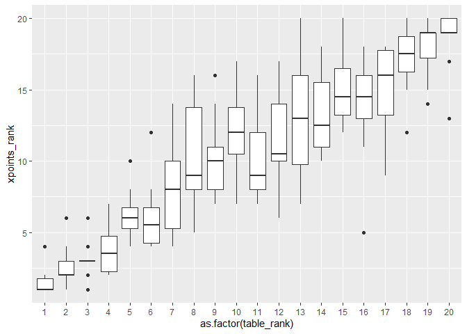
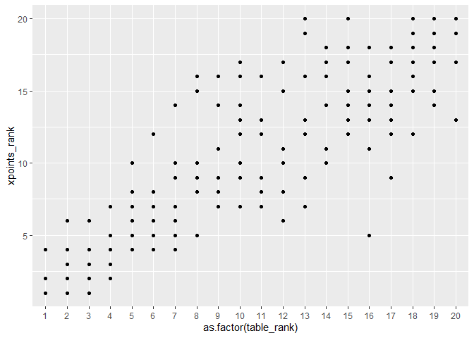
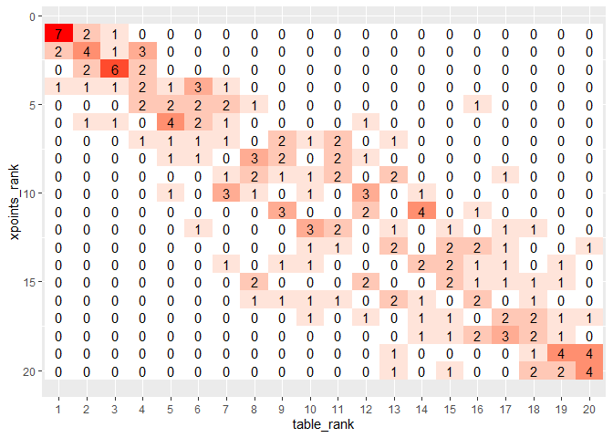

# Getting data


``` r
DF_xg <- 
  rbind(
    get_league_teams_stats(league_name = "EPL", year = 2023),
    get_league_teams_stats(league_name = "EPL", year = 2022),
    get_league_teams_stats(league_name = "EPL", year = 2021),
    get_league_teams_stats(league_name = "EPL", year = 2020),
    get_league_teams_stats(league_name = "EPL", year = 2019),
    get_league_teams_stats(league_name = "EPL", year = 2018),
    get_league_teams_stats(league_name = "EPL", year = 2017),
    get_league_teams_stats(league_name = "EPL", year = 2016),
    get_league_teams_stats(league_name = "EPL", year = 2015),
    get_league_teams_stats(league_name = "EPL", year = 2014)
  )

DF_table_summary <- 
  inner_join(
    DF_xg %>% select(xpts,date,pts,xG,xGA,scored,team_name,year),
    DF_xg %>% select(date,xG,xGA,scored,team_name,year) %>% rename(xG = xGA, xGA = xG),
    by = c("date","xG", "xGA", "year")) %>%
  group_by(team_name.x, year) %>%
  rename(team_name = team_name.x) %>% 
  summarise(xpts = sum(xpts), pts = sum(pts), GD = sum(scored.x - scored.y), GF = sum(scored.x), .groups = "drop") %>% 
  mutate(points = pts + GD/1000 + GF/1000000) 
```

# xpoints_rank vs. table_rank  


``` r
DF_table_summary %>% 
  group_by(year) %>% 
  mutate(table_rank = rank(-points)) %>% 
  mutate(xpoints_rank = rank(-xpts)) %>% 
  filter(table_rank <= 4) %>% 
  dcast(year ~ table_rank, value.var = "xpoints_rank") %>% 
  kable()
```


| year|  1|  2|  3|  4|
|----:|--:|--:|--:|--:|
| 2014|  1|  3|  2|  4|
| 2015|  4|  1|  3|  2|
| 2016|  2|  3|  1|  5|
| 2017|  1|  6|  3|  2|
| 2018|  1|  2|  3|  5|
| 2019|  2|  1|  4|  3|
| 2020|  1|  4|  3|  2|
| 2021|  1|  2|  3|  4|
| 2022|  1|  2|  6|  3|
| 2023|  1|  2|  3|  7|

``` r
DF_table_summary %>% 
  group_by(year) %>% 
  mutate(table_rank = rank(-points)) %>% 
  mutate(xpoints_rank = rank(-xpts)) %>% 
  filter(table_rank <= 4) %>%
  filter(xpoints_rank > 4) %>% 
  select(team_name, year, xpts, xpoints_rank, pts, table_rank) %>% 
  kable()
```


|team_name         | year|    xpts| xpoints_rank| pts| table_rank|
|:-----------------|----:|-------:|------------:|---:|----------:|
|Aston Villa       | 2023| 55.4286|            7|  68|          4|
|Liverpool         | 2016| 69.8308|            5|  76|          4|
|Manchester United | 2017| 62.3307|            6|  81|          2|
|Manchester United | 2022| 66.3995|            6|  75|          3|
|Tottenham         | 2018| 61.4400|            5|  71|          4|

``` r
DF_table_summary %>% 
  group_by(year) %>% 
  mutate(table_rank = rank(-points)) %>% 
  mutate(xpoints_rank = rank(-xpts)) %>% 
  filter(xpoints_rank <= 4) %>%
  filter(table_rank > 4) %>% 
  select(team_name, year, xpts, xpoints_rank, pts, table_rank) %>%
  kable()
```


|team_name         | year|    xpts| xpoints_rank| pts| table_rank|
|:-----------------|----:|-------:|------------:|---:|----------:|
|Brighton          | 2022| 70.8574|            4|  62|          6|
|Chelsea           | 2017| 68.4570|            4|  70|          5|
|Manchester United | 2016| 70.8942|            4|  69|          6|
|Manchester United | 2018| 61.8596|            4|  66|          6|
|Newcastle United  | 2023| 65.5900|            4|  60|          7|

``` r
DF_table_summary %>% 
  group_by(year) %>% 
  mutate(table_rank = rank(-points)) %>% 
  mutate(xpoints_rank = rank(-xpts)) %>% 
  filter(xpoints_rank >= 18) %>%
  filter(table_rank < 18) %>% 
  select(team_name, year, xpts, xpoints_rank, pts, table_rank) %>%
  kable()
```


|team_name               | year|    xpts| xpoints_rank| pts| table_rank|
|:-----------------------|----:|-------:|------------:|---:|----------:|
|Aston Villa             | 2014| 40.8917|           18|  38|         17|
|Aston Villa             | 2019| 37.2269|           18|  35|         17|
|Bournemouth             | 2022| 34.7342|           20|  39|         15|
|Brighton                | 2018| 36.1860|           18|  36|         17|
|Crystal Palace          | 2020| 37.9485|           18|  44|         14|
|Huddersfield            | 2017| 36.8432|           18|  37|         16|
|Newcastle United        | 2019| 31.9173|           20|  44|         13|
|Nottingham Forest       | 2022| 35.0461|           18|  38|         16|
|Swansea                 | 2016| 36.4908|           18|  41|         15|
|Wolverhampton Wanderers | 2022| 35.0081|           19|  41|         13|

``` r
DF_table_summary %>% 
  group_by(year) %>% 
  mutate(table_rank = rank(-points)) %>% 
  mutate(xpoints_rank = rank(-xpts)) %>% 
  filter(table_rank >= 18) %>%
  filter(xpoints_rank < 18) %>% 
  select(team_name, year, xpts, xpoints_rank, pts, table_rank) %>%
  kable()
```


|team_name            | year|    xpts| xpoints_rank| pts| table_rank|
|:--------------------|----:|-------:|------------:|---:|----------:|
|Bournemouth          | 2019| 39.1979|           15|  34|         18|
|Cardiff              | 2018| 37.4492|           17|  34|         18|
|Fulham               | 2020| 42.4183|           16|  28|         18|
|Hull                 | 2014| 41.3213|           17|  35|         18|
|Leeds                | 2022| 40.5808|           15|  31|         19|
|Leicester            | 2022| 45.0736|           12|  34|         18|
|Middlesbrough        | 2016| 37.2534|           17|  28|         19|
|Southampton          | 2022| 36.4664|           17|  25|         20|
|Watford              | 2019| 47.8737|           14|  34|         19|
|West Bromwich Albion | 2017| 42.9637|           13|  31|         20|

``` r
DF_table_summary %>% 
  group_by(year) %>% 
  mutate(table_rank = rank(-points)) %>% 
  mutate(xpoints_rank = rank(-xpts)) %>% 
  ggplot(aes(x = as.factor(table_rank), y = xpoints_rank)) +
  # geom_point()
  geom_boxplot()
```

<!-- -->

``` r
DF_table_summary %>% 
  group_by(year) %>% 
  mutate(table_rank = rank(-points)) %>% 
  mutate(xpoints_rank = rank(-xpts)) %>% 
  ggplot(aes(x = as.factor(table_rank), y = xpoints_rank)) +
  geom_point()
```

<!-- -->

``` r
  # geom_boxplot()

DF_table_summary %>% 
  group_by(year) %>% 
  mutate(table_rank = rank(-points)) %>% 
  mutate(xpoints_rank = rank(-xpts)) %>% 
  ungroup() %>%
  mutate(one = 1) %>%
  dcast(xpoints_rank ~ table_rank, value.var = "one", fun.aggregate = sum) %>%
  melt(id.vars = "xpoints_rank") %>%
  rename(table_rank = variable) %>% 
  ggplot(aes(x = table_rank, y = xpoints_rank, label = value, fill = value)) +
  geom_tile() +
  scale_fill_gradient(low = "white", high = "red") +
  geom_text() + 
  scale_y_reverse() +
  theme(legend.position = "none")
```

<!-- -->

``` r
DF_table_summary %>% 
  group_by(year) %>% 
  mutate(table_rank = rank(-points)) %>% 
  mutate(xpoints_rank = rank(-xpts)) %>% 
  mutate(rank_diff = table_rank - xpoints_rank) %>% 
  ggplot(aes(x = rank_diff)) +
  geom_histogram(binwidth = 1, fill = "blue")
```

<!-- -->

``` r
DF_table_summary %>% 
  group_by(year) %>% 
  mutate(table_rank = rank(-points)) %>% 
  mutate(xpoints_rank = rank(-xpts)) %>% 
  mutate(rank_diff = table_rank - xpoints_rank) %>% 
  filter(abs(rank_diff)> 5) %>% 
  select(team_name, year, xpts, xpoints_rank, pts, table_rank, rank_diff) %>%
  arrange(desc(abs(rank_diff))) %>% 
  kable()
```


|team_name               | year|    xpts| xpoints_rank| pts| table_rank| rank_diff|
|:-----------------------|----:|-------:|------------:|---:|----------:|---------:|
|Brighton                | 2020| 61.4067|            5|  41|         16|        11|
|Southampton             | 2017| 48.7157|            9|  36|         17|         8|
|Swansea                 | 2014| 43.3167|           16|  56|          8|        -8|
|Burnley                 | 2017| 41.0017|           14|  54|          7|        -7|
|Leicester               | 2021| 42.3123|           15|  52|          8|        -7|
|Manchester United       | 2023| 44.4186|           15|  60|          8|        -7|
|Newcastle United        | 2019| 31.9173|           20|  44|         13|        -7|
|West Bromwich Albion    | 2017| 42.9637|           13|  31|         20|         7|
|West Ham                | 2023| 41.2783|           16|  52|          9|        -7|
|Wolverhampton Wanderers | 2021| 40.5351|           17|  51|         10|        -7|
|Brentford               | 2021| 55.9965|            7|  46|         13|         6|
|Crystal Palace          | 2021| 58.1500|            6|  48|         12|         6|
|Fulham                  | 2022| 39.2370|           16|  52|         10|        -6|
|Leicester               | 2022| 45.0736|           12|  34|         18|         6|
|Tottenham               | 2019| 49.2646|           12|  59|          6|        -6|
|Wolverhampton Wanderers | 2022| 35.0081|           19|  41|         13|        -6|

``` r
DF_table_summary %>% 
  group_by(year) %>% 
  mutate(table_rank = rank(-points)) %>% 
  mutate(xpoints_rank = rank(-xpts)) %>% 
  mutate(rank_diff = table_rank - xpoints_rank) %>% 
  group_by(team_name) %>% 
  summarise(tot_years = n(), diff_0_years = sum(if_else(table_rank == xpoints_rank, 1, 0))) %>% 
  kable()
```


|team_name               | tot_years| diff_0_years|
|:-----------------------|---------:|------------:|
|Arsenal                 |        10|            4|
|Aston Villa             |         7|            1|
|Bournemouth             |         7|            0|
|Brentford               |         3|            0|
|Brighton                |         7|            2|
|Burnley                 |         8|            5|
|Cardiff                 |         1|            0|
|Chelsea                 |        10|            3|
|Crystal Palace          |        10|            0|
|Everton                 |        10|            1|
|Fulham                  |         4|            2|
|Huddersfield            |         2|            1|
|Hull                    |         2|            0|
|Leeds                   |         3|            0|
|Leicester               |         9|            1|
|Liverpool               |        10|            6|
|Luton                   |         1|            0|
|Manchester City         |        10|            6|
|Manchester United       |        10|            1|
|Middlesbrough           |         1|            0|
|Newcastle United        |         9|            1|
|Norwich                 |         3|            2|
|Nottingham Forest       |         2|            0|
|Queens Park Rangers     |         1|            0|
|Sheffield United        |         3|            1|
|Southampton             |         9|            2|
|Stoke                   |         4|            1|
|Sunderland              |         3|            1|
|Swansea                 |         4|            0|
|Tottenham               |        10|            4|
|Watford                 |         6|            1|
|West Bromwich Albion    |         5|            1|
|West Ham                |        10|            1|
|Wolverhampton Wanderers |         6|            1|

``` r
inner_join(
  DF_table_summary %>% 
    # select(team_name.x, year, xpts, points, pts) %>% 
    group_by(year) %>% mutate(table_rank = rank(-points)) %>% mutate(justice_rank = rank(-xpts)) %>% 
    ungroup(),
  DF_table_summary %>% 
    # select(team_name.x, year, xpts, points, pts) %>% 
    group_by(year) %>% mutate(table_rank = rank(-points)) %>% mutate(justice_rank = rank(-xpts) - 1) %>% 
    ungroup(),
  by = c("year", "justice_rank")) %>% 
  filter(abs(table_rank.x - table_rank.y) == 1) %>% 
  arrange(xpts.x - xpts.y) %>% 
  select(year,team_name.x, pts.x, xpts.x, table_rank.x, justice_rank, team_name.y, pts.y, xpts.y, table_rank.y) %>% 
  rename(justice_rank.x = justice_rank) %>% 
  mutate(justice_rank.y = justice_rank.x + 1) %>% 
  head(5) %>% 
  kable()
```


| year|team_name.x          | pts.x|  xpts.x| table_rank.x| justice_rank.x|team_name.y      | pts.y|  xpts.y| table_rank.y| justice_rank.y|
|----:|:--------------------|-----:|-------:|------------:|--------------:|:----------------|-----:|-------:|------------:|--------------:|
| 2021|Everton              |    39| 43.5380|           16|             13|Southampton      |    40| 43.4481|           15|             14|
| 2016|Everton              |    61| 55.7771|            7|              7|Southampton      |    46| 55.6851|            8|              8|
| 2014|West Bromwich Albion |    44| 44.7359|           13|             13|Leicester        |    41| 44.6400|           14|             14|
| 2019|Burnley              |    54| 49.5405|           10|             10|Sheffield United |    54| 49.3411|            9|             11|
| 2015|Sunderland           |    39| 40.5241|           17|             17|Newcastle United |    37| 40.2114|           18|             18|
