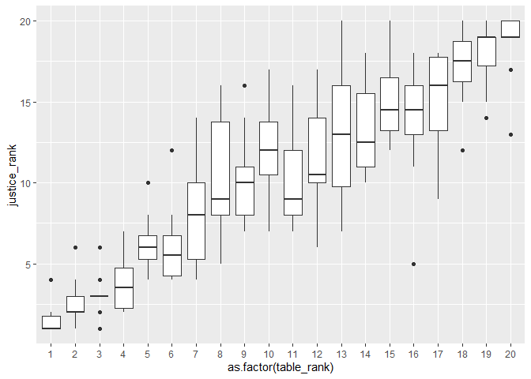
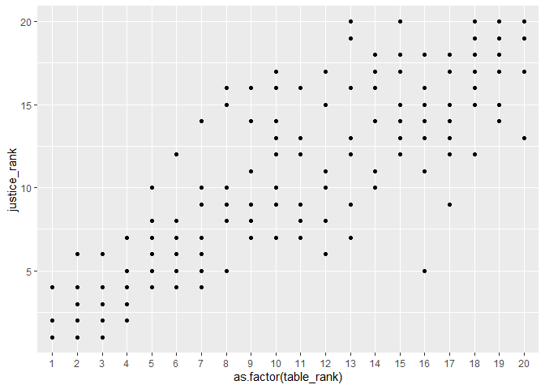
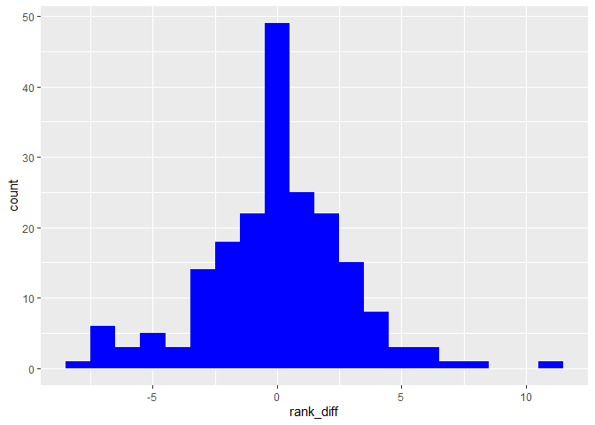
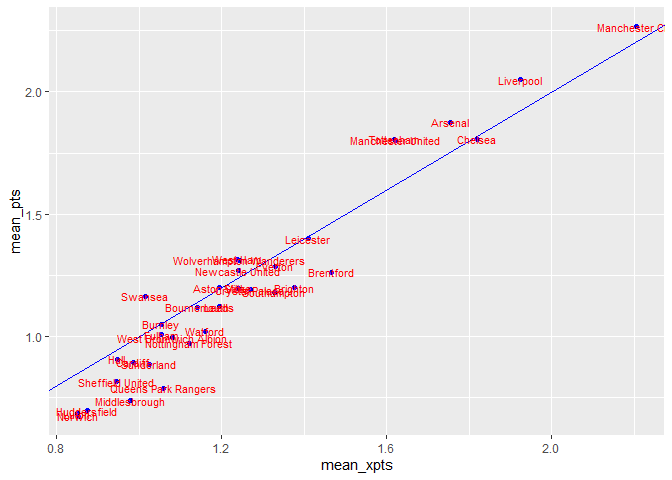

# About

Exploring Understat's data.


``` r
DF_xg <- 
  rbind(
    get_league_teams_stats(league_name = "EPL", year = 2023),
    get_league_teams_stats(league_name = "EPL", year = 2022),
    get_league_teams_stats(league_name = "EPL", year = 2021),
    get_league_teams_stats(league_name = "EPL", year = 2020),
    get_league_teams_stats(league_name = "EPL", year = 2019),
    get_league_teams_stats(league_name = "EPL", year = 2018),
    get_league_teams_stats(league_name = "EPL", year = 2017),
    get_league_teams_stats(league_name = "EPL", year = 2016),
    get_league_teams_stats(league_name = "EPL", year = 2015),
    get_league_teams_stats(league_name = "EPL", year = 2014)
  )

DF_table_summary <- 
  inner_join(
    DF_xg %>% select(xpts,date,pts,xG,xGA,scored,team_name,year),
    DF_xg %>% select(date,xG,xGA,scored,team_name,year) %>% rename(xG = xGA, xGA = xG),
    by = c("date","xG", "xGA", "year")) %>%
  group_by(team_name.x, year) %>%
  summarise(xpts = sum(xpts), pts = sum(pts), GD = sum(scored.x - scored.y), GF = sum(scored.x), .groups = "drop") %>% 
  # arrange(year,desc(pts),desc(GD)) %>% 
  mutate(points = pts + GD/1000 + GF/1000000) 
```


``` r
DF_table_summary %>% 
  group_by(year) %>% 
  mutate(table_rank = rank(-points)) %>% 
  mutate(justice_rank = rank(-xpts)) %>% 
  filter(table_rank <= 4) %>% 
  dcast(year ~ table_rank, value.var = "justice_rank") %>% 
  kable()
```


| year|  1|  2|  3|  4|
|----:|--:|--:|--:|--:|
| 2014|  1|  3|  2|  4|
| 2015|  4|  1|  3|  2|
| 2016|  2|  3|  1|  5|
| 2017|  1|  6|  3|  2|
| 2018|  1|  2|  3|  5|
| 2019|  2|  1|  4|  3|
| 2020|  1|  4|  3|  2|
| 2021|  1|  2|  3|  4|
| 2022|  1|  2|  6|  3|
| 2023|  1|  2|  3|  7|


``` r
DF_table_summary %>% 
  group_by(year) %>% 
  mutate(table_rank = rank(-points)) %>% 
  mutate(justice_rank = rank(-xpts)) %>% 
  ggplot(aes(x = as.factor(table_rank), y = justice_rank)) +
  # geom_point()
  geom_boxplot()
```

<!-- -->

``` r
DF_table_summary %>% 
  group_by(year) %>% 
  mutate(table_rank = rank(-points)) %>% 
  mutate(justice_rank = rank(-xpts)) %>% 
  ggplot(aes(x = as.factor(table_rank), y = justice_rank)) +
  geom_point()
```

<!-- -->

``` r
  # geom_boxplot()
```


``` r
DF_table_summary %>% 
  group_by(year) %>% 
  mutate(table_rank = rank(-points)) %>% 
  mutate(justice_rank = rank(-xpts)) %>% 
  mutate(rank_diff = table_rank - justice_rank) %>% 
  ggplot(aes(x = rank_diff)) +
  geom_histogram(binwidth = 1, fill = "blue")
```

<!-- -->


``` r
DF_table_summary %>% 
  group_by(year) %>% 
  mutate(table_rank = rank(-points)) %>% 
  mutate(justice_rank = rank(-xpts)) %>% 
  mutate(rank_diff = table_rank - justice_rank) %>% 
  filter(abs(rank_diff)> 5) %>% 
  kable()
```


|team_name.x             | year|    xpts| pts|  GD| GF|   points| table_rank| justice_rank| rank_diff|
|:-----------------------|----:|-------:|---:|---:|--:|--------:|----------:|------------:|---------:|
|Brentford               | 2021| 55.9965|  46|  -8| 48| 45.99205|         13|            7|         6|
|Brighton                | 2020| 61.4067|  41|  -6| 40| 40.99404|         16|            5|        11|
|Burnley                 | 2017| 41.0017|  54|  -3| 36| 53.99704|          7|           14|        -7|
|Crystal Palace          | 2021| 58.1500|  48|   4| 50| 48.00405|         12|            6|         6|
|Fulham                  | 2022| 39.2370|  52|   2| 55| 52.00205|         10|           16|        -6|
|Leicester               | 2021| 42.3123|  52|   3| 62| 52.00306|          8|           15|        -7|
|Leicester               | 2022| 45.0736|  34| -17| 51| 33.98305|         18|           12|         6|
|Manchester United       | 2023| 44.4186|  60|  -1| 57| 59.99906|          8|           15|        -7|
|Newcastle United        | 2019| 31.9173|  44| -20| 38| 43.98004|         13|           20|        -7|
|Southampton             | 2017| 48.7157|  36| -19| 37| 35.98104|         17|            9|         8|
|Swansea                 | 2014| 43.3167|  56|  -3| 46| 55.99705|          8|           16|        -8|
|Tottenham               | 2019| 49.2646|  59|  14| 61| 59.01406|          6|           12|        -6|
|West Bromwich Albion    | 2017| 42.9637|  31| -25| 31| 30.97503|         20|           13|         7|
|West Ham                | 2023| 41.2783|  52| -14| 60| 51.98606|          9|           16|        -7|
|Wolverhampton Wanderers | 2021| 40.5351|  51|  -5| 38| 50.99504|         10|           17|        -7|
|Wolverhampton Wanderers | 2022| 35.0081|  41| -27| 31| 40.97303|         13|           19|        -6|


``` r
DF_table_summary %>% 
  group_by(year) %>% 
  mutate(table_rank = rank(-points)) %>% 
  mutate(justice_rank = rank(-xpts)) %>% 
  mutate(rank_diff = table_rank - justice_rank) %>% 
  group_by(team_name.x) %>% 
  summarise(tot_years = n(), diff_0_years = sum(if_else(table_rank == justice_rank, 1, 0))) %>% 
  kable()
```


|team_name.x             | tot_years| diff_0_years|
|:-----------------------|---------:|------------:|
|Arsenal                 |        10|            4|
|Aston Villa             |         7|            1|
|Bournemouth             |         7|            0|
|Brentford               |         3|            0|
|Brighton                |         7|            2|
|Burnley                 |         8|            5|
|Cardiff                 |         1|            0|
|Chelsea                 |        10|            3|
|Crystal Palace          |        10|            0|
|Everton                 |        10|            1|
|Fulham                  |         4|            2|
|Huddersfield            |         2|            1|
|Hull                    |         2|            0|
|Leeds                   |         3|            0|
|Leicester               |         9|            1|
|Liverpool               |        10|            6|
|Luton                   |         1|            0|
|Manchester City         |        10|            6|
|Manchester United       |        10|            1|
|Middlesbrough           |         1|            0|
|Newcastle United        |         9|            1|
|Norwich                 |         3|            2|
|Nottingham Forest       |         2|            0|
|Queens Park Rangers     |         1|            0|
|Sheffield United        |         3|            1|
|Southampton             |         9|            2|
|Stoke                   |         4|            1|
|Sunderland              |         3|            1|
|Swansea                 |         4|            0|
|Tottenham               |        10|            4|
|Watford                 |         6|            1|
|West Bromwich Albion    |         5|            1|
|West Ham                |        10|            1|
|Wolverhampton Wanderers |         6|            1|


``` r
DF_xg %>% 
  group_by(team_name) %>% 
  summarise(xpts = sum(xpts), pts = sum(pts), games = n()) %>% 
  mutate(mean_xpts = xpts/games, mean_pts = pts/games) %>% 
  ggplot(aes(x = mean_xpts, mean_pts, label = team_name)) +
  geom_point(colour = "blue") +
  geom_abline(colour = "blue") +
  geom_text(size = 3, colour = "red")
```

<!-- -->


